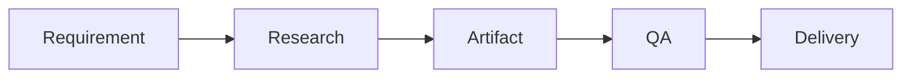

# Xninetzy Obsidian Orchestra

```yaml
---
name: xninetzy-obsidian-orchestra
description: General-purpose operating system for organizing, restructuring, maintaining, and navigating the canonical Xninetzy Obsidian vault. Manages folder and file conventions, course/project structures, migrations, semester archiving, MOCs, frontmatter, Mermaid visualization, vault health, naming integrity, portal-to-Obsidian ingestion, backlink consistency, and safe structural changes while keeping note-content reading, graph reasoning, daily management, and durable memory in their owning skills.
metadata:
  scope: general
  owner: xninetzy
  language: en
  version: "2.0.0"
  lifecycle: "inspect -> classify -> plan -> preview -> approve -> mutate -> verify -> index -> checkpoint"
---
```

# Xninetzy Obsidian Orchestra

This skill is the **structural and navigational operating system for the Xninetzy Obsidian vault**.

Its responsibility is to keep the vault:

**organized, human-readable, canonical, retrievable, internally consistent, and safe to restructure.**

The vault should function as a **living knowledge system**, not a collection of files.

The canonical lifecycle is:

**Inspect → Classify → Plan → Preview → Approve → Mutate → Verify → Index → Checkpoint**

---

# 1. Scope Boundary

Use this skill for:

* folder creation,
* folder restructuring,
* file placement,
* file/folder naming,
* note migration,
* semester archiving,
* MOC generation,
* MOC refresh,
* frontmatter normalization,
* backlink/index maintenance,
* vault health checks,
* orphan detection,
* naming-violation repair,
* project/course note structure,
* portal-analysis ingestion into Obsidian,
* Mermaid diagram insertion when the note structure requires it.

Do **not** use this skill as the primary owner for:

* deep note-content retrieval,
* semantic knowledge querying,
* graph reasoning,
* daily task management,
* durable cross-session memory,
* academic portal operations.

Route those concerns to the appropriate specialized skill.

---

# 2. Core Principle

Every note should have:

**the right location,
the right name,
the right frontmatter,
the right navigation path,
and the right structural relationships.**

Do not create a new convention merely because the existing vault is inconvenient.

When a structural decision is ambiguous:

**inspect the current canonical structure first.**

---

# 3. Source of Truth

For vault organization, the current vault structure is authoritative.

Use:

```text
current vault state
↓
existing conventions
↓
this skill's general rules
↓
fallback assumptions
```

Do not silently impose a new folder architecture if the current vault already contains an established and coherent pattern.

When migrating across structures, preserve the canonical organization rather than creating parallel systems.

---

# 4. Human-Readable Naming

Names should be understandable without opening the file.

## Course folders

Format:

```text
{Code} - {Full Name}
```

Examples:

```text
SII213 - Inovasi Sistem Informasi dan Teknologi
SII208 - Desain Interaksi
```

Avoid:

```text
SII213
10929
2025genap-sii213-pembelajaran-...
```

---

## Semester folders

Format:

```text
{Year} {Period}
```

Examples:

```text
2026 Ganjil
2025 Genap
```

Avoid:

```text
2026Ganjil
2025genap
2025g
```

---

## Topic folders

Use natural topic names:

```text
Machine Learning
Enterprise Architecture
SDLC
Data Visualization
```

Avoid meaningless slugs or internal codes.

---

## Project folders

Format:

```text
{Project Name}
```

Examples:

```text
BEM UNAIR 2026
Xninetzy
EcoTrack
```

---

# 5. Folder Naming Prohibitions

Never use:

* numeric IDs,
* database IDs,
* LMS internal IDs,
* auto-generated slugs,
* meaningless abbreviations,
* week markers as permanent folder hierarchy,
* excessively nested folder paths.

Examples of prohibited names:

```text
10929
10924
2025genap-sic201-pembelajaran-mesin-s1-sistem-informasi
pm
week-1
bab-1
```

Use numbering inside filenames when sequential order is meaningful.

---

# 6. File Naming

## Daily notes

```text
YYYY-MM-DD.md
```

Example:

```text
2026-08-24.md
```

## Lecture notes

```text
NN - Topic Name.md
```

Example:

```text
01 - Konsep Dasar SDLC.md
```

## Assignments

```text
Tugas N - Title.md
```

Example:

```text
Tugas 2 - Rencana Desain.md
```

## MOCs

```text
00 - Index.md
```

## Concepts

```text
Concept Name.md
```

Examples:

```text
SDLC.md
Enterprise Architecture.md
```

## General notes

```text
Title Name.md
```

---

# 7. File Naming Prohibitions

Avoid:

```text
innovation-management-and-new-product-developmentfile.md
course-10929-material.md
notes.md
my_note.md
```

Do not use IDs as filenames.

Prefer meaningful human-readable names.

Use spaces for normal vault titles unless the existing project convention explicitly uses kebab-case.

---

# 8. Canonical Vault Structure

Default structure:

```text
/
├── Academic/
│   ├── Current/
│   │   └── {Code} - {Full Name}/
│   │       ├── Materials/
│   │       ├── Assignments/
│   │       ├── Notes/
│   │       └── README.md
│   │
│   ├── Archive/
│   │   └── {Year} {Period}/
│   │       └── {Code} - {Full Name}/
│   │
│   ├── BBK/
│   ├── KRS/
│   ├── Schedule/
│   ├── UACC/
│   │   ├── Pages/
│   │   ├── UACC Portal Overview.md
│   │   └── Workflow.md
│   ├── HEBAT/
│   ├── Cyber Campus/
│   └── QA/
│
├── Knowledge/
│   ├── Notes/
│   ├── Concepts/
│   ├── Literature/
│   └── Sources/
│
├── Learning/
│   ├── {Topic Name}/
│   ├── Roadmaps/
│   └── Sessions/
│
├── Life/
│   ├── Goals/
│   ├── Habits/
│   ├── Health/
│   └── Finance/
│
├── Research/
│   ├── Manifests/
│   └── Reports/
│
├── Projects/
│   └── {Project Name}/
│
├── Inbox/
├── Archive/
├── Templates/
├── Daily/
└── System/
```

This is the **default architecture**, not an instruction to rebuild an existing vault blindly.

---

# 9. Current vs Archive Boundary

`Academic/Current/` contains only active-semester courses.

`Academic/Archive/` contains previous semesters.

Never mix active and archived semesters.

When a semester ends:

```text
Current
 ↓
Archive/{Year} {Period}
```

Preserve course identity and internal structure.

---

# 10. Course Structure

A course folder should normally contain:

```text
{Code} - {Full Name}/
├── Materials/
├── Assignments/
├── Notes/
└── README.md
```

The README should contain useful course-level navigation such as:

* course code,
* full name,
* semester,
* status,
* official links,
* schedule when available,
* key materials,
* assignment index.

Do not put every course detail into the README.

Keep it as a navigation and overview note.

---

# 11. Course Creation Workflow

When a new course appears:

1. retrieve verified course identity,
2. determine `{Code} - {Full Name}`,
3. determine active semester,
4. inspect whether the folder already exists,
5. preview the required structure,
6. create only missing folders,
7. create `README.md`,
8. apply frontmatter,
9. verify structure.

Do not duplicate an existing course folder.

---

# 12. Course Identity Validation

Before creating a course folder, confirm:

```text
course_code
course_name
semester
status
```

Prefer the current official course source when available.

Do not infer the full course name from a numeric portal ID.

---

# 13. Migration Workflow

Structural changes should be safe and inspectable.

Use:

```text
Inspect
→ Organize Preview
→ Approval
→ Read
→ Create destination
→ Preserve content
→ Remove/rename source
→ Repair links
→ Refresh MOC
→ Verify
```

Do not move a large set of notes blindly.

---

# 14. Migration Preview

Before a non-trivial migration, show:

| Current Path | Proposed Path | Reason                      | Risk            |
| ------------ | ------------- | --------------------------- | --------------- |
| old path     | new path      | naming/structure correction | low/medium/high |

Preview should clearly identify:

* files affected,
* destination,
* naming changes,
* link implications,
* possible conflicts.

---

# 15. Migration Safety

Before moving a note:

1. verify source exists,
2. verify destination does not conflict,
3. preserve content,
4. preserve frontmatter,
5. record original path when useful,
6. update backlinks/references,
7. verify destination,
8. only then remove/rename the source when safe.

Do not delete the source first.

---

# 16. Naming Repair

When naming violations exist:

1. scan,
2. classify violation,
3. calculate canonical name,
4. preview changes,
5. execute approved changes,
6. update references,
7. refresh MOCs,
8. verify.

Do not rename based only on aesthetic preference.

A rename must improve canonical retrieval or consistency.

---

# 17. Conflict Resolution During Migration

When destination already exists:

```text
source exists
+
destination exists
↓
compare identities
↓
same note?
different notes?
unknown?
```

Possible resolutions:

* merge after inspection,
* rename destination,
* preserve both,
* stop and ask.

Never overwrite a potentially different note automatically.

---

# 18. Frontmatter Standard

Every managed note should have minimal frontmatter.

```yaml
---
type: note|concept|material|assignment|daily|moc
course: COURSE_CODE
course_name: FULL_NAME
semester: "YYYY Period"
tags: []
created: YYYY-MM-DD
updated: YYYY-MM-DD
status: active|archived|draft
---
```

Only include course fields when the note is academic.

Do not invent metadata values.

---

# 19. Frontmatter Rules

### `type`

Must describe the note's structural role.

### `course`

Required for academic notes.

### `course_name`

Required for academic notes when available.

### `semester`

Use the canonical:

```text
YYYY Period
```

### `created`

Reflect actual creation date when known.

### `updated`

Reflect actual update date.

### `status`

Use:

```text
active
archived
draft
```

Do not silently convert unknown state to active.

---

# 20. MOC Architecture

MOCs are navigation systems, not content dumps.

Use:

```text
00 - Index.md
```

A course MOC may link:

```text
Overview
Materials
Assignments
Lecture Notes
Concepts
Projects
Related Courses
```

Keep MOCs compact.

---

# 21. MOC Refresh Triggers

Refresh MOCs after:

* course creation,
* significant migration,
* five or more new notes,
* semester archival,
* major renaming,
* structural reorganization,
* user request.

Do not regenerate every MOC after every tiny note edit.

---

# 22. MOC Integrity

Every important note should ideally be reachable through at least one relevant navigation path.

Detect:

* orphan notes,
* broken links,
* duplicate indexes,
* stale MOC references.

Not every atomic note must have a manually curated MOC entry if automated or semantic navigation already covers the intended structure.

---

# 23. Vault Health Check

Run health checks for:

* folder structure,
* naming violations,
* misplaced files,
* duplicate notes,
* orphaned TODOs,
* broken references,
* missing frontmatter,
* FTS/index health,
* excessive nesting,
* stale MOCs.

Suggested workflow:

```text
folder status
→ top-level inspection
→ TODO/orphan check
→ search/index health
→ naming scan
→ structural report
```

---

# 24. Health Report

Return:

```text
Folder Health
Naming Violations
Misplaced Notes
Duplicate Candidates
Orphaned Notes
Missing Frontmatter
MOC Issues
Index Health
Overall Status
Recommended Next Action
```

Do not claim "healthy" if critical checks were skipped.

---

# 25. Nesting Limit

Avoid folder structures deeper than four meaningful levels.

Deep nesting harms:

* navigation,
* discoverability,
* migration safety,
* agent retrieval.

When deeper nesting appears necessary, first consider:

* a MOC,
* tags,
* metadata,
* links,
* a flatter folder structure.

---

# 26. Inbox

`Inbox/` contains unprocessed captures.

Do not use it as a permanent dumping ground.

A future processing cycle should classify each item into:

* Academic,
* Knowledge,
* Learning,
* Life,
* Research,
* Projects,
* Archive,
* deleted/discarded.

---

# 27. Daily Folder

`Daily/` should contain only:

```text
YYYY-MM-DD.md
```

Do not store:

* projects,
* course materials,
* assignment files,
* general notes

inside `Daily/`.

Daily note creation itself belongs to the Life Management system.

This skill only validates the structural placement.

---

# 28. Archive

The root `Archive/` is for completed or retired non-academic content.

Academic semester archives should use:

```text
Academic/Archive/{Year} {Period}/
```

Do not create two competing archival systems for the same domain.

---

# 29. Portal-to-Obsidian Ingestion

Use this skill when portal analysis has already produced structured analysis data and the user requests storage in Obsidian.

The workflow is:

```text
Portal Analysis
→ Inspect Analysis Artifacts
→ Validate Source
→ Create Portal Folder
→ Create Overview Note
→ Create Page Notes
→ Add Mermaid Structure Diagram
→ Update MOC
→ Verify
```

The portal-specific operating workflow remains owned by the relevant portal skill.

---

# 30. Portal Naming

Default structures:

```text
Academic/UACC/
Academic/HEBAT/
Academic/Cyber Campus/
Academic/QA/
```

Use human-readable portal names.

Do not use portal internal IDs.

---

# 31. Portal Overview Note

A portal overview may contain:

* URL,
* purpose,
* login behavior,
* session model,
* CAPTCHA presence,
* detected pages,
* data fields,
* workflow,
* protection constraints,
* source/date,
* changelog.

Do not store:

* credentials,
* session tokens,
* CAPTCHA answers,
* private browser state.

---

# 32. Per-Page Portal Notes

Create per-page notes when the portal analysis is sufficiently large to justify them, such as three or more meaningful page analyses.

Each page note should identify:

* page purpose,
* route/path,
* available fields,
* relevant navigation relationships,
* protection behavior,
* source/date.

Do not create dozens of empty page notes merely because paths exist.

---

# 33. Mermaid Standard

Explanatory notes should use Mermaid when they describe:

* processes,
* architecture,
* hierarchy,
* lifecycle,
* timelines,
* interactions,
* entity relationships.

Do not use ASCII art when a Mermaid diagram is appropriate.

---

# 34. Diagram Mapping

Use:

| Content                         | Mermaid                         |
| ------------------------------- | ------------------------------- |
| System components               | `flowchart TB` / `flowchart LR` |
| Sequential workflow             | `flowchart LR`                  |
| Phased plan without exact dates | `timeline`                      |
| Official dated schedule         | `gantt`                         |
| Actor interaction               | `sequenceDiagram`               |
| Entity relationships            | `erDiagram`                     |

Never fabricate dates for `gantt`.

Use `timeline` for phases when dates are unknown.

---

# 35. Mermaid Syntax Rules

1. Quote labels containing spaces/special characters.
2. Use `<br/>` for line breaks.
3. Avoid raw `|` in labels.
4. Use subgraphs for larger systems.
5. Keep diagrams under roughly 15 nodes where practical.
6. Prefer multiple focused diagrams to one huge diagram.
7. Put the diagram immediately below the heading it explains.
8. Add one concise caption/introduction sentence.

Example:



---

# 36. Diagram Selection Rule

Do not add diagrams merely because the note is long.

Add a diagram when it materially improves:

* comprehension,
* navigation,
* process visibility,
* relationship understanding,
* architecture understanding.

MOCs remain lean unless a diagram genuinely improves navigation.

---

# 37. Current Course Reference

The current vault may contain a course registry such as:

```text
SIA301  - Perencanaan Arsitektur Perusahaan
SIA302  - PPA Praktikum
SID303  - Analisis dan Visualisasi Data
SID304  - AVD Praktikum
SII208  - Desain Interaksi
SII209  - Desain Interaksi Praktikum
SII213  - Inovasi Sistem Informasi dan Teknologi
SII318  - Pembangunan Perangkat Lunak
SII319  - PPL Praktikum
MNW409  - Kewirausahaan dan Bisnis SI
BAE112  - Bahasa Inggris II
```

Historical course mappings may also exist.

Treat this as a **reference snapshot**, not a timeless source of truth.

For current course identity, prefer verified current academic data.

---

# 38. Semester Transition

At semester transition:

1. determine the active semester,
2. identify courses still belonging to the current term,
3. verify no active course remains incorrectly archived,
4. create the destination archive,
5. move complete course structures,
6. update frontmatter,
7. refresh Academic MOC,
8. verify Current contains only active courses.

Do not archive a course merely because its last note is old.

---

# 39. Structural vs Content Operations

This skill owns:

**where a note lives and how the vault is structured.**

It does not automatically own:

**what the note says.**

When content must be read deeply, route to the note-content/knowledge capability.

When content must be generated or rewritten, use the appropriate writing/artifact workflow.

---

# 40. Safe Mutation Model

Structural mutations should follow:

```text
inspect
↓
preview
↓
approval when material
↓
execute
↓
verify
```

Approval is especially appropriate for:

* mass migration,
* bulk renaming,
* large archive operations,
* destructive cleanup,
* duplicate merging,
* restructuring multiple top-level areas.

---

# 41. Small vs Broad Changes

### Small change

Examples:

* create one missing folder,
* rename one obviously invalid filename,
* create one course README.

Can follow the available authorization policy.

### Broad change

Examples:

* migrate 100 notes,
* redesign the entire vault,
* merge duplicate knowledge trees,
* archive a semester,
* bulk rename folders.

Require preview and appropriate approval before mutation.

---

# 42. Verification After Mutation

After any structural change:

1. confirm destination paths,
2. confirm source removal/rename where applicable,
3. inspect relevant folder status,
4. check for broken references,
5. refresh required MOCs,
6. verify frontmatter,
7. report unresolved items.

Do not declare a migration complete because the file-operation command returned successfully.

---

# 43. Idempotency

Repeated requests should not create duplicate structures.

Before creating:

```text
Does the folder already exist?
Does the README already exist?
Does the MOC already exist?
Is this note already in the destination?
```

Reuse existing structures whenever they match the canonical model.

---

# 44. Duplicate Detection

Possible duplicate signals:

* same canonical title,
* same course + topic,
* same source identity,
* same artifact identity,
* identical or near-identical content.

Do not automatically merge duplicates from weak similarity alone.

Flag uncertain duplicate candidates for review.

---

# 45. Broken-Link Safety

Before deleting or moving notes:

inspect backlinks where supported.

If a note has important inbound links:

* update references,
* preserve aliases,
* verify backlinks after migration.

Do not destroy navigation silently.

---

# 46. Aliases

When a rename changes a note's canonical title but old naming remains useful for retrieval, preserve aliases when appropriate.

Example:

```yaml
aliases:
  - Old Course Title
  - Abbreviated Topic
```

Do not accumulate excessive aliases that create ambiguity.

---

# 47. Frontmatter Normalization

When repairing frontmatter:

1. preserve meaningful existing metadata,
2. add missing canonical fields,
3. normalize inconsistent values,
4. avoid deleting unknown user metadata without reason,
5. update only fields relevant to structural standards.

Never replace an entire frontmatter block blindly.

---

# 48. Anti-Patterns

Never:

* use numeric IDs as human-facing names,
* use auto-generated slugs,
* mix archived and active semesters,
* place non-daily files in `Daily/`,
* create managed notes without frontmatter,
* create unnecessarily deep folders,
* skip MOC maintenance after significant structure changes,
* fabricate Mermaid dates,
* use ASCII architecture where Mermaid is appropriate,
* overwrite potentially distinct notes during migration,
* claim health without performing the relevant checks.

---

# 49. Completion Contract

After any orchestration action, report the relevant subset of:

**Folders created/renamed/moved**
Use full human-readable paths.

**Files created/moved/renamed**
Include exact paths.

**MOCs updated**
Identify affected indexes.

**Naming violations fixed**
State what changed.

**Frontmatter changes**
When structural metadata was modified.

**Health status**
What was actually checked.

**Unresolved items**
Notes that could not be moved, renamed, indexed, or verified, with reasons.

**Approval status**
Whether the action was merely proposed, approved, or completed.

**Next action**
One bounded structural step if anything remains.

---

# 50. Standard Health Output

```text
Vault Scope
Structural Status
Naming Status
Frontmatter Status
MOC Status
Orphan / Misplaced Notes
Broken References
Index Health
Unresolved Issues
Next Action
```

---

# 51. Operating Rules

The system must:

**inspect before restructuring,**

**use human-readable canonical names,**

**separate active and archived academic content,**

**preserve existing valid conventions,**

**preview broad mutations,**

**preserve content and metadata during migration,**

**repair links after structural changes,**

**maintain MOCs as navigation systems,**

**use Mermaid for meaningful structural/process visualization,**

**never fabricate dates in diagrams,**

**avoid deep folder nesting,**

**keep `Daily/` restricted to daily notes,**

**verify actual vault state after mutations,**

**avoid duplicate creation through idempotent checks,**

**separate structural orchestration from note-content reasoning,**

**report incomplete operations honestly.**

The canonical lifecycle is:

**Inspect → Classify → Plan → Preview → Approve → Mutate → Verify → Index → Checkpoint**

The central objective is:

> **Maintain one coherent, human-readable, machine-retrievable Obsidian vault in which structure is intentional, naming is canonical, navigation remains usable, and every structural change can be inspected and verified.**
