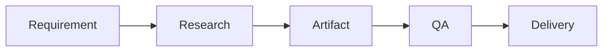

# Xninetzy Obsidian Orchestra — MOCs, Diagrams, and Portal Ingestion

This reference expands MOC architecture, refresh triggers, integrity, inbox, daily, archive, portal-to-Obsidian ingestion, portal naming, portal overview notes, per-page notes, Mermaid standard, diagram mapping, Mermaid syntax, and diagram selection rule. Read it when generating or refreshing navigation structures.

## MOC architecture

MOCs are navigation systems, not content dumps. Use `00 - Index.md`. A course MOC may link:

```text
Overview
Materials
Assignments
Lecture Notes
Concepts
Projects
Related Courses
```

Keep MOCs compact.

## MOC refresh triggers

Refresh MOCs after:

* course creation,
* significant migration,
* five or more new notes,
* semester archival,
* major renaming,
* structural reorganization,
* user request.

Do not regenerate every MOC after every tiny note edit.

## MOC integrity

Every important note should ideally be reachable through at least one relevant navigation path.

Detect:

* orphan notes,
* broken links,
* duplicate indexes,
* stale MOC references.

Not every atomic note must have a manually curated MOC entry if automated or semantic navigation already covers the intended structure.

## Inbox

`Inbox/` contains unprocessed captures. Do not use it as a permanent dumping ground. A future processing cycle should classify each item into Academic, Knowledge, Learning, Life, Research, Projects, Archive, or deleted/discarded.

## Daily folder

`Daily/` should contain only `YYYY-MM-DD.md` files. Do not store projects, course materials, assignment files, or general notes inside `Daily/`. Daily note creation itself belongs to the Life Management system. This skill only validates the structural placement.

## Archive

The root `Archive/` is for completed or retired non-academic content. Academic semester archives should use `Academic/Archive/{Year} {Period}/`. Do not create two competing archival systems for the same domain.

## Portal-to-Obsidian ingestion

Use this skill when portal analysis has already produced structured analysis data and the user requests storage in Obsidian. The workflow is:

```text
Portal Analysis
→ Inspect Analysis Artifacts
→ Validate Source
→ Create Portal Folder
→ Create Overview Note
→ Create Page Notes
→ Add Mermaid Structure Diagram
→ Update MOC
→ Verify
```

The portal-specific operating workflow remains owned by the relevant portal skill.

## Portal naming

Default structures:

```text
Academic/UACC/
Academic/HEBAT/
Academic/Cyber Campus/
Academic/QA/
```

Use human-readable portal names. Do not use portal internal IDs.

## Portal overview note

A portal overview may contain:

* URL,
* purpose,
* login behavior,
* session model,
* CAPTCHA presence,
* detected pages,
* data fields,
* workflow,
* protection constraints,
* source/date,
* changelog.

Do not store credentials, session tokens, CAPTCHA answers, or private browser state.

## Per-page portal notes

Create per-page notes when the portal analysis is sufficiently large to justify them, such as three or more meaningful page analyses.

Each page note should identify:

* page purpose,
* route/path,
* available fields,
* relevant navigation relationships,
* protection behavior,
* source/date.

Do not create dozens of empty page notes merely because paths exist.

## Mermaid standard

Explanatory notes should use Mermaid when they describe:

* processes,
* architecture,
* hierarchy,
* lifecycle,
* timelines,
* interactions,
* entity relationships.

Do not use ASCII art when a Mermaid diagram is appropriate.

## Diagram mapping

Use:

| Content                         | Mermaid                         |
| ------------------------------- | ------------------------------- |
| System components               | `flowchart TB` / `flowchart LR` |
| Sequential workflow             | `flowchart LR`                  |
| Phased plan without exact dates | `timeline`                      |
| Official dated schedule         | `gantt`                         |
| Actor interaction               | `sequenceDiagram`               |
| Entity relationships            | `erDiagram`                     |

Never fabricate dates for `gantt`. Use `timeline` for phases when dates are unknown.

## Mermaid syntax rules

1. Quote labels containing spaces/special characters.
2. Use `<br/>` for line breaks.
3. Avoid raw `|` in labels.
4. Use subgraphs for larger systems.
5. Keep diagrams under roughly 15 nodes where practical.
6. Prefer multiple focused diagrams to one huge diagram.
7. Put the diagram immediately below the heading it explains.
8. Add one concise caption/introduction sentence.

Example:



## Diagram selection rule

Do not add diagrams merely because the note is long. Add a diagram when it materially improves comprehension, navigation, process visibility, relationship understanding, or architecture understanding. MOCs remain lean unless a diagram genuinely improves navigation.

## Portal-to-Obsidian ingestion steps

1. Inspect portal analysis artifacts and validate source.
2. Create the portal folder.
3. Create the overview note.
4. Create per-page notes when meaningful.
5. Add a Mermaid structure diagram when the analysis is sufficiently rich.
6. Update the relevant MOC.
7. Verify integrity, backlinks, and references.

Do not mutate portal state during ingestion.