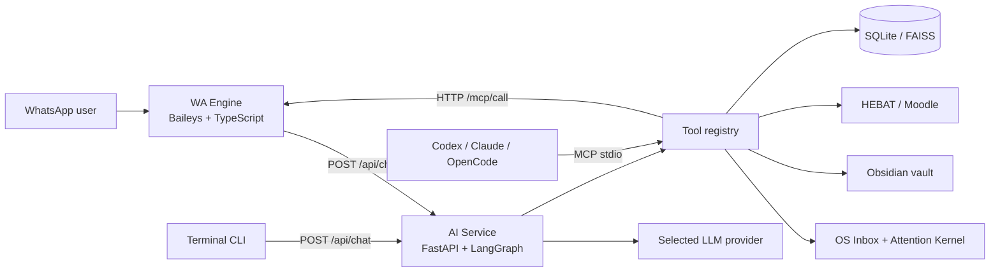

# Xninetzy AI

> WhatsApp-first Personal Learning OS dan Life OS dengan AI agent, Obsidian, HEBAT/Moodle, knowledge base, reminder, serta MCP untuk Codex, Claude Code, dan OpenCode.


Xninetzy AI mengubah WhatsApp menjadi antarmuka untuk belajar, riset, catatan, tugas, dan otomasi personal. Pesan natural maupun slash command dirutekan ke agent dan tool yang sesuai; aksi sensitif tetap melewati confirmation token, approval, allowlist, dan pembatasan workspace.

Project ini ditujukan untuk instalasi lokal/single-owner. Docker Compose memakai
bridge network dan hanya mempublikasikan API ke loopback host, sehingga dapat
digunakan di Linux, macOS, Windows, dan WSL2. Jangan mengekspos service ke
internet sebelum membaca bagian [Keamanan](#keamanan).

## Daftar Isi

- [Kemampuan utama](#kemampuan-utama)
- [Arsitektur](#arsitektur)
- [Struktur repository](#struktur-repository)
- [Quick start dengan Docker](#quick-start-dengan-docker)
- [Menjalankan untuk development](#menjalankan-untuk-development)
- [Tutorial penggunaan](#tutorial-penggunaan)
- [Provider LLM](#provider-llm)
- [MCP untuk Codex, Claude Code, dan OpenCode](#mcp-untuk-codex-claude-code-dan-opencode)
- [Coding agent melalui WhatsApp](#coding-agent-melalui-whatsapp)
- [HTTP API](#http-api)
- [Data dan persistence](#data-dan-persistence)
- [Testing](#testing)
- [Troubleshooting](#troubleshooting)
- [Keamanan](#keamanan)
- [Dokumentasi lanjutan](#dokumentasi-lanjutan)

## Kemampuan Utama

| Area | Kemampuan |
|---|---|
| Chat agent | Routing LangGraph, jawaban langsung, ReAct tools, workflow multi-aksi, dan slash command deterministik |
| LLM | Flaz sebagai default melalui `langchain-openai`, plus OpenAI, Anthropic, OpenRouter, Ollama, dan endpoint OpenAI-compatible |
| OS kernel | Universal inbox, deterministic triage, attention queue lintas task/learning/capture, dan event yang replay-safe |
| Learning OS | Roadmap adaptif, study session, mastery, task belajar, review mingguan, resource attachment, dan approval aktivasi |
| HEBAT/Moodle | Login Playwright, sinkronisasi course/activity/tugas, deadline digest, download file asli, baca PDF, dan submission dengan konfirmasi |
| Obsidian | List, search, read, create, append, frontmatter, tag, heading, backlink, todo, MOC, daily note, dan backup sebelum overwrite |
| Knowledge | Ingest teks/file, hybrid FAISS+FTS, evidence selection, grounded Q&A bersitasi, dan Graph RAG |
| Media WhatsApp | Dokumen, quoted attachment, OCR gambar, OCR scanned PDF, serta shared durable media storage |
| Life OS | Goal, task, reminder, habit, workout, money, check-in, dan daily review |
| Research | Light research, deep research bertingkat, academic/YouTube source, research brief, dan notification policy |
| Personalization | Chat memory, semantic memory, rules, style profile, feedback, dan Lightning improvement proposals |
| MCP | Seluruh registry tool Xninetzy melalui MCP stdio; aksi WhatsApp melalui HTTP MCP-style server |
| Coding runtime | Codex CLI, Claude Code, atau OpenCode yang dibatasi admin, workspace, timeout, environment, dan audit log |

## Arsitektur



Ada dua server tool yang berbeda:

1. **Xninetzy MCP stdio** berada di AI service dan mengekspos seluruh tool registry, termasuk Obsidian, HEBAT, task, reminder, roadmap, research, provider, dan coding agent.
2. **WhatsApp HTTP MCP-style server** berada di WA engine karena hanya proses tersebut yang memiliki socket Baileys. Server ini menangani pesan, media, kontak, group, dan label WhatsApp.

Alur request chat:

```text
WhatsApp atau CLI
  └─ POST /api/chat
      ├─ slash command → command_router → tool langsung
      ├─ multi-action request → workflow engine
      └─ pesan natural → LangGraph → direct / clarify / ReAct agent
                              └─ tool registry → Obsidian / HEBAT / DB / WA
```

## Struktur Repository

```text
.
├── .env.example                       # template konfigurasi tanpa secret
├── docker-compose.yml
├── apps/
│   ├── cli/                           # terminal client, Ink + React
│   └── docs/                          # documentation site, Astro
├── docs/                              # dokumentasi lintas-service
└── services/
    ├── ai/
    │   ├── app/main.py                # entry point FastAPI
    │   ├── app/xninetzy/
    │   │   ├── agent/                 # LangGraph dan prompt
    │   │   ├── core/                  # config, provider, coding runtime
    │   │   ├── domains/               # IT learning dan domain bisnis
    │   │   ├── interfaces/            # API, MCP, media, WhatsApp client
    │   │   ├── os/                    # knowledge, notes, HEBAT, HITL, life OS
    │   │   ├── tools/                 # registry dan tool implementations
    │   │   └── workflow/              # workflow multi-aksi
    │   ├── scripts/
    │   └── tests/
    └── wa-enggine/
        ├── src/ai/                    # client ke AI service
        ├── src/mcp/                   # HTTP MCP-style tool server
        └── src/whatsapp/              # socket, listener, trigger, session
```

## Prasyarat

### Jalur Docker

- Docker Engine + Compose di Linux, atau Docker Desktop di macOS/Windows.
- Flaz API key atau provider LLM lain yang didukung.
- Absolute path ke Obsidian vault atau folder kosong yang akan dijadikan vault.
- Akun WhatsApp yang dapat ditautkan sebagai linked device.

### Jalur development lokal

- Python 3.11+.
- [`uv`](https://docs.astral.sh/uv/).
- Node.js 20+ dan Yarn 1.22.
- Chromium/Playwright untuk HEBAT dan Web Analysis.
- Tesseract English dan Indonesian untuk OCR jika tidak menggunakan image Docker.

Provider search seperti Tavily, Serper, dan YouTube bersifat opsional. Tanpa API key tersebut, deep research tetap dapat berjalan tetapi sumber eksternalnya lebih terbatas.

## Quick Start dengan Docker

Instalasi terpandu Linux, macOS, atau WSL2:

```bash
curl -fsSL https://raw.githubusercontent.com/misbahul45/xninetzy/main/scripts/install.sh | bash
```

Windows PowerShell:

```powershell
irm https://raw.githubusercontent.com/misbahul45/xninetzy/main/scripts/install.ps1 | iex
```

Script meminta secret secara interaktif, membuat key internal, menyiapkan vault,
memvalidasi Compose, dan menjalankan AI serta WhatsApp engine. Dokumentasi lengkap
tersedia di `apps/docs`, portofolio pembuat di
<https://misbahul-muttaqin.vercel.app/>, dan source profile di
<https://github.com/misbahul45>.

Compose menggunakan bridge network dan port loopback sehingga jalur Docker yang
sama berjalan di Linux, macOS, Windows, dan WSL2.

### 1. Buat environment lokal

Dari root repository:

```bash
cp .env.example .env
chmod 600 .env
```

Jangan menaruh API key, password HEBAT, token, cookie, atau nomor pribadi di `.env.example`.

### 2. Masukkan Flaz API key secara aman

```bash
cd services/ai
uv run python scripts/configure_flaz.py
cd ../..
```

Script memakai `getpass`, tidak mencetak key, menulis `.env` secara atomik, dan mempertahankan permission `600`.

Nilai default yang disimpan:

```env
FLAZ_BASE_URL=https://ai.flaz.id/v1
FLAZ_MODEL=deepseek-v4-pro
LLM_DEFAULT_PROVIDER=flaz
LLM_ENABLED_PROVIDERS=flaz
```

Lengkapi key internal AI dan WA MCP tanpa mencetak secret:

```bash
cd services/ai
uv run python scripts/configure_internal_auth.py
cd ../..
```

Script menambahkan key konfigurasi yang belum ada, membuat `AI_API_KEY`,
menyamakan `MCP_API_KEY` dengan `WA_MCP_API_KEY`, dan menjaga `.env` tetap
berpermission `600`. Nilai yang sudah ada tidak ditimpa.

### 3. Atur path dan identitas host

Cari UID/GID host:

```bash
id -u
id -g
```

Edit `.env`:

```env
HOST_UID=1000
HOST_GID=1000
OBSIDIAN_VAULT_HOST_PATH=/absolute/path/to/your/obsidian-vault
ADMIN_JID=628xxxxxxxxxx@s.whatsapp.net
ADMIN_NAMES=your_name
APP_TIMEZONE=Asia/Jakarta
WA_STARTUP_MENU_ENABLED=true
WA_STARTUP_MENU_DELAY_MS=1500
```

`OBSIDIAN_VAULT_HOST_PATH` wajib berupa absolute path. Docker Compose sengaja menolak start jika nilainya kosong.

### 4. Pilih login WhatsApp

QR mode:

```env
WA_LOGIN_MODE=qr
```

Atau pairing code:

```env
WA_LOGIN_MODE=pairing_code
WA_PHONE_NUMBER=628xxxxxxxxxx
```

Gunakan format negara tanpa `+`, spasi, atau tanda baca.

### 5. Validasi dan jalankan service

```bash
docker compose config -q
docker compose up --build -d ai wa-enggine
docker compose ps
```

Pantau login WhatsApp:

```bash
docker compose logs -f wa-enggine
```

QR atau pairing code muncul di log. Di ponsel buka **WhatsApp → Linked devices** lalu selesaikan proses login.

Saat koneksi pertama pada setiap process launch berhasil, WA engine mengirim
lima kartu menu dengan total 15 tombol ke `ADMIN_JID`: Harian, Life OS,
Learning OS, Knowledge, dan Kontrol AI. Reconnect dalam proses yang sama tidak
mengirim ulang. Jika interactive button ditolak oleh client/protokol WhatsApp,
sistem mengirim satu fallback teks berisi command yang sama.

### Menyalakan bot otomatis saat laptop boot

Aktifkan Docker sekali:

```bash
sudo systemctl enable --now docker
systemctl is-enabled docker
systemctl is-active docker
```

Service `ai` dan `wa-enggine` memakai `restart: unless-stopped`. Setelah
container pernah dibuat dengan `docker compose up -d`, Docker akan menyalakannya
kembali saat laptop boot. Jangan menjalankan `docker compose down` jika ingin
startup otomatis tetap berlaku karena perintah itu menghapus container.

### 6. Verifikasi health

```bash
curl -s http://127.0.0.1:8000/health
curl -s http://127.0.0.1:8081/health
```

Respons AI yang diharapkan:

```json
{"status":"ok","service":"xninetzy-ai"}
```

Health WA juga menampilkan `socket_ready` dan status koneksi WhatsApp.

### Login Cyber Campus dengan CAPTCHA manual

Cyber Campus memakai credential HEBAT dari `.env`; credential tidak masuk
prompt, tool schema, atau database. Aktifkan:

```env
CYBER_CAMPUS_ENABLED=true
CYBER_CAMPUS_CREDENTIAL_SOURCE=hebat
WEB_ANALYSIS_ENCRYPTION_KEY=<fernet-key-lokal>
ADMIN_JID=628xxxxxxxxxx@s.whatsapp.net
```

Atau aktifkan sekaligus buat encryption key secara aman:

```bash
cd services/ai
uv run python scripts/configure_internal_auth.py --enable-cyber-campus
cd ../..
```

Perintah berhenti jika credential HEBAT atau `ADMIN_JID` belum tersedia dan
tidak pernah mencetak nilainya.

Dari WhatsApp admin kirim `/cyber-login`. Agent membuka browser di background,
mengisi NIM/password, lalu mengirim gambar CAPTCHA ke `ADMIN_JID`. Owner menjawab
gambar dengan nilai saja, mengirim nilai saja selama challenge aktif, atau memakai
`/captcha <challenge-id> <jawaban>`. Salah ketik `/catchpa` juga dinormalisasi.
Jawaban hanya diterima dari JID admin dan tidak melewati LLM. CAPTCHA tidak
dipecahkan otomatis. Setelah login berhasil, session disimpan terenkripsi.

Gunakan `/portal-nav` untuk inventaris navigasi real-time, `/krs-capabilities`
untuk capability manifest KRS, dan `/web-refresh mahasiswa` untuk audit struktur.
Analyzer hanya memakai GET/HEAD, memblokir mutasi, dan tidak mengeksekusi
JavaScript mentah dari LLM. Semua approval dikirim ke WhatsApp dengan tombol
Approve/Reject dan fallback `/approve` atau `/reject`.

Token nilai Cyber Campus hanya diterima dari WhatsApp admin melalui challenge
yang terikat owner dan berumur pendek. Token tidak melewati LLM, tidak disimpan,
dan dikonsumsi setelah satu percobaan pembacaan nilai.

Untuk membaca KHS, kirim `/nilai`, `/nilai semester 1`, atau
`/nilai <kode-periode>`. Urutan portal wajib dipertahankan: Xninetzy membuka halaman KHS,
owner menunggu dan membalas verified token terbaru, reader mengisi token pada
halaman yang sama, lalu reader memilih semester dan mengambil tabel nilai.
Dropdown semester tidak boleh dipilih sebelum token terisi karena portal akan
menolak token tersebut. Abaikan token yang terbit dari challenge lama dan selalu
gunakan token yang muncul setelah prompt WhatsApp terbaru.

### 7. Kirim pesan pertama

Contoh dari WhatsApp:

```text
/helper
buat roadmap belajar machine learning 14 hari
ingatkan aku besok jam 08.00 untuk review tugas
simpan ringkasan percakapan ini ke Obsidian
```

### 8. Jalankan terminal client opsional

```bash
docker compose --profile tools run --rm cli
```

Stop seluruh service:

```bash
docker compose down
```

## Menjalankan untuk Development

Docker Compose mempublikasikan port loopback yang sama dengan proses lokal.
Jangan menjalankan instance Docker dan lokal bersamaan pada port atau akun
WhatsApp yang sama.

### AI service

```bash
cd services/ai
uv sync
uv run playwright install chromium
uv run uvicorn app.main:app --host 127.0.0.1 --port 8000 --reload
```

AI service otomatis membaca `.env` dari root repository.

### WhatsApp engine

Di terminal kedua:

```bash
cd services/wa-enggine
yarn install --frozen-lockfile
yarn dev
```

WA engine juga mencari root `.env` secara otomatis. Untuk local development, gunakan:

```env
AI_API_URL=http://127.0.0.1:8000
WA_AUTH_DIR=/absolute/path/to/xninetzy/services/wa-enggine/sessions
WA_MEDIA_DIR=/absolute/path/to/xninetzy/services/ai/data/wa-media
```

### Terminal client

Di terminal ketiga:

```bash
cd apps/cli
yarn install --frozen-lockfile
yarn dev
```

Atau build lalu jalankan:

```bash
yarn build
yarn start
```

### Documentation site

```bash
cd apps/docs
yarn install --frozen-lockfile
yarn dev
```

Buka `http://127.0.0.1:4321`. Untuk production static build:

```bash
yarn check
yarn build
yarn preview --host 127.0.0.1
```

Source panduan berada di `apps/docs/src/pages/docs` sebagai Markdown. Navigasi berada di `apps/docs/src/data/navigation.ts`.

## Tutorial Penggunaan

### Tutorial 1 — Obsidian sebagai learning vault

Aktifkan konfigurasi:

```env
OBSIDIAN_ENABLED=true
OBSIDIAN_VAULT_HOST_PATH=/absolute/path/to/your/vault
OBSIDIAN_VAULT_PATH=/app/obsidian-vault
OBSIDIAN_ALLOW_WRITE=true
OBSIDIAN_ALLOW_DELETE=false
OBSIDIAN_BACKUP_BEFORE_WRITE=true
```

Contoh percakapan:

```text
buat note Learning/REST API.md yang menjelaskan resource, method, status code, dan latihan
cari note yang membahas machine learning
tambahkan hasil review hari ini ke Daily/2026-07-28.md
buat MOC yang menghubungkan semua note Data Analytics
```

Guard bawaan menolak absolute path, traversal `..`, credential-like path, dan extension berbahaya. Delete dinonaktifkan secara default; overwrite dapat membuat backup di vault.

### Tutorial 2 — HEBAT/Moodle dari login sampai roadmap

Simpan credential hanya di `.env` lokal:

```env
HEBAT_USERNAME=
HEBAT_PASSWORD=
HEBAT_BASE_URL=https://hebat.elearning.unair.ac.id
HEBAT_LOGIN_URL=https://hebat.elearning.unair.ac.id/login/index.php
HEBAT_BROWSER_HEADLESS=true
HEBAT_AUTO_LOGIN=false
HEBAT_REQUIRE_CONFIRMATION=true
```

Alur WhatsApp yang direkomendasikan:

```text
login hebat
sync course hebat
cek course hebat
masuk ke course Pembelajaran Mesin dan tampilkan activity
download semua PDF dari Pembelajaran Mesin
baca outline seluruh PDF lalu buat roadmap lengkap di Obsidian
```

File hasil download disimpan di:

```text
services/ai/data/hebat/downloads/<course-id>/<activity>/<filename>
```

Tool meng-resolve halaman activity Moodle ke URL file asli `pluginfile.php`, sehingga file HTML redirect tidak dianggap sebagai PDF. Upload submission tidak berjalan otomatis: file harus sesuai allowlist, ukuran dibatasi, dan user harus mengonfirmasi token submission.

Debug login tanpa membocorkan password/cookie:

```text
/hebat-debug
```

### Tutorial 3 — Dokumen dan gambar dari WhatsApp

Kirim atau reply sebuah PDF, DOCX, TXT, CSV, JSON, spreadsheet, presentasi, atau gambar dengan instruksi:

```text
ringkas dokumen ini
buat daftar action item dari file ini
jawab pertanyaan berdasarkan PDF yang aku reply
baca teks pada gambar ini lalu simpan ke Obsidian
jadikan file ini knowledge
```

Media disimpan pada shared volume dan divalidasi berdasarkan checksum. Scanned PDF dan gambar menggunakan OCR Tesseract jika teks native tidak tersedia.

### Tutorial 4 — Research, roadmap, dan approval

```text
/deep-research quality kenapa manusia sulit disiplin
buat roadmap belajar 28 hari dari hasil riset ini
/approvals
/approve 1
```

Membuat draft tidak sama dengan mengaktifkan roadmap. Aktivasi mengubah status
roadmap menjadi `active` dan memproyeksikan item belajar ke task bersama hanya
setelah approval admin berhasil. Menyelesaikan task itu dari WhatsApp, MCP,
Codex, Claude, atau OpenCode memperbarui progress roadmap yang sama secara
idempotent.

Planner membedakan roadmap 7, 14, dan 30 hari serta memakai source knowledge
internal jika tersedia. Draft menampilkan ID/judul sumber yang dipakai; jika
tidak ada evidence, draft meminta validasi sumber dan tidak mengklaim berasal
dari vault.

### Tutorial 5 — Capture, triage, dan fokus harian

Gunakan OS Inbox saat sesuatu penting tetapi belum jelas harus menjadi task,
note, atau knowledge:

```text
/capture ide belajar database dengan membuat mini project
/capture cek lagi materi Data Analytics minggu depan
/inbox
/triage 12 task
/today
```

`/capture` menyimpan input terlebih dahulu tanpa memaksa bentuk akhirnya.
`/triage` mempromosikan satu capture menjadi task bersama atau mengarsipkannya.
`/today` bukan lagi daftar task mentah: command ini menyusun attention queue dari
deadline, prioritas, learning state, dan capture yang belum ditriage. Capture
idempotent berdasarkan key dari caller; triage replay-safe berdasarkan ID
capture melalui semua interface.

### Tutorial 6 — Reminder natural language

```text
ingatkan aku 15 menit lagi untuk minum obat
ingatkan aku besok jam 08.00 untuk belajar KNN
in 1 minute remind me to check the service
```

Periksa task dan reminder dari WhatsApp:

```text
/today
/review
```

### Tutorial 6b — Automation closed-loop

Aktifkan target dan jam di `.env`:

```dotenv
OS_NOTIFY_CHAT_ID=628xxxxxxxxxx@s.whatsapp.net
MORNING_BRIEFING_HOUR=7
EVENING_CHECKIN_HOUR=20
WEEKLY_REVIEW_WEEKDAY=6
WEEKLY_REVIEW_HOUR=20
```

Morning briefing menggabungkan task, deadline HEBAT, roadmap, dan freshness.
Evening/weekly review memakai event yang benar-benar tersimpan. Dari WhatsApp,
Codex, Claude, atau OpenCode, minta agent menjalankan `os_job_status` untuk
melihat attempt, kegagalan, dan status pengiriman yang sama.

### Tutorial 7 — Provider dan model per pengguna

```text
/llm
/llm list
/llm use flaz deepseek-v4-pro
```

Pilihan provider/model disimpan per user di SQLite. API key tidak pernah disimpan sebagai preferensi user dan tidak ditampilkan oleh `/llm list`.

## Command WhatsApp Penting

Slash command diproses deterministik oleh `services/ai/app/xninetzy/ecosystem/command_router.py`.

| Command | Fungsi |
|---|---|
| `/helper [topic]` | Panduan kemampuan bot |
| `/today` | Attention queue dari task, learning state, dan OS Inbox |
| `/capture <isi>`, `/inbox`, `/triage <id> task\|archive` | Capture dan proses input lintas interface |
| `/tasks` | Daftar task |
| `/goals` | Daftar goal |
| `/review` | Daily review |
| `/hebat`, `/hebat-debug` | Digest atau debug aman HEBAT |
| `/research <topic>` | Research ringan |
| `/deep-research [speed\|balanced\|quality] <topic>` | Deep research |
| `/roadmaps`, `/study-today`, `/study-review` | Learning OS |
| `/knowledge` | Pencarian knowledge |
| `/approvals`, `/approve <id>`, `/reject <id>` | Human-in-the-loop approval |
| `/media-info`, `/analyze-media` | Analisis attachment/reply |
| `/remember <text>`, `/memory`, `/memory search <query>` | Semantic memory |
| `/rule list`, `/rule add <rule>` | Aturan personal |
| `/style show`, `/style set <description>` | Gaya jawaban |
| `/llm list`, `/llm use <provider> [model]` | Provider chat |
| `/agent list`, `/agent use <runtime>`, `/code <task>` | Coding agent |
| `/workflow-status`, `/workflow-latest` | Status workflow multi-aksi |

Private chat diproses langsung. Group chat diproses ketika bot di-mention, pesan memakai prefix `!`, user me-reply pesan bot, atau `WA_GROUP_ALLOW_ALL=true`.

## Provider LLM

Flaz adalah provider default dan menggunakan `ChatOpenAI` dari `langchain-openai` dengan custom base URL:

```env
LLM_DEFAULT_PROVIDER=flaz
LLM_ENABLED_PROVIDERS=flaz
FLAZ_API_KEY=
FLAZ_BASE_URL=https://ai.flaz.id/v1
FLAZ_MODEL=deepseek-v4-pro
FLAZ_MODELS=deepseek-v4-pro
```

Contoh mengaktifkan beberapa provider:

```env
LLM_ENABLED_PROVIDERS=flaz,openai,anthropic,openrouter,ollama,generic

OPENAI_API_KEY=
OPENAI_MODEL=gpt-model-name
OPENAI_MODELS=gpt-model-name

ANTHROPIC_API_KEY=
ANTHROPIC_MODEL=claude-model-name
ANTHROPIC_MODELS=claude-model-name

OPENROUTER_API_KEY=
OPENROUTER_MODEL=provider/model
OPENROUTER_MODELS=provider/model

OLLAMA_BASE_URL=http://127.0.0.1:11434/v1
OLLAMA_MODEL=local-model
OLLAMA_MODELS=local-model

GENERIC_OPENAI_API_KEY=
GENERIC_OPENAI_BASE_URL=https://your-provider.example/v1
GENERIC_OPENAI_MODEL=your-model
GENERIC_OPENAI_MODELS=your-model
```

`*_MODELS` adalah allowlist yang dipisahkan koma. Provider baru dianggap siap jika masuk `LLM_ENABLED_PROVIDERS`, memiliki model, base URL jika diperlukan, dan credential wajib tersedia.

Panduan lengkap: [Provider LLM, Coding Agent, dan MCP](docs/AI_PROVIDERS_CODING_AGENTS_MCP.md).

## MCP untuk Codex, Claude Code, dan OpenCode

Entry point MCP Xninetzy:

```bash
uv run --directory services/ai python -m app.xninetzy.interfaces.mcp_server
```

Server memakai transport `stdio` dan mengambil katalog langsung dari `tools/registry.py`. Tool baru otomatis terekspos tanpa wrapper manual. Jangan menulis log aplikasi ke stdout MCP karena stdout dipakai untuk protocol frame.

Untuk akses dari folder mana pun, pakai konfigurasi **global/user** dengan path absolut. Ganti `/home/you` dan lokasi repository sesuai host.

### Codex global

```bash
codex mcp add xninetzy -- \
  /home/you/.local/bin/uv run \
  --directory /home/you/code/xninetzy/services/ai \
  python -m app.xninetzy.interfaces.mcp_server
```

Tambahkan timeout pada entry `[mcp_servers.xninetzy]` di `~/.codex/config.toml`:

```toml
startup_timeout_sec = 30
tool_timeout_sec = 120
```

### Claude Code global

```bash
claude mcp add --scope user xninetzy \
  -e PYTHONUNBUFFERED=1 -- \
  /home/you/.local/bin/uv run \
  --directory /home/you/code/xninetzy/services/ai \
  python -m app.xninetzy.interfaces.mcp_server
```

### OpenCode global

Tambahkan key berikut ke `~/.config/opencode/opencode.jsonc` tanpa menimpa konfigurasi lain:

```json
{
  "mcp": {
    "xninetzy": {
      "type": "local",
      "command": [
        "/home/you/.local/bin/uv",
        "run",
        "--directory",
        "/home/you/code/xninetzy/services/ai",
        "python",
        "-m",
        "app.xninetzy.interfaces.mcp_server"
      ],
      "enabled": true,
      "timeout": 120000
    }
  }
}
```

Verifikasi dari luar repository untuk memastikan tidak ada project config yang menutupi masalah:

```bash
cd /tmp
codex mcp get xninetzy
claude mcp list
opencode mcp list
```

Claude dan OpenCode seharusnya menampilkan `Connected`. Contoh prompt:

```text
Gunakan MCP xninetzy untuk menampilkan note pada folder Learning/Pembelajaran Mesin.
```

Xninetzy memetakan path container `/app/data` ke `services/ai/data` ketika MCP berjalan di host. API key tetap dibaca dari `.env` project dan tidak perlu disalin ke config MCP.

Konfigurasi runtime path opsional:

```env
MCP_RUNTIME_MODE=auto
MCP_HOST_DATA_DIR=
MCP_HOST_SQLITE_PATH=
```

## Coding Agent melalui WhatsApp

Coding agent berbeda dari provider chat. Provider chat menjawab pesan; coding runtime menjalankan CLI lokal yang dapat membaca atau mengubah repository.

Aktifkan hanya pada AI service yang berjalan di host dan memiliki binary serta session login CLI:

```env
CODING_AGENT_ENABLED=true
CODING_AGENT_DEFAULT=codex
CODING_AGENT_ALLOWED=internal,codex,claude-code,opencode
CODING_AGENT_ADMIN_ONLY=true
CODING_AGENT_WORKSPACE=/absolute/path/to/xninetzy
CODING_AGENT_ALLOWED_ROOT=/absolute/path/to/xninetzy
CODING_AGENT_TIMEOUT_SECONDS=600
CODING_AGENT_SANDBOX=workspace-write
```

Gunakan dari WhatsApp:

```text
/agent list
/agent use codex
/code jalankan test terkait dan jelaskan kegagalannya
```

Runtime tidak memakai shell interpolation, menerima environment allowlist minimal, dibatasi ke allowed root, memiliki timeout/output cap, dan mencatat audit run. Container standar tidak membawa binary atau login store Codex/Claude/OpenCode; host mode lebih mudah untuk fitur ini.

## HTTP API

Base URL default:

```text
http://127.0.0.1:8000
```

| Method | Endpoint | Keterangan |
|---|---|---|
| `GET` | `/health` | Health check publik |
| `POST` | `/api/chat` | Chat utama WhatsApp/CLI |
| `GET` | `/api/reminders` | List reminder, memakai bearer `AI_API_KEY` |
| `POST` | `/api/reminders` | Membuat reminder |
| `POST` | `/api/reminders/{id}/cancel` | Membatalkan reminder |
| `POST` | `/api/reminders/{id}/close` | Menutup reminder |
| `GET` | `/api/debug/tools` | Tool registry jika debug endpoint aktif |
| `POST` | `/api/debug/invoke-tool/{tool}` | Invoke tool untuk development |

Contoh chat:

```bash
curl -X POST http://127.0.0.1:8000/api/chat \
  -H 'Content-Type: application/json' \
  -H 'Authorization: Bearer <AI_API_KEY>' \
  -d '{
    "chat_id": "local-test",
    "sender_id": "local-user",
    "sender_name": "Local User",
    "message": "jelaskan perbedaan classification dan clustering",
    "chat_type": "private",
    "metadata": {}
  }'
```

`AI_API_KEY` melindungi chat, reminder, dan debug routes. Authentication bersifat
fail-closed: saat `AI_API_AUTH_REQUIRED=true` dan key belum dikonfigurasi,
endpoint terlindungi mengembalikan `503`. Tambahkan ke `.env`:

```env
AGENT_DEBUG_ENDPOINTS=false
AI_API_KEY=a-long-random-secret
AI_API_AUTH_REQUIRED=true
SINGLE_OWNER_MODE=true
ADMIN_JID=628xxxxxxxxxx@s.whatsapp.net
```

WA engine dan CLI mengirim bearer token tersebut secara otomatis. Request chat
tetap harus memakai sender JID yang cocok dengan `ADMIN_JID` atau
`OWNER_ALLOWED_JIDS`. Health check tetap publik; jangan expose port `8000`
langsung ke internet.

### WhatsApp HTTP MCP-style API

Base URL default:

```text
http://127.0.0.1:8081
```

```bash
curl -H 'Authorization: Bearer <MCP_API_KEY>' \
  http://127.0.0.1:8081/mcp/tools
```

Contoh mengirim pesan:

```bash
curl -X POST http://127.0.0.1:8081/mcp/call \
  -H 'Content-Type: application/json' \
  -H 'Authorization: Bearer <MCP_API_KEY>' \
  -d '{
    "tool": "send_text_message",
    "input": {
      "jid": "628xxxxxxxxxx@s.whatsapp.net",
      "text": "Halo dari Xninetzy"
    }
  }'
```

Jika `MCP_API_KEY` kosong, endpoint tool tidak membutuhkan auth. Untuk penggunaan nyata, isi `MCP_API_KEY` dan `WA_MCP_API_KEY` dengan secret yang sama.

## Data dan Persistence

| Data | Lokasi host | Lokasi container |
|---|---|---|
| SQLite, FAISS, HEBAT, web analysis | `services/ai/data` | `/app/data` |
| Obsidian vault | `OBSIDIAN_VAULT_HOST_PATH` | `/app/obsidian-vault` |
| Media WhatsApp | named volume `wa-media` | `/app/data/wa-media` |
| Session WhatsApp | named volume `wa-session` | `/app/sessions` |

AI container berjalan sebagai `${HOST_UID:-1000}:${HOST_GID:-1000}` agar file shared tetap writable dari host dan container. Jika data lama terlanjur dibuat sebagai root, perbaiki ownership secara terarah; jangan memakai `chmod 777`.

Runtime data berikut tidak boleh masuk Git:

- `.env` dan credential.
- SQLite beserta WAL/SHM.
- browser profile dan storage state HEBAT.
- session Baileys.
- media WhatsApp.
- PDF/DOCX course dan hasil download lain.
- FAISS index dan cache web analysis.
- snapshot backup dan manifest yang memuat metadata data pribadi.

`services/ai/data/**` di-ignore secara menyeluruh kecuali README kebijakan.
Setiap clone membuat SQLite sendiri saat startup; jangan membagikan database,
FAISS, browser state, atau hasil analisis melalui Git. Panduan lengkap:
[Local data per installation](apps/docs/src/pages/docs/local-data.md).

### Backup dan restore

Snapshot mencakup SQLite serta FAISS index/map, memakai checksum SHA-256, dan
tidak menyertakan secret, session, download, atau vault:

```bash
docker compose exec ai uv run python scripts/xninetzy_backup.py create
docker compose exec ai uv run python scripts/xninetzy_backup.py list
docker compose exec ai uv run python scripts/xninetzy_backup.py verify <backup-name>
```

Restore membutuhkan `--confirm` dan restart AI setelahnya. Ikuti prosedur lengkap
di [Backup dan restore](apps/docs/src/pages/docs/backup-restore.md).

## Testing

### AI service tests

```bash
cd services/ai
uv sync
uv run pytest -q
uv run ruff check app tests
```

Test suite mencakup routing, MCP stdio, provider, coding agents, HEBAT parser/downloader, Obsidian, knowledge, reminder, HITL, workflow, media, research, dan Life OS.

### WhatsApp engine tests

```bash
cd services/wa-enggine
yarn install --frozen-lockfile
yarn test
yarn build
```

### Terminal client checks

```bash
cd apps/cli
yarn install --frozen-lockfile
yarn typecheck
yarn build
```

### Documentation site checks

```bash
cd apps/docs
yarn install --frozen-lockfile
yarn check
yarn build
```

### Docker configuration dan smoke checks

```bash
docker compose config -q
docker compose up --build -d ai wa-enggine
curl -s http://127.0.0.1:8000/health
curl -s http://127.0.0.1:8081/health
```

## Troubleshooting

### Model tidak dapat dihubungi

Periksa provider tanpa membocorkan API key:

```text
/llm list
```

Pastikan provider masuk `LLM_ENABLED_PROVIDERS`, model masuk `*_MODELS`, base URL benar, dan credential tersedia. Untuk Flaz, ulangi konfigurasi aman:

```bash
cd services/ai
uv run python scripts/configure_flaz.py
```

### QR atau pairing code tidak muncul

```bash
docker compose logs -f wa-enggine
```

Pastikan `WA_LOGIN_MODE` valid dan `WA_PHONE_NUMBER` tersedia untuk pairing mode. Docker menyimpan session pada named volume `wa-session`, bukan folder bind mount.

Jika benar-benar perlu login ulang, stop service lalu hapus hanya volume session WhatsApp yang sesuai project. Tindakan ini menghapus linked-device session dan membutuhkan login ulang; jangan menghapus volume `wa-media` jika masih dibutuhkan.

### Bot tidak merespons di group

```env
WA_GROUP_TRIGGER_MODE=mention_or_prefix
WA_COMMAND_PREFIX=!
WA_GROUP_ALLOW_ALL=false
```

Mention bot, reply pesan bot, atau gunakan prefix `!`.

### AI tidak dapat memanggil tool WhatsApp

```bash
curl -s http://127.0.0.1:8081/health
```

Pastikan `socket_ready=true`, `WA_MCP_BASE_URL=http://127.0.0.1:8081`, dan `WA_MCP_API_KEY` cocok dengan `MCP_API_KEY`.

### Obsidian gagal menulis

- Pastikan `OBSIDIAN_VAULT_HOST_PATH` absolute dan ada.
- Pastikan UID/GID container sama dengan owner vault.
- Pastikan `OBSIDIAN_ALLOW_WRITE=true`.
- Periksa bahwa path note relatif terhadap vault dan extension diizinkan.

### HEBAT login atau download gagal

```text
/hebat-debug
```

Pastikan credential tersedia, Chromium Playwright terpasang, session directory writable, dan HEBAT tidak sedang maintenance. File course seharusnya muncul di `services/ai/data/hebat/downloads`.

### Codex/Claude/OpenCode tidak melihat MCP

- Jalankan pemeriksaan dari `/tmp` untuk membuktikan config bersifat global.
- Pastikan konfigurasi memakai absolute path ke binary `uv` dan `services/ai`.
- Jalankan `uv sync` di `services/ai`.
- Periksa `codex mcp get xninetzy`, `claude mcp list`, atau `opencode mcp list`.
- Jika repository dipindah, perbarui absolute path pada ketiga global config.

### Permission denied pada SQLite atau download

Periksa `HOST_UID`, `HOST_GID`, dan ownership `services/ai/data`. Jangan menjalankan service secara bergantian sebagai root dan user biasa tanpa menyamakan ownership.

## Keamanan

Checklist minimum sebelum service digunakan di luar mesin development:

- [ ] `.env` permission `600` dan diabaikan Git.
- [ ] `MCP_API_KEY` serta `WA_MCP_API_KEY` terisi dan sama.
- [ ] `AI_API_KEY` terisi dan `AI_API_AUTH_REQUIRED=true`.
- [ ] `AGENT_DEBUG_ENDPOINTS=false`.
- [ ] Port `8000` dan `8081` tidak terekspos langsung ke internet.
- [ ] `ADMIN_JID` menggunakan JID eksplisit; jangan hanya mengandalkan display name.
- [ ] `OBSIDIAN_ALLOW_DELETE=false` kecuali ada kebutuhan dan review khusus.
- [ ] `HEBAT_ALLOW_AUTO_SUBMIT=false` serta confirmation tetap aktif.
- [ ] Coding agent admin-only, workspace sempit, dan allowed root absolut.
- [ ] Backup vault dan database pernah diuji restore.
- [ ] Secret yang pernah dikirim ke chat atau masuk commit sudah dirotasi.

Catatan penting:

- Baileys bukan WhatsApp Business API resmi. Perubahan protokol atau kebijakan WhatsApp dapat memengaruhi koneksi.
- `/api/chat`, reminder, dan debug routes dilindungi `AI_API_KEY`, tetapi shared
  secret bukan pengganti firewall, TLS, atau VPN.
- HEBAT, portal akademik, dan authenticated web analysis adalah integrasi personal. Hormati kebijakan institusi, rate limit, dan jangan membagikan session/cookie.
- KRS watcher bersifat read/notify-only. Submit tetap tindakan manual pemilik.

## Dokumentasi Lanjutan

| Dokumen | Isi |
|---|---|
| [Astro Documentation App](apps/docs/README.md) | Menjalankan, mengembangkan, dan membangun situs dokumentasi |
| [Provider LLM, Coding Agent, dan MCP](docs/AI_PROVIDERS_CODING_AGENTS_MCP.md) | Provider registry, runtime coding, MCP, HEBAT, permission, dan troubleshooting |
| [Codebase Guide and Feature Playbook](services/ai/docs/CODEBASE_GUIDE_AND_FEATURE_PLAYBOOK.md) | Orientasi codebase dan playbook fitur |
| [Learning Roadmap Workflow](services/ai/docs/LEARNING_ROADMAP_WORKFLOW.md) | Draft, approval, activation, dan progress roadmap |
| [HEBAT Debug Guide](services/ai/docs/HEBAT_DEBUG_GUIDE.md) | Diagnosis login dan browser session |
| [Media Ingestion](services/ai/docs/MEDIA_INGESTION.md) | Dokumen, image, OCR, dan WhatsApp media |
| [HITL Admin Approval](services/ai/docs/HITL_ADMIN_APPROVAL.md) | Kebijakan approval admin |
| [Deep Research Workflow](services/ai/docs/DEEP_RESEARCH_WORKFLOW.md) | Tahapan deep research |
| [Graph RAG MVP](services/ai/docs/GRAPH_RAG_MVP.md) | Model graph dan integrasi knowledge |
| [Web Analysis Plan](docs/plan/PLANNING_WEB_ANALYSIS_AGENT.md) | Desain authenticated local web analysis |

## Status Project

Xninetzy AI sudah memiliki implementasi end-to-end untuk WhatsApp, CLI,
multi-provider LLM, registry MCP, Obsidian, HEBAT, media/OCR, grounded retrieval,
roadmap, approval, reminder, research, coding runtime, API owner boundary,
replay-safe WA processing, serta backup/restore terverifikasi. Fokus berikutnya
adalah closed-loop event reducers, scheduled backup/drill, CI, observability,
durable workflow workers, dan hardening network.

Kontribusi sebaiknya menyertakan test, tidak menambahkan credential atau runtime data, mempertahankan guard aksi sensitif, dan memperbarui dokumentasi ketika command/config berubah.
