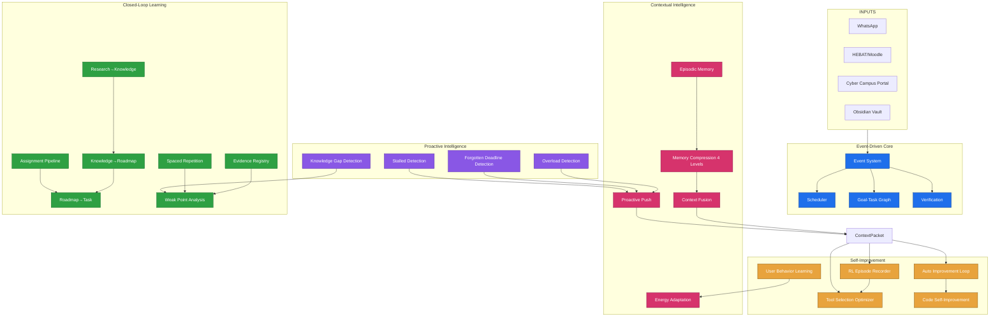

# Xninetzy MCP — V2 Production Autonomy Roadmap

**Tujuan:** Transformasi Xninetzy dari production-ready MCP server (V1) menjadi autonomous Learning OS dan Life OS yang proactive, context-aware, dan self-improving.

**Prasyarat:** V1 complete (knowledge_answer fix, DuckDuckGo/yt-dlp/paper search gratis, output standard, idempotency, dokumentasi OSS, CI/CD).

**Basis data:** MCP usability review, gap analysis, V1 roadmap, dokumentasi internal.
**Target V2 rilis:** Q3 2027 (4-6 bulan setelah V1).

---

## V2 Pillars

```
V2 = Event-Driven Core + Closed-Loop Learning + Contextual Intelligence + RL Self-Improvement
      │                      │                         │                          │
      │  Event System        │  Research→Obsidian→     │  Episodic Memory         │  RL Episode Recorder
      │  Scheduler           │  Graph→Roadmap→Task→    │  Context Fusion           │  Automated Improvement
      │  Goal-Task Graph     │  Recall→Quiz→Mastery    │  Memory Compression       │  Code Self-Improve
      │  Proactive Loops     │  Assignment Pipeline    │  Proactive Push           │  User Behavior Learning
      │  Verification        │  Evidence Registry      │  Energy-Aware             │
```

---

## Milestone V2

### Milestone 0: V1 Foundation Hardening (Pra-V2, 2 minggu)

Sebelum V2 dimulai, pastikan V1 benar-benar solid. V2 BANGUN DI ATAS V1, bukan di sampingnya.

**Checklist masuk V2:**
```
[ ] knowledge_answer(query) → synthesized answer dengan confidence
[ ] web_search(query) → DuckDuckGo, return real results, tanpa API key
[ ] youtube_search(query) → yt-dlp, return real results, tanpa API key
[ ] research_search_papers(query) → arXiv + CrossRef, return paper metadata
[ ] Semua tool return structured JSON melalui MCP
[ ] Semua error return format standar: {status, code, message}
[ ] Testing coverage ≥ 80%
[ ] CI/CD hijau
[ ] Developer onboarding < 5 menit
[ ] Tag v1.0.0 sudah dirilis
```

Jika salah satu belum, **V2 belum bisa dimulai**. V2 butuh fondasi yang kokoh.

---

### Milestone 1: Event-Driven Core (Minggu 1-4)

**Goal:** Sistem bisa mendeteksi perubahan state, memicu workflow otomatis, dan memverifikasi hasil. Ini adalah fondasi untuk semua automation di V2.

#### 1.1 Event System

**Akar masalah (dari gap analysis):** Tidak ada event system. Setiap tool berjalan sendiri. Tidak ada cara untuk mendeteksi "habis sync HEBAT, ada tugas baru" atau "task sudah overdue 3 hari".

**Arsitektur:**

```
┌─────────────┐     ┌──────────────┐     ┌───────────────┐
│ Event Source │────▶│ Event Bus    │────▶│ Event Handler  │
│              │     │ (SQLite)     │     │ Registry       │
│  • tool call │     │              │     │                │
│  • scheduler │     │  event_id    │     │  handler_id    │
│  • webhook   │     │  source      │     │  event_type    │
│  • external  │     │  type        │     │  priority      │
│              │     │  payload     │     │  workflow_ref  │
│              │     │  severity    │     │  cooldown      │
│              │     │  created_at  │     │  max_retry     │
└─────────────┘     └──────────────┘     └───────────────┘
                            │
                            ▼
                     ┌──────────────┐
                     │ Event Log    │
                     │ (analytics)  │
                     │  handled_at  │
                     │  result      │
                     │  duration_ms │
                     └──────────────┘
```

**Tabel:**
```sql
CREATE TABLE events (
    event_id TEXT PRIMARY KEY,          -- hash(source + type + timestamp)
    source TEXT NOT NULL,                -- 'hebat_sync', 'task_system', 'habit_tracker', 'research', 'portal', 'scheduler'
    event_type TEXT NOT NULL,            -- 'assignment.new', 'task.overdue', 'habit.missed_3days', 'research.completed'
    payload TEXT NOT NULL,               -- JSON: { entity_id, entity_type, summary, metadata }
    severity INTEGER DEFAULT 3,         -- 1 (critical) - 5 (info)
    created_at TEXT NOT NULL,            -- ISO 8601
    ttl_seconds INTEGER DEFAULT 86400    -- auto-expire setelah 24 jam
);

CREATE TABLE event_handlers (
    handler_id TEXT PRIMARY KEY,
    event_type TEXT NOT NULL,
    priority INTEGER DEFAULT 5,         -- 1 (highest) - 10 (lowest)
    workflow_name TEXT,                  -- workflow yang di-trigger
    cooldown_seconds INTEGER DEFAULT 0, -- minimal interval antar eksekusi
    max_retry INTEGER DEFAULT 3,
    enabled INTEGER DEFAULT 1,
    created_at TEXT NOT NULL
);

CREATE TABLE event_log (
    log_id TEXT PRIMARY KEY,
    event_id TEXT NOT NULL REFERENCES events(event_id),
    handler_id TEXT NOT NULL REFERENCES event_handlers(handler_id),
    status TEXT NOT NULL,                -- 'pending', 'running', 'success', 'failed', 'skipped'
    result TEXT,                         -- JSON output
    error TEXT,                          -- error message if failed
    attempt INTEGER DEFAULT 1,
    duration_ms INTEGER,
    created_at TEXT NOT NULL,
    FOREIGN KEY (event_id) REFERENCES events(event_id)
);
```

**Event types (V2 scope):**

| Event Type | Source | Severity | Trigger |
|---|---|---|---|
| `assignment.new` | HEBAT sync | 2 | Tugas baru terdeteksi |
| `assignment.deadline_approaching` | Scheduler | 1 | Deadline < 48 jam |
| `task.overdue` | Scheduler | 2 | Task lewat deadline |
| `task.completed` | task_complete | 4 | Task selesai |
| `goal.stalled` | Scheduler | 2 | Goal no progress > 7 hari |
| `habit.missed` | Scheduler | 3 | Habit terlewat 3+ hari |
| `research.completed` | Research pipeline | 3 | Deep research selesai |
| `study.session_completed` | Learning session | 4 | Sesi belajar selesai |
| `recall.due` | Scheduler | 3 | Recall card jatuh tempo |
| `knowledge.ingested` | Knowledge ingest | 4 | File/dokumen baru diingest |
| `portal.session_expired` | Portal checker | 2 | Session portal kedaluwarsa |
| `system.error_rate_high` | Monitoring | 1 | Error rate > 5% |

**Tools baru:**
- `system_event_emit(source, type, payload, severity)` — emit event (dipanggil internal)
- `system_event_list(event_type, status, limit)` — list events
- `system_event_handler_register(event_type, workflow_name, priority)` — register handler
- `system_event_handler_unregister(handler_id)`

**Verifikasi:**
- [ ] Emit event → event tercatat di tabel
- [ ] Event dengan handler → workflow terpanggil
- [ ] Handler cooldown → tidak trigger ulang dalam interval
- [ ] Error handler → retry sampai max_retry
- [ ] Event expired → tidak diproses

#### 1.2 Goal-Task Dependency Graph

**Akar masalah (dari gap analysis):** Goals dan tasks terisolasi. Tidak ada cara untuk tahu "task X ini bagian dari goal Y" atau "goal Z stalled karena task dependencies belum selesai".

**Tabel baru:**
```sql
ALTER TABLE tasks ADD COLUMN goal_id INTEGER REFERENCES goals(goal_id);
ALTER TABLE tasks ADD COLUMN estimated_minutes INTEGER DEFAULT 30;
ALTER TABLE tasks ADD COLUMN depends_on_task_ids TEXT DEFAULT ''; -- JSON array

CREATE TABLE goal_hierarchy (
    parent_goal_id INTEGER NOT NULL REFERENCES goals(goal_id),
    child_goal_id INTEGER NOT NULL REFERENCES goals(goal_id),
    relationship TEXT DEFAULT 'subgoal', -- 'subgoal', 'milestone', 'prerequisite'
    PRIMARY KEY (parent_goal_id, child_goal_id)
);
```

**Tools baru:**
- `goal_link_task(goal_id, task_id)` — hubungkan task ke goal
- `goal_link_goals(parent_id, child_id, relationship)` — hierarki goal
- `goal_dependency_graph(goal_id)` — visualisasi dependency tree
- `goal_health_check(goal_id)` — analisis: "goal ini stalled karena task X dan Y belum selesai"
- `task_set_dependency(task_id, depends_on_ids)` — set task dependencies

**Impact analysis engine:**
- Jika task A delayed → task mana yang terpengaruh?
- Goal mana yang terancam?
- Rekomendasi: task mana yang harus diprioritaskan?

**Verifikasi:**
- [ ] Goal dengan sub-goal terdeteksi di `goal_dependency_graph`
- [ ] Task dengan dependency diblokir sampai dependency selesai
- [ ] Impact analysis untuk delayed task
- [ ] API output: JSON tree, bukan Markdown prose

#### 1.3 Scheduler & Proactive Loops

**Akar masalah (dari gap analysis):** Morning briefing, evening review, weekly review semua manual. Tidak ada yang berjalan otomatis.

**Arsitektur:**

```
┌──────────────┐    ┌──────────────┐    ┌──────────────┐
│ APScheduler   │───▶│ Scheduler     │───▶│ Workflow      │
│ (interval)   │    │ Registry     │    │ Executor     │
│              │    │              │    │              │
│ daily 07:00  │    │ briefing_job │    │ os_today +   │
│ daily 21:30  │    │ review_job   │    │ hebat_digest │
│ weekly Sun   │    │ weekly_job   │    │ → wa_send    │
│ every 15min  │    │ event_poller │    │              │
└──────────────┘    └──────────────┘    └──────────────┘
```

**Scheduled jobs:**

| Job ID | Time | Pipeline | Description |
|---|---|---|---|
| `morning_briefing` | 07:00 daily | `os_today` + `hebat_academic_digest` + `event_list(severity<=2)` → format → `wa_send_text` | Ringkasan hari ini |
| `midday_replan` | 13:00 daily | `task_today` (remaining) + `energy_check` → adjust plan | Replan siang |
| `evening_review` | 21:30 daily | `daily_review_generate` + `habit_today` + `workout_summary` → `obsidian_append` to daily note | Review harian |
| `weekly_review` | Minggu 20:00 | `goal_list` + `learning_review_week` + `money_summary` + `workout_summary` + pattern analysis → format → `wa_send_text` | Review mingguan |
| `event_poller` | Every 15 min | Poll events with pending handlers → execute | Event processor |
| `deadline_scanner` | Every 6 jam | Check upcoming deadlines → emit event | Deadline detector |
| `health_check` | Every 1 jam | `lightning_healthcheck` + error rate check → emit event if issues | System health |

**Tools baru:**
- `scheduler_job_list()` — tampilkan semua scheduled jobs
- `scheduler_job_toggle(job_id, enabled)` — enable/disable job
- `scheduler_job_run_now(job_id)` — jalankan job sekarang
- `scheduler_job_set_time(job_id, cron_expression)` — ubah jadwal

**Verifikasi:**
- [ ] Morning briefing terkirim otomatis jam 07:00
- [ ] Evening review terkirim jam 21:30
- [ ] Weekly review terkirim hari Minggu
- [ ] Event poller memproses event dalam < 1 menit
- [ ] User bisa disable job individual
- [ ] Error di satu job tidak mengganggu job lain

#### 1.4 Verification & Self-Healing

**Akar masalah (dari gap analysis):** Tidak ada action log, tidak ada verification step, tidak ada retry mechanism.

**Tabel:**
```sql
CREATE TABLE action_log (
    action_id TEXT PRIMARY KEY,
    tool_name TEXT NOT NULL,
    input JSON NOT NULL,
    expected_result TEXT,               -- description of expected outcome
    actual_result TEXT,                  -- actual outcome
    status TEXT NOT NULL DEFAULT 'pending', -- 'pending', 'success', 'failed', 'rolling_back'
    attempt_count INTEGER DEFAULT 1,
    max_attempts INTEGER DEFAULT 3,
    error TEXT,
    rollback_action TEXT,               -- tool name for rollback
    rollback_input JSON,
    rollback_status TEXT,               -- 'pending', 'success', 'failed', 'not_needed'
    created_at TEXT NOT NULL,
    completed_at TEXT,
    verified_at TEXT
);
```

**Verification patterns:**
- Create: cek entity exists setelah create
- Update: cek field berubah sesuai input
- Delete: cek entity tidak ada lagi
- Search: cek result count > 0
- Send: cek delivery status (untuk WhatsApp)

**Tools baru:**
- `system_action_log(status, tool_name, limit)` — lihat action log
- `system_action_retry(action_id)` — retry failed action
- `system_action_rollback(action_id)` — rollback action

**Verifikasi:**
- [ ] Setiap tool call tercatat di action_log
- [ ] Verification step setelah setiap mutasi
- [ ] Retry otomatis untuk transient failures
- [ ] Rollback untuk partial failures
- [ ] Action log bisa diquery

---

### Milestone 2: Closed-Loop Learning (Minggu 5-10)

**Goal:** Pipeline otomatis dari research → knowledge → graph → roadmap → task → study → recall → mastery. Siklus belajar menjadi closed loop tanpa intervensi manual.

#### 2.1 Research-to-Knowledge Pipeline

**Akar masalah (dari gap analysis):** Research selesai, hasilnya cuma teks. Tidak otomatis tersimpan ke knowledge base, graph, atau Obsidian.

**Workflow:**

```
research.completed event
  → knowledge_ingest_text(brief_title, brief_content)
  → obsidian_save_note(title, content, folder="Research")
  → graph_add_node(research_brief, ...)
  → graph_link_research_to_roadmap(research_node, related_roadmap)
  → event: knowledge.ingested
```

**Tools baru:**
- `learning_integrate_research(brief_id)` — satu tool yang jalanin seluruh pipeline

**Verifikasi:**
- [ ] Research selesai → otomatis ke knowledge + Obsidian + graph
- [ ] Tool bisa dipanggil manual juga
- [ ] Idempotent: research yang sama tidak duplikat

#### 2.2 Knowledge-to-Roadmap Pipeline

**Akar masalah (dari gap analysis):** Knowledge base penuh, tapi tidak otomatis jadi rencana belajar.

**Workflow:**

```
knowledge.ingested event
  → analisis topik dari konten
  → cari roadmap yang cocok atau buat draft roadmap baru
  → buat concept nodes di graph
  → link konsep ke source knowledge
  → learning_create_roadmap(draft=true)
  → request approval (HITL) untuk aktivasi
```

**Tools baru:**
- `learning_roadmap_from_knowledge(source_id)` — generate roadmap dari knowledge source

**Verifikasi:**
- [ ] Knowledge ingest → deteksi topik baru → saran roadmap
- [ ] Draft roadmap butuh approval sebelum aktif
- [ ] User bisa set preference: auto atau manual

#### 2.3 Roadmap-to-Task Pipeline

**Akar masalah (dari gap analysis):** Roadmap dibuat, task tidak otomatis ter-generate.

**Workflow:**

```
roadmap.activated event
  → untuk tiap konsep di roadmap:
      → learning_define_concept
      → learning_create_recall_card
      → task_capture(concept_title, due_at=jadwal)
      → task_set_dependency(mengikuti prerequisite)
  → notify user: "Roadmap X siap dengan N task"
```

**Tools baru:**
- `learning_roadmap_activate(roadmap_id)` — aktivasi roadmap + auto-create tasks + recall cards

**Verifikasi:**
- [ ] Aktivasi roadmap → task tergenerate sesuai konsep
- [ ] Task dependencies mengikuti prerequisite
- [ ] Recall cards terbuat untuk tiap konsep

#### 2.4 Assignment Intelligence Pipeline

**Akar masalah (dari gap analysis):** Tugas HEBAT baru muncul, tidak ada proses otomatis untuk breakdown, estimasi, dan scheduling.

**Workflow:**

```
assignment.new event
  → download instruksi + material (hebat_get_assignment_detail + hebat_download_material)
  → ekstrak requirement (LLM parsing dari deskripsi)
  → identifikasi deliverable
  → estimasi difficulty & durasi (berdasarkan historical data)
  → cek kalender & task aktif (os_today + task_list)
  → pecah jadi subtasks
  → cari referensi dari knowledge base + web search
  → buat reminder deadlines subtask
  → notify user: "Tugas X terdeteksi. Saya buatkan 5 subtask dengan deadline H-3."
```

**Tools baru:**
- `hebat_process_new_assignment(assignment_id)` — pipeline assignment lengkap
- `assignment_estimate_difficulty(assignment_id)` — estimasi kesulitan
- `assignment_generate_subtasks(assignment_id)` — generate subtasks

**Verifikasi:**
- [ ] Assignment baru → subtask auto-generated
- [ ] Estimasi difficulty akurat (dibanding manual judgment)
- [ ] Referensi relevan dari knowledge base
- [ ] Deadline subtask masuk akal

#### 2.5 Evidence Registry

**Akar masalah (dari gap analysis):** Knowledge base menyimpan chunks, bukan claims. Tidak ada cara untuk tracking "klaim mana yang sudah terverifikasi" dan "sumber mendukung atau tidak".

**Tabel:**
```sql
CREATE TABLE evidence_claims (
    claim_id TEXT PRIMARY KEY,
    claim_text TEXT NOT NULL,
    topic TEXT NOT NULL,
    confidence TEXT DEFAULT 'medium',     -- 'high', 'medium', 'low', 'unverified'
    last_verified_at TEXT,
    verification_count INTEGER DEFAULT 0,
    created_at TEXT NOT NULL
);

CREATE TABLE evidence_sources (
    source_id TEXT PRIMARY KEY,
    claim_id TEXT NOT NULL REFERENCES evidence_claims(claim_id),
    source_type TEXT NOT NULL,             -- 'paper', 'web', 'knowledge', 'book', 'expert'
    source_ref TEXT NOT NULL,              -- DOI, URL, knowledge_source_id
    support_level TEXT DEFAULT 'support',  -- 'support', 'contradict', 'neutral', 'unclear'
    reading_status TEXT DEFAULT 'abstract',-- 'abstract', 'full_text', 'verified'
    extracted_at TEXT NOT NULL,
    FOREIGN KEY (claim_id) REFERENCES evidence_claims(claim_id)
);
```

**Tools baru:**
- `evidence_claim_create(claim_text, topic)` — buat claim baru
- `evidence_claim_attach_source(claim_id, source_type, source_ref, support_level)` — attach source
- `evidence_claim_verify(claim_id)` — verifikasi claim berdasarkan attached sources
- `evidence_claim_search(topic, confidence)` — cari claims
- `evidence_claim_reverify_due()` — claims yang perlu diverifikasi ulang (outdated)

**Verifikasi:**
- [ ] Claim dengan 3+ supporting sources → confidence = high
- [ ] Claim dengan contradicting sources → flagged for review
- [ ] Claim > 6 bulan tanpa reverifikasi → due for reverification
- [ ] Evidence registry bisa di-search

#### 2.6 Weak Point Analysis & Adaptive Focus

**Akar masalah (dari gap analysis):** Mastery score ada tapi cuma aggregate. Tidak ada analisis "konsep mana yang paling lemah" dan "rekomendasi belajar selanjutnya."

**Tools baru:**
- `learning_weak_points(roadmap_id)` — analisis weak points dari recall accuracy + quiz + study sessions
- `learning_next_focus(roadmap_id)` — rekomendasi konsep berikutnya berdasarkan weak points + prerequisites + deadline

**Algoritma rekomendasi (deterministik, bukan LLM):**
1. Cari konsep dengan mastery terendah
2. Prioritaskan konsep yang prerequisites-nya sudah terpenuhi
3. Pertimbangkan deadline (tugas HEBAT yang butuh konsep ini)
4. Pertimbangkan energi user (energi rendah → konsep ringan)
5. Return top 3 rekomendasi

**Verifikasi:**
- [ ] Weak point analysis akurat (compare dengan quiz results)
- [ ] Rekomendasi mengikuti prerequisite chain
- [ ] Deadline-aware: konsep untuk tugas HEBAT diprioritaskan

---

### Milestone 3: Contextual Intelligence (Minggu 7-12, overlap dengan M2)

**Goal:** Sistem memahami konteks penuh kehidupan user — masa lalu (memory), sekarang (working context), dan masa depan (goals + deadlines).

#### 3.1 Multi-Modal Context Fusion

**Akar masalah (dari gap analysis):** Agent harus manggil 3-4 tool terpisah untuk dapet konteks lengkap. Tidak ada `context_fuse` yang return semuanya dalam satu panggilan.

**Arsitektur:**

```
context_fuse(query)
  │
  ├── memory_get_context(query)         → semantic memory
  ├── os_today()                         → personal context (goals, tasks, deadlines)
  ├── knowledge_search(query)           → knowledge base
  ├── graph_get_context(query)          → graph relationships
  ├── event_list(severity<=2, limit=5)  → urgent events
  └── learning_weak_points()            → learning gaps
  │
  └── WeightedRanker
        ├── relevance score per sumber
        ├── deduplication
        ├── context budget management
        └── priority boost untuk urgent items
```

**Tools baru:**
- `context_fuse(query)` — return ContextPacket lengkap

**ContextPacket output contract:**
```json
{
  "query": "apa itu N-BEATS?",
  "personal": {
    "active_goals": [],
    "today_tasks": [],
    "upcoming_deadlines": [],
    "energy_level": 3
  },
  "knowledge": {
    "evidence": [],
    "confidence": "high"
  },
  "memory": [],
  "graph": {
    "nodes": [],
    "edges": []
  },
  "events": [],
  "learning": {
    "weak_points": [],
    "next_focus": ""
  },
  "metadata": {
    "sources_consulted": ["memory", "knowledge", "graph"],
    "runtime_ms": 234,
    "budget_used": "65%"
  }
}
```

**Verifikasi:**
- [ ] context_fuse return semua sumber dalam 1 panggilan
- [ ] Relevance scoring: hasil yang tidak relevan tidak muncul
- [ ] Context budget: total output < 4000 token
- [ ] Deduplication: konten sama dari 2 sumber tidak dobel

#### 3.2 Episodic Memory System

**Akar masalah (dari gap analysis):** Memory yang ada hanya semantic (fakta) dan procedural (rules). Tidak ada episodic memory: "kemarin pas belajar X, saya struggle di bagian Y."

**Tabel:**
```sql
CREATE TABLE episodic_memories (
    episode_id TEXT PRIMARY KEY,
    episode_type TEXT NOT NULL,           -- 'study_session', 'task_completion', 'error', 'decision', 'insight'
    summary TEXT NOT NULL,                -- ringkasan otomatis
    outcome TEXT,                         -- 'success', 'partial', 'failed'
    reflection TEXT,                      -- user reflection atau auto-reflection
    concepts_involved TEXT,               -- JSON array of concept IDs
    emotional_context TEXT,               -- energy level, mood saat itu
    source_tool TEXT,                     -- tool yang menghasilkan episode ini
    source_id TEXT,                       -- reference ID (session_id, task_id, dll)
    created_at TEXT NOT NULL,
    consolidated_at TEXT                  -- kapan dipromosikan ke semantic memory
);
```

**Tools baru:**
- `episodic_record(event_type, summary, outcome, concepts, emotional_context)` — catat episode
- `episodic_search(query, event_type, limit)` — cari episode
- `episodic_patterns(event_type, time_range)` — deteksi pola dari episode
- `episodic_consolidate()` — kompresi: episode lama → semantic memory

**Auto-recording triggers (dari event system):**
- `study.session_completed` → record episode
- `task.completed` → record episode
- `system.error` → record episode (error berulang → pattern detection)
- `knowledge_answer` low confidence → record episode (gap knowledge)

**Verifikasi:**
- [ ] Study session selesai → episode tercatat
- [ ] Bisa search "kemarin belajar apa"
- [ ] Pattern detection: "kamu sering struggle di probability concepts"
- [ ] Konsolidasi: episode > 30 hari → semantic memory

#### 3.3 Memory Compression Pipeline (4 Levels)

**Akar masalah (dari gap analysis):** Memory cuma 2 level (chat history = working, memory table = semantic). Tidak ada kompresi atau promosi antar level.

**Pipeline:**

```
Working Memory (chat history, raw)
  │  auto-summarize setiap N messages
  ▼
Episodic Memory (session summaries, decisions, outcomes)
  │  auto-consolidate setiap M hari
  ▼
Semantic Memory (facts, concepts, verified knowledge)
  │  auto-pattern-detect setiap minggu
  ▼
Procedural Memory (rules, preferences, skills, workflows)
```

**Tools baru:**
- `memory_compress()` — jalankan kompresi manual
- `memory_level(query)` — cari di level spesifik
- `memory_stats()` — statistik tiap level

**Verifikasi:**
- [ ] Chat history > 50 pesan → auto-summary
- [ ] Episode > 30 hari → consolidated ke semantic
- [ ] Pattern mingguan → procedural rule suggestion
- [ ] Query di level bawah tetap return hasil

#### 3.4 Proactive Context Push

**Akar masalah (dari gap analysis):** Sistem cuma reaktif. User harus nanya dulu. Tidak ada push notification untuk hal penting.

**Policies:**

| Condition | Action | Cooldown |
|---|---|---|
| Deadline < 24 jam | "Tugas X deadline besok! Progress: Y%" | 6 jam |
| Task overdue > 3 hari | "Task X sudah overdue 3 hari. Masih relevan?" | 24 jam |
| Goal no progress > 7 hari | "Goal X tidak ada progress seminggu. Mau adjust?" | 7 hari |
| Habit missed > 3 hari berturut | "Kamu sudah 3 hari tidak [habit]. Butuh bantuan?" | 3 hari |
| Energy rendah 3+ hari berturut | "Energi kamu rendah 3 hari ini. Ada yang bisa dibantu?" | 7 hari |
| New research completed | "Research X selesai. Mau saya buatkan roadmap?" | 1x per research |

**Tools baru:**
- `proactive_push_list()` — lihat push notifications yang akan dikirim
- `proactive_push_dismiss(push_id)` — dismiss notification
- `proactive_push_policy(status, action)` — atur policy

**Verifikasi:**
- [ ] Deadline approaching → push notification terkirim
- [ ] Cooldown respected (tidak spam)
- [ ] User bisa dismiss
- [ ] User bisa atur policy "jangan push di atas jam 22"

---

### Milestone 4: RL + Self-Improvement Engine (Minggu 10-16, overlap dengan M2+M3)

**Goal:** Sistem belajar dari pengalaman — error, feedback, outcome — dan meningkatkan performa secara otomatis.

#### 4.1 RL Episode Recorder

**Akar masalah (dari gap analysis):** Tidak ada data untuk RL. Setiap keputusan tidak dicatat sebagai (state, action, reward, next_state).

**Tabel:**
```sql
CREATE TABLE rl_episodes (
    episode_id TEXT PRIMARY KEY,
    session_id TEXT,                      -- grouping key untuk satu interaksi
    state_snapshot TEXT NOT NULL,         -- JSON: context sebelum action
    action_tool TEXT NOT NULL,            -- tool yang dipanggil
    action_input TEXT NOT NULL,           -- JSON: tool input
    action_output TEXT,                   -- JSON: tool output
    reward REAL,                          -- -1.0 to 1.0
    reward_source TEXT,                   -- 'user_feedback', 'task_completion', 'error', 'timeout'
    next_state TEXT,                      -- JSON: context setelah action
    created_at TEXT NOT NULL
);
```

**Reward function (deterministik, V2):**
```
+1.0  → Task completed successfully
+0.5  → User memberikan feedback positif
+0.3  → Knowledge_search return high confidence
+0.2  → Tool call sukses
 0.0  → Default (neutral)
-0.3  → Tool call error
-0.5  → User memberikan feedback negatif
-0.7  → Task failed
-1.0  → Repeated error (3+ kali dalam 1 jam)
```

**Tools baru:**
- `rl_record_episode(session_id, state, action, input, output, reward, reward_source)` — record episode
- `rl_episode_search(action_tool, reward_range, limit)` — cari episode
- `rl_stats()` — statistik RL: total episodes, average reward, best/worst tools

**Verifikasi:**
- [ ] Setiap tool call → rl_episode tercatat
- [ ] Reward dihitung otomatis berdasarkan outcome
- [ ] Bisa search episode dengan reward rendah → cari pola error
- [ ] Statistik RL bisa diakses

#### 4.2 Tool Selection Optimizer

**Akar masalah (dari MCP usability review):** Deskripsi tool tidak jelas → agent salah pilih tool → wasted LLM calls + bad UX.

**Pendekatan RL:**
```
State: user query + context packet
Action: tool selection
Reward: apakah tool return useful result?
Policy:权重 adjustment berdasarkan historical reward
```

**Implementation (V2, deterministic):**
- Track tiap tool selection: (query_pattern, tool_name, reward)
- Query pattern normalization: lowercase, hapus stopwords, extract intent keywords
- Ranking: untuk query pattern yang sama, urutkan tools berdasarkan historical reward
- Tool list yang dikirim ke LLM diurutkan berdasarkan ranking ini (bukan alphabetical)

**Tools baru:**
- `rl_tool_ranking(query)` — lihat ranking tools untuk query tertentu
- `rl_tool_ranking_reset()` — reset ranking ke default

**Verifikasi:**
- [ ] Tool yang sering gagal → ranking turun
- [ ] Tool yang sering sukses → ranking naik
- [ ] Ranking persist antar restart
- [ ] Reset mengembalikan ke default

#### 4.3 Automated Improvement Loop

**Akar masalah (dari gap analysis):** Lightning improve ada, tapi manual. User harus trigger. Proposal selalu butuh admin approval.

**Workflow (V2):**

```
[Minggu 20:00, otomatis]
  → lightning_improve()
  → untuk tiap proposal:
      → hitung confidence score:
          - error frequency
          - user impact (berapa kali user kena error ini)
          - risk score (apakah perubahan ini aman?)
      → if confidence >= 0.8 AND risk <= 0.3:
          → auto-apply (tanpa admin)
      → else:
          → request approval via HITL
  → monitor 7 hari post-apply:
      → bandingkan error rate before vs after
      → if error rate naik:
          → auto-rollback proposal
          → notify admin
```

**Tools baru:**
- `lightning_auto_improve()` — jalankan improvement loop otomatis
- `lightning_proposal_confidence(proposal_id)` — hitung confidence score
- `lightning_proposal_risk(proposal_id)` — hitung risk score
- `lightning_monitor(proposal_id)` — monitor hasil improvement

**Verifikasi:**
- [ ] Improvement loop jalan otomatis tiap minggu
- [ ] High confidence + low risk → auto-apply
- [ ] Post-apply monitoring → rollback jika error rate naik
- [ ] Admin tetap bisa approve/reject kapan saja

#### 4.4 Code-Level Self-Improvement

**Akar masalah (dari gap analysis):** Lightning bisa deteksi error tapi tidak bisa fix code. Coding agent sudah ada tapi tidak terhubung.

**Workflow:**

```
Error pattern terdeteksi (3+ occurrences)
  → lightning_improve() → proposal
  → if proposal type == "code_change":
      → coding_agent_run(task=f"Fix {error_pattern} in {file_path}")
      → Codex/Claude Code generates diff
      → Validasi: test dulu
      → if test hijau:
          → apply diff
          → create PR
          → notify admin
      → if test merah:
          → reject diff
          → log ke error analysis
```

**Kondisi sekarang:** `coding_agent_run` sudah ada dan berfungsi. Yang kurang adalah penghubung antara `lightning_improve` → `coding_agent_run`.

**Tools baru:**
- `lightning_propose_code_fix(error_pattern_id)` — generate code fix proposal via coding agent
- `lightning_apply_code_fix(proposal_id)` — apply fix + test

**Verifikasi:**
- [ ] Error pattern → code fix proposal
- [ ] Proposal yang di-apply melalui coding_agent_run
- [ ] Test hijau sebelum apply
- [ ] Rollback jika test gagal

#### 4.5 User Behavior Learning

**Akar masalah (dari gap analysis):** Sistem tidak belajar dari pola interaksi user. Setiap user dapat pengalaman yang sama.

**What to learn (V2):**

| Pattern | Data Source | Learning Output |
|---|---|---|
| Waktu aktif | `daily_checkin` time, chat timestamps | Optimal time untuk task berat |
| Topik favorit | Query frequency per topic | Personalize search ranking |
| Response format preference | User edits / corrections | Adjust style automatically |
| Task completion rate | `task_complete` vs `task_list` | Better effort estimation |
| Ignored suggestions | Proactive push that user dismisses | Adjust suggestion frequency |
| Error tolerance | User reaction to errors | Adjust notification verbosity |

**Tabel:**
```sql
CREATE TABLE user_behavior_insights (
    insight_id TEXT PRIMARY KEY,
    pattern_type TEXT NOT NULL,           -- 'active_hours', 'preferred_topics', 'response_style', dll
    insight_data TEXT NOT NULL,           -- JSON
    confidence REAL DEFAULT 0.5,
    last_updated TEXT NOT NULL,
    sample_size INTEGER DEFAULT 1
);
```

**Tools baru:**
- `learning_insight_list()` — lihat insights tentang user
- `learning_insight_refresh()` — refresh insights dari data terbaru

**Verifikasi:**
- [ ] Setelah 7 hari penggunaan, insights mulai akurat
- [ ] Active hours detected → task scheduling optimized
- [ ] Topik favorit → search ranking adjusted
- [ ] Insights persist antar restart

#### 4.6 Energy-Aware Adaptation

**Akar masalah (dari gap analysis):** `daily_checkin` mencatat energy (1-5) tapi tidak dipakai untuk apapun.

**Adaptation rules (V2, deterministic):**

| Energy | Response Style | Task Suggestion | Notification |
|---|---|---|---|
| 5 (high) | Detail, teknis | Task berat, konsep baru | Semua notifikasi |
| 4 | Normal | Task normal | Semua |
| 3 | Ringkas | Task ringan, review | Prioritaskan urgent |
| 2 | Sangat ringkas | Hanya quick win | Hanya critical |
| 1 (low) | "Mungkin istirahat?" | Istirahat | Jangan ganggu |

**Tools baru:**
- `energy_adapt_now()` — lihat adaptasi saat ini berdasarkan energy terakhir
- `energy_trend(period)` — tren energi (mingguan, bulanan)
- `energy_suggest()` — saran berdasarkan energi (istirahat? task ringan?).

**Verifikasi:**
- [ ] Energy rendah → response lebih singkat
- [ ] Energy rendah → task suggestion lebih ringan
- [ ] Energy trend → detect burnout pattern
- [ ] User bisa override adaptation

---

### Milestone 5: Proactive Intelligence (Minggu 13-18, overlap dengan M3+M4)

**Goal:** Sistem tidak hanya react dan context-aware, tapi juga proactive — mendeteksi masalah sebelum terjadi dan menawarkan solusi.

#### 5.1 Overload Detection

**Pola (deterministik, V2):**
- Total estimated_minutes of pending tasks > available time → overload warning
- Deadline clustering: 3+ deadlines dalam 3 hari → overload warning
- Energy trend: 3+ hari energy <= 2 → burnout risk
- Task completion rate dropping → overload warning

**Tools baru:**
- `system_detect_overload()` — deteksi overload
- `system_suggest_replan()` — saran replan (task mana yang bisa ditunda)

**Verifikasi:**
- [ ] Overload terdeteksi dari task + deadline + energy
- [ ] Replan suggestion masuk akal
- [ ] Notification ke user sebelum overload terjadi

#### 5.2 Forgotten Deadline Detection

**Pola (deterministik):**
- Deadline dalam < 48 jam, task status masih "pending"
- User aktif chat tapi tidak menyentuh task itu
- Task terkait deadline belum di-breakdown

**Tools baru:**
- `system_detect_forgotten_deadlines()` — deteksi deadline terancam

**Verifikasi:**
- [ ] Deadline H-2 tanpa progress → terdeteksi
- [ ] Notification terkirim ke user
- [ ] Saran: breakdown task atau postpone

#### 5.3 Stalled Project Detection

**Pola (deterministik):**
- Goal dengan no progress log > 7 hari
- Task terkait goal tidak ada yang completed dalam 7 hari
- Learning roadmap dengan 0 study session dalam 7 hari

**Tools baru:**
- `system_detect_stalled()` — deteksi stalled goals/roadmaps/projects

**Verifikasi:**
- [ ] Goal tanpa progress 7+ hari → terdeteksi
- [ ] Saran: adjust goal, breakdown task, atau archive

#### 5.4 Knowledge Gap Detection

**Pola (deterministik):**
- `knowledge_answer` dengan confidence rendah untuk topik yang sama berulang
- Recall cards dengan accuracy < 60% untuk konsep yang sama
- Study session yang selalu berakhir dengan "masih bingung"

**Tools baru:**
- `system_detect_knowledge_gaps()` — deteksi gap pengetahuan
- `system_suggest_resources(topic)` — rekomendasi sumber belajar untuk gap

**Verifikasi:**
- [ ] Topik dengan recall accuracy rendah → terdeteksi sebagai gap
- [ ] Saran resource relevan (dari knowledge base + web search)
- [ ] Integrasi dengan learning roadmap: otomatis tambah konsep ke weak points

---

## V2 Release Criteria

V2 dinyatakan rilis jika DAN HANYA JIKA:

```
[ ] V1 foundation hardening complete (all V1 criteria met)
[ ] Event system: events ter-record, handler ter-trigger, cooldown bekerja
[ ] Goal-Task dependency graph: queryable, impact analysis working
[ ] Scheduler: morning briefing, evening review, weekly review otomatis
[ ] Verification: setiap action tercatat + diverifikasi
[ ] Research-to-Knowledge pipeline: research → knowledge + Obsidian + graph
[ ] Assignment intelligence: tugas HEBAT → subtask + estimasi + referensi
[ ] Evidence registry: claims + sources + confidence scoring
[ ] Weak point analysis: akurat, rekomendasi masuk akal
[ ] Context fusion: 1 panggilan = semua konteks
[ ] Episodic memory: auto-record sesi belajar, searchable
[ ] Proactive push: deadline approaching → notification
[ ] RL episode recorder: tiap action terekam + reward
[ ] Automated improvement loop: jalan mingguan, auto-apply untuk low-risk
[ ] Energy-aware adaptation: response + task suggestion berubah sesuai energi
[ ] Overload + forgotten deadline + stalled detection: bekerja
[ ] Integration test: semua pipeline end-to-end
[ ] Dokumentasi V2 complete
[ ] Tag v2.0.0 dibuat
```

---

## V2 Dependency Graph

```
V1 Foundation (PRA-V2)
  │
  ├── Event System (M1)
  │     ├── Scheduler (M1)
  │     ├── Proactive Push (M3)
  │     ├── Overload Detection (M5)
  │     └── Automated Improvement (M4)
  │
  ├── Goal-Task Graph (M1)
  │     ├── Capacity Planning (M5)
  │     └── Stalled Detection (M5)
  │
  ├── Verification (M1)
  │     └── Self-Healing (M1 → M4)
  │
  ├── Research Pipeline (V1 + M2)
  │     ├── Research-to-Knowledge (M2)
  │     ├── Knowledge-to-Roadmap (M2)
  │     └── Assignment Pipeline (M2)
  │
  ├── Evidence Registry (M2)
  │     ├── Knowledge Gap Detection (M5)
  │     └── Weak Point Analysis (M2)
  │
  ├── Context Fusion (M3)
  │     └── ContextPacket → RL State (M4)
  │
  ├── Episodic Memory (M3)
  │     ├── Memory Compression (M3)
  │     └── RL Episode Recorder (M4)
  │
  └── RL Episode Recorder (M4)
        ├── Tool Selection Optimizer (M4)
        ├── Automated Improvement (M4)
        └── Code Self-Improvement (M4)
```

---

## V2 Architecture Diagram (Akhir V2)



---

## V2 Resource Requirements

### Engineering hours

| Milestone | Engineer-weeks | Parallelizable |
|---|---|---|
| Pra-V2: V1 Hardening | 2 | Ya |
| M1: Event-Driven Core | 3-4 | Ya (event ≠ scheduler ≠ graph) |
| M2: Closed-Loop Learning | 4-5 | Partial (pipeline sequential) |
| M3: Contextual Intelligence | 3-4 | Ya (fusion ≠ episodic ≠ push) |
| M4: RL + Self-Improvement | 4-5 | Partial (episode recorder dulu) |
| M5: Proactive Intelligence | 2-3 | Ya (detectors independen) |
| Integrasi + Testing | 2-3 | No |
| Dokumentasi + Release | 1-2 | No |
| **Total** | **21-28** | **~5-6 bulan calendar** |

### External dependencies (baru)

| Dependency | Untuk | License | Risk |
|---|---|---|---|
| `apscheduler` | Scheduler (mungkin sudah ada) | MIT | Low |
| `duckduckgo_search` | Web search (dari V1) | MIT | Low |
| `yt-dlp` | YouTube (dari V1) | Unlicense | Low |
| `arxiv` | Paper search (dari V1) | MIT | Low |

**Zero paid API key** — sama seperti V1. Seluruh V2 menggunakan API gratis atau library open source.

---

## V2 Files

### File baru
```
app/xninetzy/os/events/
├── __init__.py
├── store.py              # CRUD events, handlers, event_log
├── emitter.py            # emit event dari tool calls
└── poller.py             # poll pending events → execute handlers

app/xninetzy/os/episodic/
├── __init__.py
├── store.py              # episodic_memories CRUD
├── recorder.py           # auto-record dari events
├── searcher.py           # search episodes
├── pattern_detector.py   # deteksi pola dari episode
└── consolidator.py       # kompresi → semantic memory

app/xninetzy/os/evidence/
├── __init__.py
├── store.py              # claims + sources CRUD
├── verifier.py           # verifikasi claim based on sources
├── searcher.py           # search claims
└── revalidator.py        # cek claim yang perlu reverifikasi

app/xninetzy/os/scheduler/
├── __init__.py
├── registry.py           # job definitions
├── executor.py           # jalankan job
└── manager.py            # enable/disable/set time

app/xninetzy/os/proactive/
├── __init__.py
├── push.py               # push notification logic
├── policy.py             # push policies (when, what, cooldown)
├── overload.py           # overload detection
├── forgotten.py          # forgotten deadline detection
├── stalled.py            # stalled project detection
└── knowledge_gap.py      # knowledge gap detection

app/xninetzy/os/rl/
├── __init__.py
├── store.py              # rl_episodes CRUD
├── reward.py             # reward function
├── tool_ranking.py       # tool selection optimizer
├── improvement.py        # automated improvement loop
└── code_fixer.py         # code-level self-improvement

app/xninetzy/os/behavior/
├── __init__.py
├── store.py              # user_behavior_insights
├── analyzer.py           # pattern analysis
├── energy.py             # energy-aware adaptation
└── preference.py         # preference learning

tests/unit/test_event_system.py
tests/unit/test_episodic_memory.py
tests/unit/test_evidence_registry.py
tests/unit/test_rl_episode.py
tests/unit/test_goal_dependency_graph.py
tests/unit/test_proactive_push.py
tests/unit/test_overload_detection.py
tests/unit/test_energy_adaptation.py
tests/integration/test_closed_loop_learning.py
tests/integration/test_assignment_pipeline.py
tests/integration/test_auto_improvement_loop.py
tests/mcp_contract/test_v2_tools.py
```

### File dimodifikasi (dari V1)
```
app/xninetzy/tools/registry.py       — tambah tools V2
app/xninetzy/core/config.py          — tambah env vars V2
app/xninetzy/db/migrations.py        — tambah tabel V2
app/xninetzy/context/builder.py      — upgrade ke context_fuse
app/xninetzy/agent/executor.py        — inject event emitter ke tools
app/xninetzy/interfaces/mcp_server.py — V2 tools exposure
```

---

## Apa yang DIDAPAT dari V2

| Kemampuan | V1 | V2 |
|---|---|---|
| Web search | ✅ DuckDuckGo gratis | ✅ Sama |
| YouTube search | ✅ yt-dlp gratis | ✅ + transcript extraction |
| Paper search | ✅ arXiv + CrossRef | ✅ + evidence registry |
| Knowledge answer | ✅ Fix synthesis | ✅ + confidence scoring |
| Goal-Task linkage | ❌ Terisolasi | ✅ Dependency graph |
| Event-driven | ❌ Tidak ada | ✅ Event system |
| Proactive loops | ❌ Manual | ✅ Morning + evening + weekly auto |
| Task auto-processing | ❌ Manual | ✅ Assignment pipeline |
| Episodic memory | ❌ Tidak ada | ✅ Auto-record sesi belajar |
| Context fusion | ❌ 3-4 tool calls | ✅ 1 context_fuse call |
| Weak point analysis | ❌ Tidak ada | ✅ Adaptive learning |
| Evidence tracking | ❌ Raw chunks | ✅ Claim → source → confidence |
| RL self-improvement | ❌ Tidak ada | ✅ Episode recorder + optimizer |
| Auto bug fixing | ❌ Tidak ada | ✅ Lightning → coding agent |
| Energy-aware | ❌ Tidak dipakai | ✅ Response + task adaptation |
| Proactive detection | ❌ Tidak ada | ✅ Overload + deadline + stalled |

---

## Catatan dari MCP Review: Lessons for V2

Dari pengalaman testing 154 tools, berikut yang jadi pedoman untuk V2:

1. **Output JSON dari awal.** Jangan mulai dengan WhatsApp Markdown lalu migrasi. Setiap tool V2 harus return JSON structured.

2. **Event system = safety net.** Event memungkinkan sistem pulih dari error tanpa intervensi user. Investasi di sini akan membayar di seluruh V2.

3. **Deterministik > LLM.** Weak point analysis, overload detection, stalled detection — semua harus deterministic. Jangan pakai LLM untuk logic yang bisa dihitung. LLM untuk synthesis dan explanation saja.

4. **Idempotency adalah hukum.** Setiap tool V2 harus idempotent. Event handler yang crash saat proses harus bisa di-retry tanpa duplikasi.

5. **Context budget management.** Context fusion harus sadar batas token. Jangan kirim semua konteks ke LLM — rank, filter, trim.

6. **HITL untuk semua yang irreversible.** Assignment submission, code change, data deletion — harus ada approval.

7. **Deskripsi tool harus include "when NOT to use".** Ini pelajaran dari MCP review yang menyebabkan agent salah pilih tool.

8. **RL reward harus deterministic.** Jangan pakai LLM untuk menghitung reward. Reward function harus pure function: input → output → score.

---

**Dokumen ini berdasarkan MCP usability review (30 Juli 2026, 154 tools tested, 54 executed), gap analysis, V1 roadmap, dan analisis dokumentasi internal. Target V2: Q3 2027.**
