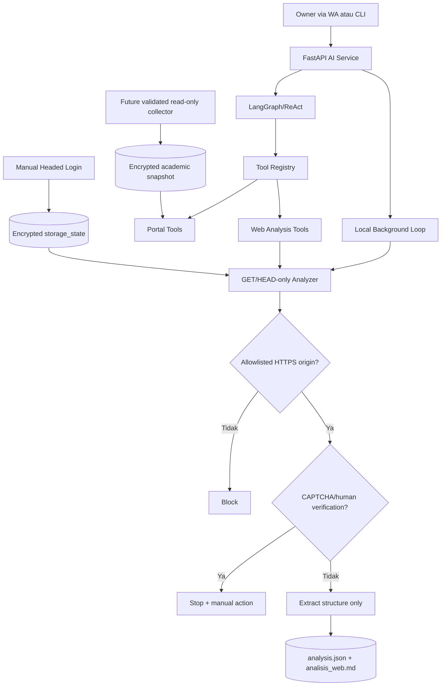

# Planning Web Analysis Agent — Local Single-Owner

## 0. Keputusan Arsitektur

Modul ini hanya untuk satu owner pada satu instalasi Xninetzy. Semua komponen
berjalan lokal sebagai Docker service/background job; tidak ada deployment cloud,
tenant, akun pengguna aplikasi, atau session yang dibagi antar-orang.

Batas permanen:

- hanya situs allowlist: `mahasiswa.unair.ac.id` dan `hebat.elearning.unair.ac.id`;
- analyzer otomatis hanya mengizinkan request `GET`/`HEAD`;
- tidak mengisi form, mengeklik tombol, submit KRS, atau solve CAPTCHA/OTP;
- human verification adalah stop-signal dan menghasilkan status
  `human_verification_required`;
- login dilakukan owner sendiri lewat browser headed;
- cookie/session tetap dienkripsi saat disimpan karena sensitif walaupun mesin lokal.

## 1. Tujuan

1. Menganalisis struktur situs sekali, lalu menyimpan hasil aman ke
   `analisis_web.md`.
2. Menjalankan refresh struktur secara background jika cache stale.
3. Menyimpan session browser dan snapshot akademik lokal secara terenkripsi.
4. Menyediakan tool LangGraph dan slash command untuk status portal serta jadwal.
5. Menjaga KRS sebagai fitur `READ + NOTIFY`; klik final selalu manual.

## 2. Koreksi Penting terhadap Draft Awal

`analisis_web.md` tidak boleh menjadi cache jadwal/nilai/tugas. Markdown tersebut
bersifat cache struktur: selector, nama field, path, hash struktur, endpoint GET/HEAD
yang sudah disanitasi, dan flag keamanan. Data akademik aktual adalah data pribadi;
ia disimpan sebagai snapshot JSON terenkripsi yang terpisah.

```text
/app/data/web-analysis/
├── analyses/
│   ├── hebat/{analysis.json,analisis_web.md}
│   └── mahasiswa/{analysis.json,analisis_web.md}
├── sessions/<site>/<profile-hmac>.storage-state.enc
└── snapshots/<site>/<profile-hmac>.snapshot-<module>.enc
```

Walaupun hanya satu owner, nama profil di-hash dengan HMAC agar identifier lokal
tidak terlihat di nama file.

## 3. Arsitektur Aktual Repo



Kode ditempatkan di `os/web_analysis`, bukan langsung di `tools/`, karena service,
cache, crypto, dan browser adalah kapabilitas OS. File di `tools/ecosystem` tetap
tipis dan hanya mengekspos service ke agent.

## 4. Komponen

### Analyzer

`app/xninetzy/os/web_analysis/analyzer_service.py`:

- validasi slug dan origin terhadap registry statis;
- browser context meng-abort semua method selain GET/HEAD;
- tidak pernah memanggil `fill`, `click`, atau submit;
- link mutating (`logout`, `delete`, `submit`, `editsubmission`, `sesskey`) ditolak;
- network listener hanya menyimpan path, nama query non-sensitif, status, dan
  content type—tidak menyimpan query value;
- isi teks akademik tidak masuk structural cache;
- maksimal halaman, timeout, dan delay dikontrol env.

### Structural Cache

`cache_manager.py` menulis JSON machine-readable dan Markdown human-readable secara
atomic dengan mode `0644` agar owner host dapat membacanya walaupun container berjalan
sebagai root. File ini bebas data pribadi. `structure_hash` dibentuk dari
module/path/selectors/field names/tag counts, bukan isi tabel atau nama mata kuliah.

### Session Lokal

`session_manager.py` memakai Fernet. Jika encryption key kosong/salah, operasi
session gagal tertutup (*fail closed*). Tidak ada fallback plaintext.

Login manual:

```bash
cd services/ai
uv run python -m app.xninetzy.os.web_analysis.cli login --site mahasiswa
uv run python -m app.xninetzy.os.web_analysis.cli login --site hebat
```

Browser harus bisa tampil di mesin host. Owner mengisi credential, CAPTCHA, dan OTP
sendiri. Session hanya disimpan setelah browser sudah berada di origin target dan
halaman login/human verification tidak lagi tampil.

### Snapshot Akademik

`snapshot_manager.py` adalah storage terenkripsi untuk data jadwal/nilai/tugas.
Collector live baru boleh ditambahkan setelah selector authenticated divalidasi
manual. Agent tidak boleh menebak struktur atau menghasilkan jadwal dari
`analisis_web.md`.

### Background Job Lokal

AI service menjalankan `web_analysis_loop()` saat startup. Loop hanya refresh cache
yang stale. Default-nya public/unauthenticated dan interval 360 menit; authenticated
background harus diaktifkan eksplisit setelah session manual siap.

## 5. Interface

Slash command:

- `/web-analysis` atau `/web-analysis <hebat|mahasiswa>` — status cache;
- `/web-refresh <hebat|mahasiswa>` — refresh struktur read-only;
- `/portalinfo` — kesiapan cache/session portal;
- `/jadwal` — baca snapshot jadwal lokal jika sudah tersedia;
- `/krs-watcher` — status fitur dengan batas permanen READ + NOTIFY.

CLI:

```bash
uv run python -m app.xninetzy.os.web_analysis.cli analyze --site hebat
uv run python -m app.xninetzy.os.web_analysis.cli analyze --site mahasiswa --force
uv run python -m app.xninetzy.os.web_analysis.cli status --site mahasiswa
```

## 6. Roadmap Implementasi

### Phase 1 — Foundation

- [x] allowlisted site registry;
- [x] GET/HEAD-only Playwright analyzer;
- [x] structure extraction tanpa page values;
- [x] atomic JSON + `analisis_web.md` cache;
- [x] granular module hash dan TTL;
- [x] CLI analyze/status;
- [x] unit test keamanan/cache.

### Phase 2 — Manual Session

- [x] satu local profile per instalasi;
- [x] encrypted storage state, fail closed;
- [x] headed-browser login handoff;
- [x] CAPTCHA/OTP sebagai tindakan manusia;
- [ ] owner mengisi encryption key dan melakukan login manual aktual;
- [ ] migrasi session plaintext HEBAT lama ke storage baru atau hapus setelah validasi.

### Phase 3 — Agent dan Local Background

- [x] tool registry;
- [x] slash command;
- [x] local background stale refresh;
- [x] personal context membaca snapshot lokal jika tersedia;
- [ ] collector jadwal/nilai/tugas setelah selector authenticated tervalidasi.

### Phase 4 — KRS Watcher

- [x] safety contract/docstring READ + NOTIFY, no submit;
- [ ] validasi selector status slot secara manual;
- [ ] polling lambat dengan change detection;
- [ ] notifikasi WA berisi status dan deep link saja;
- [ ] klik/submit tetap manual selamanya.

### Phase 5 — Packaging Lokal

- [ ] installer/setup command untuk generate local encryption key;
- [ ] health/status local background job;
- [ ] backup/rotation key dengan prosedur eksplisit;
- [ ] dokumentasi update aplikasi tanpa menghapus volume data.

## 7. Definition of Done

- [ ] `analisis_web.md` publik berhasil dihasilkan untuk dua situs dari container;
- [x] tidak ada request mutating dari analyzer;
- [x] query value, credential, cookie, dan page data tidak masuk structural cache;
- [x] human verification menghentikan crawl;
- [x] KRS ditandai DO NOT AUTOMATE;
- [x] session/snapshot fail closed dan terenkripsi;
- [x] single-owner local background loop aktif;
- [ ] login manual aktual dilakukan owner;
- [ ] collector live menghasilkan snapshot jadwal yang tervalidasi;
- [ ] `/jadwal` diuji terhadap snapshot nyata milik owner.

Status checklist sengaja jujur: fondasi dan integrasi aman sudah tersedia, tetapi
authenticated data collector tidak dianggap selesai sebelum login manual dan
selector situs aktual diverifikasi.
