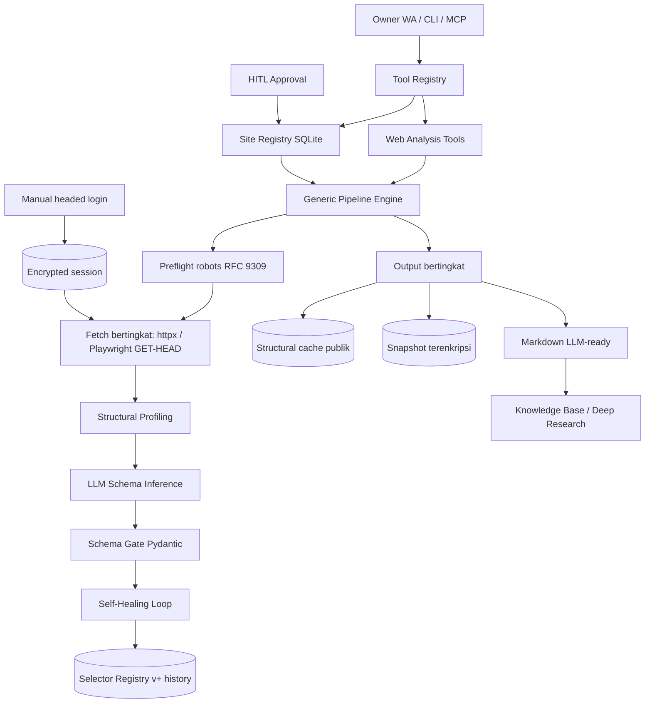

# Xninetzy Web Analyzer Ecosystem Plan — From Allowlist to Analyzer-Any-Web

Last updated: 2026-07-31

Status: draft — hasil deep research + desain arsitektur. Belum ada kode baru.

## 0. Ringkasan Eksekutif

Xninetzy saat ini hanya bisa menganalisis dua situs allowlist statis
(`hebat.elearning.unair.ac.id` dan `mahasiswa.unair.ac.id`) lewat modul
`os/web_analysis` yang GET/HEAD-only, aman, dan terkunci rapat. Plan ini
memperluas kemampuan tersebut menjadi **ekosistem analyzer web yang bisa
menganalisis situs apa pun** — dari portofolio akademik, dokumentasi teknis,
blog, toko online, hingga portal institusi — tanpa mengorbankan prinsip
keamanan yang sudah dibangun.

"Tak terbatas" di sini berarti **unlimited jumlah situs yang bisa dianalisis**,
bukan unlimited akses. Batas permanen (tanpa CAPTCHA bypass, tanpa login
otomatis untuk situs non-allowlist, robots.txt dihormati, rate limit per host,
data pribadi terenkripsi) tetap berlaku dan justru menjadi diferensiator
kepercayaan ekosistem ini.

Arsitektur target: pipeline generik 6 langkah (preflight → fetch berjenjang →
structural profiling → semantic schema inference → self-healing selector →
output bertingkat) plus Site Registry dinamis berbasis SQLite, registry
selector/modul berversi dengan LLM repair gate, dan integrasi dengan deep
research, knowledge base, serta HITL approval owner.

## 1. Keputusan Arsitektur

1. Evolusi dari allowlist statis di kode menjadi **allowlist dinamis di
   database** dengan tiga tier akses (lihat Bagian 3).
2. Analyzer tetap read-only: hanya `GET`/`HEAD`; tidak pernah `fill`, `click`,
   submit, atau solve CAPTCHA/OTP — konsisten dengan contract yang sudah ada.
3. Login otomatis hanya diizinkan untuk situs Tier 0 (allowlist akademik
   dengan session terenkripsi milik owner). Situs lain: public-only. Alasan
   legal: garis pemisah yang menang di pengadilan adalah login wall (hiQ v.
   LinkedIn; Meta v. Bright Data).
4. Human verification adalah stop-signal: status `human_verification_required`,
   notifikasi ke owner, tidak ada usaha bypass (Cloudflare secara eksplisit
   memblokir browser automation; evasion adalah perlombaan senjata yang
   melanggar ToS dan meningkatkan risiko legal).
5. robots.txt dihormati sesuai RFC 9309, termasuk fail-closed: jika robots.txt
   tidak terjangkau karena error 5xx, crawler menganggap complete disallow.
6. LLM dipakai untuk interpretasi dan perbaikan, bukan untuk crawling:
   `scraper → parser → LLM untuk klasifikasi field/schema alignment` — pola
   yang direkomendasikan industri untuk menghindari halusinasi pada data
   deterministik.
7. Output dipisah tegas: structural cache (publik, tanpa data pribadi),
   snapshot konten (terenkripsi bila berisi data pribadi), markdown LLM-ready
   (untuk knowledge base / deep research).
8. Semua komponen tetap lokal single-owner; tidak ada cloud, tenant, atau
   session bersama.

## 2. Temuan Riset yang Mendasari

### 2.1 Dua paradigma ekstraksi web (2025-2026)

- **API-first / managed (Firecrawl)**: URL masuk, keluar Markdown/JSON
  LLM-ready tanpa logika ekstraksi. Kelebihan: cepat untuk RAG. Kekurangan:
  tidak memegang session authenticated dengan baik (stateless), ekstraksi
  LLM dapat halusinasi (mis. salah memetakan harga rekomendasi ke SKU utama),
  dan biaya melonjak di skala besar.
- **Orchestration framework (Crawlee/Scrapy)**: kontrol deterministik penuh
  (RequestQueue, selector, politeness). Kelebihan: presisi data. Kekurangan:
  selector rot — saat situs mengganti class React, spider langsung patah dan
  butuh maintenance manual.
- Kesimpulan: Xninetzy sebaiknya menggabungkan keduanya — **deterministik
  dulu, LLM hanya sebagai repair layer** (lihat 2.3).

### 2.2 Framework OSS yang relevan

- **Crawl4AI** (MIT, Python, 49k+ stars): "Scrapy for LLMs". Punya adaptive
  crawling (tahu kapan berhenti), LLM extraction, virtual scroll, Docker
  self-host. Referensi bagus untuk desain pipeline Python.
- **Scrapling** (Python): adaptive parser dengan **structural profile** —
  saat selector gagal, ia mencocokkan profil struktur (tag, atribut, parent,
  child, teks sekitar, posisi DOM) dan memilih elemen dengan skor kemiripan
  tertinggi. Ini fondasi mekanik self-healing yang deterministik (tanpa LLM).
- **Firecrawl** (AGPL self-host): markdown token-efficient, schema extraction
  via natural language + Pydantic. Contoh output pipeline yang LLM-ready.
- **Playwright MCP** (resmi Microsoft): browser sebagai tool MCP; accessibility
  tree membuat agent memahami halaman tanpa screenshot mahal.
- **Browser Use / Stagehand**: pola agent-loop (observe → plan → act → verify)
  dan primitif `act/extract/observe`. Referensi untuk integrasi browser agentic
  di masa depan.

### 2.3 Self-healing scraper: pola industri

Pola yang konsisten di Kadoa, Harvest, selfhealing-scraper, dan sejenisnya:

1. **Deteksi rot** di layer validasi: ekstraksi mengembalikan null/0 match,
   schema Pydantic gagal, atau page structure berubah.
2. **Repair**: LLM menerima old HTML fragment + new HTML + old selectors,
   lalu mengusulkan selector baru.
3. **Gate validasi**: selector baru diuji terhadap schema dan known-good
   sebelum dipercaya (circuit breaker; jangan sampai scraper "menyembuhkan
   dirinya sendiri sampai rusak").
4. **Persistensi**: riwayat selector disimpan, bisa rollback, owner
   dinotifikasi.
5. **Ekstra**: structural diff (git diff untuk web page), semantic cache
   (cache hasil LLM-extract, invalidasi saat HTML hash berubah, hemat 50-70%
   token), dan script generation satu kali (LLM generate script deterministik
   → 0 token saat runtime).

Frekuensi rot nyata: situs e-commerce populer mengubah layout tiap 4-8 minggu.
Self-healing bukan kemewahan, melainkan syarat agar ekosistem "unlimited sites"
tidak jadi neraka maintenance.

### 2.4 Politeness dan standar

- **RFC 9309 (IETF, Sept 2022)**: standarisasi robots.txt — parser wajib
  membaca minimal 500 KiB, longest-match rule, dan aturan penting: status
  5xx pada robots.txt berarti **complete disallow** (fail closed), bukan
  "bebas crawl".
- **IETF draft crawler best practices (2025)**: User-Agent wajib
  mengidentifikasi crawler + URL deskripsi; crawler tidak boleh mengganggu
  operasi normal situs (per-host rate limiting).
- `Crawl-delay` TIDAK ada di RFC 9309; tiga mesin pencari besar berbeda
  pendapat — jangan bergantung padanya, gunakan rate limit per host sendiri.

### 2.5 Legal: garis yang menang di pengadilan

- **hiQ v. LinkedIn** (9th Circuit, 2022): scraping data publik yang bisa
  dilihat tanpa login umumnya BUKAN pelanggaran CFAA. Tapi hiQ tetap kalah
  di kontrak (ToS) dan membayar $500.000 — jadi "legal" ≠ "bebas risiko".
- **Meta v. Bright Data** (2024): scrap data publik saat logged-out dianggap
  tidak terikat ToS karena scraper bukan "user". **Login wall adalah garis
  pemisah praktisnya.**
- **GDPR**: "publik" bukan pengecualian. Clearview AI kena denda €20 juta
  (CNIL) + €30,5 juta (Dutch DPA) karena scraping data pribadi publik tanpa
  lawful basis. Data pribadi = risiko tertinggi.
- **robots.txt bukan access control**: Ziff Davis v. OpenAI (2025) menyebut
  robots.txt sebagai "permintaan" (keep-off-the-grass sign), bukan barrier
  teknis. Tetap dihormati sebagai etika dan bukti itikad baik, tapi bukan
  pengaman hukum.
- Implikasi desain: (a) public-only untuk situs non-allowlist, (b) minimalkan
  koleksi data pribadi, (c) snapshot terenkripsi + deletion path, (d) jangan
  pernah fake account / login otomatis ke situs pihak ketiga.

### 2.6 Anti-bot: sikap etis

Cloudflare mendokumentasikan bahwa challenge-nya dirancang untuk memblokir
headless browser dan framework automation. Sinyal deteksi: navigator.webdriver,
canvas/WebGL fingerprint, TLS fingerprint (JA3/JA4), HTTP/2 settings, timing
antar-request. Strategi bypass (stealth patch, proxy rotation, CAPTCHA solver)
adalah arms race mahal + pelanggaran ToS. Keputusan: **deteksi → berhenti →
lapor owner**. Ini persis perilaku yang sudah diimplementasikan di analyzer
HEBAT/Mahasiswa.

### 2.7 Deep research agent sebagai konsumen utama

Perplexity Deep Research dan sejenisnya (arXiv: Deep Research Bench,
2506.06287) memakai pola iteratif: search → baca → sintesis. Xninetzy sudah
punya deep research workflow; analyzer generik ini akan menjadi **sumber
evidence baru**: hasil analisis situs (struktur + markdown) bisa diingest ke
knowledge base dan dipakai sebagai evidence bundle di deep research, tanpa
menjadi sumber jawaban mentah.

## 3. Model Tier Akses

| Tier | Definisi | Contoh | Session | Fitur |
|------|----------|--------|---------|-------|
| Tier 0 | Allowlist statis di kode | hebat, mahasiswa | Encrypted manual session (owner) | Full pipeline + snapshot akademik + watcher |
| Tier 1 | Situs terdaftar owner (HITL) | docs.python.org, jurnal favorit | Opsional, manual, per-situs | Full pipeline generik + recipe adapter + monitoring |
| Tier 2 | Analyze-on-demand (URL acak) | satu artikel, satu halaman | Tidak pernah | One-shot public-only, budget kecil, tanpa persistensi jangka panjang |

Registrasi situs baru (Tier 1) membutuhkan konfirmasi owner lewat HITL yang
sudah ada: `hitl_request_approval` → `wa_send_admin_verification`. Dengan ini,
"allowlist" tetap ada — tapi sekarang dikelola pengguna, bukan hardcoded.

## 4. Pipeline Generik (6 Langkah)

```
URL masuk
  │
  1. PREFLIGHT & POLITENESS
  │    - validasi https + format URL
  │    - blocklist domain (malware/phishing, jika API tersedia)
  │    - robots.txt (RFC 9309, cache per host, fail-closed pada 5xx)
  │    - meta robots noindex/nofollow
  │    - budget: max halaman, max kedalaman, max rate, timeout
  │
  2. FETCH BERTINGKAT
  │    - httpx GET ringan (HTML statis / API JSON)
  │    - deteksi JS-heavy → Playwright render (GET/HEAD only)
  │    - abort request mutating di level browser context
  │
  3. STRUCTURAL PROFILING
  │    - DOM → structural fingerprint (tag, atribut, parent, sibling,
  │      teks sekitar, posisi) ala Scrapling
  │    - klasifikasi tipe halaman (docs, article, listing, form, portal)
  │    - ekstraksi metadata: title, meta tags, schema.org, sitemap, links
  │
  4. SEMANTIC SCHEMA INFERENCE (LLM)
  │    - LLM mengklasifikasi field dari halaman yang sudah di-scrape
  │    - output: JSON schema (Pydantic) + deskripsi field
  │    - schema gate: validasi ketat sebelum dipakai (anti-halusinasi)
  │
  5. SELF-HEALING SELECTOR
  │    - deteksi rot: null / 0 match / schema fail
  │    - repair: LLM(old HTML + new HTML + old selectors) → selector baru
  │    - gate: uji terhadap known-good + schema, circuit breaker
  │    - persist + notifikasi + rollback path
  │
  6. OUTPUT BERTINGKAT
  │    - structural cache (publik): modules, paths, selectors, endpoints
  │      sanitasi, structure_hash
  │    - snapshot (terenkripsi, hanya jika data pribadi)
  │    - markdown LLM-ready → knowledge base / deep research
  ▼
  Selesai / human_verification_required / blocked / error
```

## 5. Komponen Ekosistem

### 5.1 Site Registry (SQLite)

Tabel `sites`: slug, tier, base_url, hostname, status (active/paused/blocked),
owner_approved_at, robots_cache_ref, ttl, budget (max_pages, max_rate,
max_depth), auth_profile (hanya Tier 0/1), protection_flags, last_analysis_at,
health.

`get_site()` lama diganti: cek registry dulu, fallback ke SITES statis untuk
Tier 0. Kompatibilitas tool name dijaga (`web_analysis_status`,
`web_analysis_refresh` tetap ada).

### 5.2 Registry Selector & Modul (berversi)

Tabel `selectors` (site_id, module, selector, engine, version, status,
created_at) dan `selector_history` untuk rollback. Self-healing menulis versi
baru hanya setelah gate lolos.

### 5.3 Recipe Adapter (template per tipe situs)

Bukan kode per-situs, melainkan **intent template** yang dipilih otomatis dari
hasil klasifikasi halaman: `docs`, `article/blog`, `ecommerce`, `news`,
`academic_portal`, `generic`. Setiap template mendefinisikan field yang ingin
diekstrak (mis. docs: title, breadcrumb, toc, body markdown). Ini analog pola
"actor" di Apify tapi lokal dan tanpa marketplace.

### 5.4 Pipeline Engine

Async worker + queue SQLite (reuse pola scheduled jobs yang sudah ada),
per-host scheduler dengan rate limiter, lease/at-most-once, supervised loop
dengan failure state observable (konsisten dengan reliability rules repo).

### 5.5 Storage & Crypto

Reuse `session_manager.py` (Fernet, fail closed, tanpa fallback plaintext) dan
`snapshot_manager.py`. Structural cache tetap mode `0644`, bebas data pribadi.

### 5.6 Integrasi

- **Deep research**: hasil markdown bisa jadi bahan evidence; analyzer dipanggil
  dari subplan riset untuk situs tertentu.
- **Knowledge base**: owner bisa mengingest markdown hasil analisis
  (`knowledge_ingest_text`), lengkap dengan citation ke source URL.
- **Personal context**: health situs Tier 1 masuk attention queue bila
  berubah / gagal.
- **HITL**: registrasi situs baru dan penghapusan data snapshot butuh approval.

## 6. Interface Baru

MCP tools (lewat registry, semua interface mendapatkannya otomatis):

- `web_site_register(url, tier=1)` → proposal HITL → approval → entry registry.
- `web_analyze_url(url, intent?)` → one-shot analisis Tier 2.
- `web_site_list()` / `web_site_status(slug)` → status + health.
- `web_analyzer_status()` → status pipeline, queue, cache, rate limit.
- `web_analysis_refresh(site_slug)` → existing, diperluas ke Tier 1.
- `web_site_remove(slug)` → HITL + cleanup snapshot terenkripsi.

Slash commands WhatsApp:

- `/web-analyze <url>` — analisis sekali (Tier 2).
- `/web-add <url>` — daftarkan situs (Tier 1, HITL).
- `/web-sites` — daftar situs terdaftar + health.

CLI (extend `os/web_analysis/cli.py`):

```bash
uv run python -m app.xninetzy.os.web_analysis.cli analyze --url https://example.com
uv run python -m app.xninetzy.os.web_analysis.cli site add --url https://example.com
uv run python -m app.xninetzy.os.web_analysis.cli site list
```

## 7. Arsitektur



## 8. Roadmap Implementasi

### Phase 1 — Generic Fetch & Preflight (4-6 minggu)

- [ ] registry tier + migrasi `get_site()` (Tier 0 tetap jalan, parity test).
- [ ] preflight: validasi URL, robots.txt parser RFC 9309 + cache + fail-closed.
- [ ] meta robots + blocklist dasar (env).
- [ ] fetch bertingkat httpx → Playwright dengan budget (pages/rate/depth/timeout).
- [ ] `web_analyze_url` one-shot Tier 2 + `web_site_register` dengan HITL.
- [ ] unit test: robots 5xx fail-closed, abort mutating, budget enforcement.

Acceptance: analisis satu URL publik menghasilkan structural cache + markdown
tanpa menyentuh halaman yang diblokir robots.txt; tidak ada request non-GET.

### Phase 2 — Structural Profiling & LLM Schema (4-6 minggu)

- [ ] structural fingerprint (tag/attr/parent/position) + similarity matching.
- [ ] klasifikasi tipe halaman (docs/article/ecommerce/news/portal/generic).
- [ ] schema inference LLM + Pydantic schema gate + fallback deterministic.
- [ ] markdown LLM-ready + pipeline metadata.
- [ ] eval set kecil (10-20 situs beragam) untuk akurasi schema.

Acceptance: schema gate menolak output LLM yang tidak lolos validasi; hasil
klasifikasi halaman benar di >= 80% eval set.

### Phase 3 — Self-Healing & Monitoring (4 minggu)

- [ ] deteksi rot (null / 0 match / schema fail) + circuit breaker.
- [ ] LLM repair dengan known-good validation gate + notifikasi owner.
- [ ] selector registry berversi + rollback.
- [ ] health monitoring per situs + attention queue.

Acceptance: selector yang sengaja dipatahkan (mutate class di fixture HTML)
diperbaiki otomatis dan tervalidasi; riwayat selector bisa di-rollback.

### Phase 4 — Ekosistem Recipe & Integrasi (4-6 minggu)

- [ ] recipe template per tipe situs + auto-pick dari klasifikasi.
- [ ] integrasi knowledge base (ingest markdown + citation URL).
- [ ] integrasi deep research (analyzer sebagai sumber evidence).
- [ ] structural diff alerts (perubahan struktur → notifikasi).

Acceptance: satu situs Tier 1 nyata (mis. docs framework yang dipakai owner)
terdaftar, dipantau, dan hasilnya bisa diingest ke knowledge base.

### Phase 5 — Hardening & Skala (berkelanjutan)

- [ ] semantic cache hasil LLM-extract (invalidasi via HTML hash).
- [ ] script generation satu kali (LLM → script deterministik, 0 token runtime).
- [ ] metrics: page fetched, rate-limit hits, repair rate, schema pass rate.
- [ ] backup/restore registry + snapshot; rotation key Fernet.
- [ ] dokumentasi pengguna di apps/docs + contoh command.

## 9. Definition of Done (ekosistem)

- [ ] Situs apa pun (dalam batas tier) bisa dianalisis read-only tanpa perubahan
      kode per-situs.
- [ ] robots.txt RFC 9309 dihormati; 5xx robots.txt → tidak ada request.
- [ ] Tidak ada CAPTCHA solving, stealth patch, atau login otomatis ke situs
      non-allowlist — teruji di unit test keamanan.
- [ ] Data pribadi hanya di snapshot terenkripsi; deletion path jelas.
- [ ] Self-healing punya gate validasi dan rollback; repair yang gagal
      menaikkan alert, bukan menulis selector baru.
- [ ] Semua interface (WA, MCP, CLI, LangGraph) memakai pipeline yang sama
      (parity test).
- [ ] Registrasi situs baru tercatat di HITL dan log audit.

## 10. Risiko & Mitigasi

| Risiko | Mitigasi |
|--------|----------|
| Halusinasi LLM pada ekstraksi | Schema gate + deterministic fallback; LLM hanya klasifikasi/repair |
| Selector rot massal | Self-healing + structural fingerprint; repair hanya setelah gate |
| Site membalas dengan block/IP ban | Rate limit per host, budget, pause otomatis setelah 429/403 |
| Risiko legal (ToS/GDPR) | Public-only Tier 2, minimasi data pribadi, snapshot encrypted, tidak ada fake account |
| Robots.txt fail-closed terlalu ketat | Default aman (disallow total) + alasan tercatat di cache |
| LLM cost membengkak | Semantic cache, script generation, repair jarang (hanya saat rot) |
| Kompleksitas registry vs keamanan | Tier 0 tak tersentuh; Tier 1 butuh HITL; default deny untuk yang tidak terdaftar |

## 11. Pertanyaan Terbuka

1. Apakah Tier 1 boleh menyimpan snapshot konten publik (non-pribadi) tanpa
   enkripsi? (Usulan: ya, dengan TTL dan deletion path.)
2. Perlu blocklist domain via Google Safe Browsing API atau cukup list statis
   env? (Usulan awal: list statis + allowlist opsional.)
3. Batas budget default per situs Tier 1 (halaman/minggu)? (Usulan: 500
   halaman, rate 1 req/2 detik.)
4. Apakah deep research boleh memicu analisis situs baru otomatis (Tier 2)
   tanpa HITL? (Usulan: boleh untuk one-shot Tier 2, tidak untuk Tier 1.)

## 12. Sumber Riset Utama

- RFC 9309 Robots Exclusion Protocol (IETF, 2022) — rfc-editor.org/rfc/rfc9309
- IETF draft-illyes-aipref-cbcp-00 Crawler Best Practices (2025)
- Firecrawl vs Crawlee vs Crawl4AI — firecrawl.dev/blog, blog.apify.com, use-apify.com (2026)
- Crawl4AI docs & repo — github.com/unclecode/crawl4AI
- Scrapling adaptive parser — github.com/D4Vinci/Scrapling, betterstack.com guide (2026)
- Self-healing scraper patterns — dataresearchtools.com (2026), Kadoa blog (2024), Harvest (dev.to, 2026)
- hiQ v. LinkedIn — cdn.ca9.uscourts.gov opinion (2022); Meta v. Bright Data (2024); ringkasan 2026 di linkedinscraperapi.com, apiserpent.com, legalclarity.org
- Clearview AI fines — cnil.fr, Dutch DPA (via ringkasan 2026)
- Cloudflare challenges docs — developers.cloudflare.com (headless automation blocked)
- Deep Research Bench — arXiv:2506.06287 (2025)
- Playwright MCP — github.com/microsoft/playwright-mcp; mcp.directory guide (2026)

## 13. Research Activity (untuk transparansi)

- MCP servers: web_search (DuckDuckGo/Startpage/Bing), websearch cadangan,
  paper_research (arXiv), youtube_search (yt-dlp).
- Queries utama: framework scraping 2025/2026; Firecrawl vs Apify vs Crawlee;
  adaptive/self-healing selectors; RFC 9309 & crawler best practices;
  hiQ/GDPR/robots.txt legal; anti-bot etis; deep research agents; Crawl4AI.
- Sumber yang diperiksa: ~30 hasil web + 2 paper arXiv (Deep Research Bench
  2506.06287; Tree Search 2407.01476) + 12 video YouTube (referensi
  tambahan, bukan bukti ilmiah).
- Keterbatasan: DuckDuckGo sempat gagal (0 results), dialihkan ke
  Startpage/websearch; dokumen legal asli (putusan hiQ) hanya dibaca via
  snippet dan ringkasan sekunder — bukan full text.
- Tidak ada file atau data pribadi owner yang diakses dalam riset ini.
