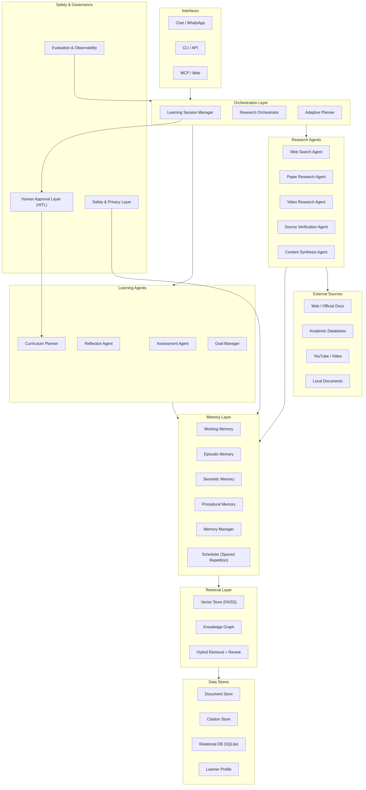
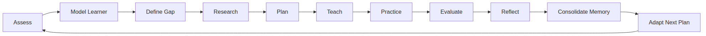
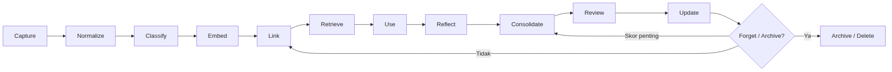
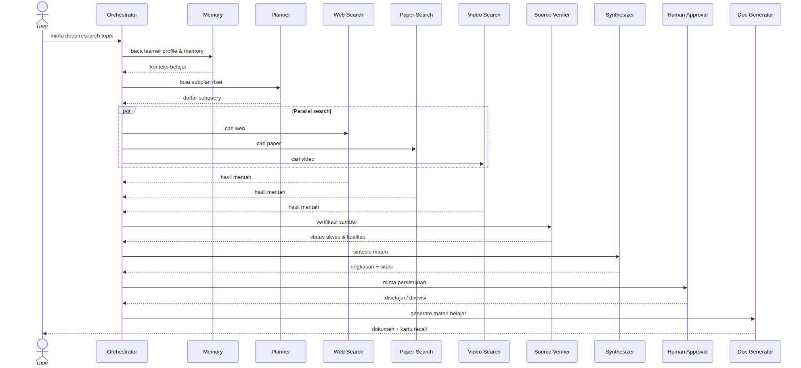

# BAB III METODE DAN PERANCANGAN

Bab ini menyajikan metode penelitian dan rancangan sistem pembelajaran adaptif yang diusulkan. Bagian 3.1 menjelaskan pendekatan penelitian yang dipilih beserta alasannya, bagian 3.2 memaparkan arsitektur umum sistem, bagian 3.3 merinci siklus belajar adaptif, bagian 3.4 menjelaskan perancangan modul automated memory, bagian 3.5 menjelaskan perancangan research agent, bagian 3.6 menyusun rancangan evaluasi yang diusulkan, dan bagian 3.7 membahas rancangan etika, privasi, serta human-in-the-loop. Seluruh uraian pada bab ini merupakan hasil rancangan berbasis literatur; tidak ada eksperimen nyata yang dilaksanakan pada penelitian ini, sehingga seluruh komponen yang belum diuji dinyatakan dengan bahasa rancangan seperti "diusulkan", "dirancang", "skenario", "hipotesis", dan "expected".

## 3.1 Metode Penelitian

Penelitian ini menggunakan pendekatan design science research yang dimaknai sebagai proses iteratif untuk membangun artefak dan mengevaluasinya secara eksplisit. Dalam konteks penelitian ini, pendekatan tersebut dioperasionalkan sebagai rancangan berbasis literatur (literature-based design): artefak yang dibangun adalah arsitektur referensi sistem pembelajaran adaptif beserta spesifikasi modulnya, sedangkan evaluasi dirancang sebagai kerangka evaluasi yang diusulkan (ex-ante) dan belum dilaksanakan. Pemilihan pendekatan ini didasarkan pada empat pertimbangan. Pertama, tujuan penelitian sebagaimana dirumuskan pada rumusan masalah RQ1–RQ8 adalah menghasilkan rancangan yang menjawab pertanyaan "bagaimana" — bagaimana automated memory mempertahankan konteks belajar, bagaimana research agent mengumpulkan dan memverifikasi materi, bagaimana keduanya diintegrasikan ke dalam siklus belajar, dan bagaimana arsitektur tersebut dapat diimplementasikan secara nyata — sehingga luaran utama yang relevan adalah artefak rancangan, bukan temuan empiris. Kedua, keterbatasan penelitian yang telah ditetapkan pada Bab I menyatakan bahwa penelitian ini tidak melaksanakan eksperimen nyata; oleh karena itu, seluruh klaim tentang efektivitas sistem disusun sebagai hipotesis dan skenario yang menunggu pengujian. Ketiga, basis literatur yang terverifikasi menyediakan landasan desain yang memadai: 63 sumber yang tercatat pada source matrix telah diverifikasi metadata, abstrak, atau teks penuhnya, sehingga setiap keputusan desain dapat dirunut ke sumber yang jelas status aksesnya. Keempat, pendekatan ini memungkinkan evaluasi desain dilakukan secara eksplisit sejak tahap perancangan, misalnya dengan memetakan setiap modul terhadap temuan desain dari literatur (Zhou et al., 2026) dan terhadap kebutuhan fungsional yang diturunkan dari rumusan masalah.

Alur metode penelitian dirancang dalam lima tahap, sebagaimana dirangkum pada Tabel 3.1.

**Tabel 3.1** Tahapan metode penelitian

| Tahap | Aktivitas | Luaran |
|---|---|---|
| 1. Analisis literatur | Studi sistematis 63 sumber terverifikasi pada enam ranah (learning science, penjadwalan ulasan, sistem tutor cerdas, automated memory, RAG/research agent, etika-evaluasi); pencatatan status akses (full text, abstrak, metadata, halaman web) | Catatan literatur (literature notes) dan source matrix berformat APA |
| 2. Pemetaan kebutuhan fungsional | Penurunan kebutuhan fungsional dari rumusan masalah RQ1–RQ8 dan celah riset G1–G5 | Daftar kebutuhan fungsional sistem |
| 3. Perancangan arsitektur | Perancangan arsitektur enam lapisan beserta diagram dan deskripsi tiap lapisan | Gambar 3.1 dan spesifikasi lapisan |
| 4. Perancangan modul | Perancangan siklus belajar adaptif, modul automated memory, dan modul research agent | Gambar 3.2–3.4, spesifikasi modul, dan formulasi penjadwalan |
| 5. Perancangan evaluasi | Penyusunan skenario uji S1–S3, metrik, dan instrumen kuesioner yang diusulkan | Tabel skenario, tabel metrik, dan draf kuesioner |

Tahap pertama, analisis literatur, dilakukan dengan menelusuri dan memverifikasi sumber-sumber pada enam ranah yang relevan. Pada ranah learning science, sumber utama meliputi kurva lupa Ebbinghaus (Ebbinghaus, 1913), efek retrieval practice (Karpicke & Roediger, 2008), praktik terdistribusi (Cepeda et al., 2006), serta evaluasi teknik belajar (Dunlosky et al., 2013). Pada ranah penjadwalan ulasan, sumber utama meliputi algoritma SM-2 (Wozniak, 1990), model half-life regression (Settles & Meeder, 2016), dan model DSR FSRS (Ye et al., 2022). Pada ranah sistem tutor cerdas, sumber meliputi Bayesian knowledge tracing (Corbett & Anderson, 1995), deep knowledge tracing (Piech et al., 2015), dan context-aware attentive knowledge tracing (Ghosh et al., 2020). Pada ranah automated memory, sumber meliputi memory stream (Park et al., 2023), virtual context management (Packer et al., 2023), pipeline ekstraksi-pemutakhiran mem0 (Chhikara et al., 2025), serta kerangka empat modul M_sys dan sembilan temuan desain (Zhou et al., 2026). Pada ranah RAG dan research agent, sumber meliputi RAG (Lewis et al., 2020), survei paradigma RAG (Gao et al., 2023), GraphRAG (Edge et al., 2024), dan agentic RAG (Singh et al., 2025). Pada ranah etika dan evaluasi, sumber meliputi panduan UNESCO (Miao & Holmes, 2023), human-in-the-loop (Holzinger, 2016), serangan inferensi keanggotaan pada memori (Chen et al., 2026), dan pertahanan memory poisoning ber-ikatan asal (Louck, 2026). Setiap sumber dicatat status aksesnya karena status akses menentukan tingkat keyakinan klaim yang dapat ditarik: klaim dari teks penuh diperlakukan dengan keyakinan tinggi, sedangkan klaim dari abstrak atau metadata dicatat dengan kualifikasi yang sesuai.

Tahap kedua, pemetaan kebutuhan fungsional, menurunkan kebutuhan sistem dari rumusan masalah dan celah riset. Celah G1 menghasilkan kebutuhan penjadwal ulasan berbasis model memori kognitif yang dapat dilatih; celah G2 menghasilkan kebutuhan kerangka evaluasi ganda (kualitas memori dan hasil belajar); celah G3 menghasilkan kebutuhan research orchestrator yang dipicu oleh gap penguasaan konsep; celah G4 menghasilkan kebutuhan lapisan persetujuan manusia pada titik keputusan konsekuensial; dan celah G5 menghasilkan kebutuhan kebijakan privasi dengan minimalisasi data dan provenance terikat asal (Zhou et al., 2026; Chen et al., 2026; Louck, 2026; Alatrash et al., 2025; Singh et al., 2025). Tahap ketiga dan keempat menghasilkan artefak rancangan yang diuraikan pada bagian 3.2 sampai 3.5. Tahap kelima menyusun rancangan evaluasi pada bagian 3.6, termasuk skenario simulasi retensi, uji groundedness, uji kualitas memori, serta instrumen kuesioner persepsi yang dirancang tetapi tidak dilaksanakan pada penelitian ini.

## 3.2 Arsitektur Umum Sistem

Arsitektur umum sistem yang diusulkan ditunjukkan pada Gambar 3.1. Arsitektur ini dirancang dengan prinsip pemisahan perhatian (separation of concerns) dan paritas antarmuka, yaitu seluruh kemampuan domain diimplementasikan sekali di bawah lapisan antarmuka dan diakses melalui jalur yang sama dari berbagai kanal (T6-06; LangChain, 2025). Secara keseluruhan arsitektur terdiri atas enam lapisan inti — lapisan antarmuka, lapisan orkestrasi, lapisan agen, lapisan memori, lapisan retrieval, dan lapisan penyimpanan data — ditambah sumber eksternal sebagai penyedia bahan riset serta lapisan keamanan dan tata kelola yang berfungsi lintas lapisan.

**Gambar 3.1** Arsitektur umum sistem pembelajaran adaptif yang diusulkan

Lapisan antarmuka (interface layer) menyediakan tiga kanal akses: chat/WhatsApp, CLI/API, dan MCP/web. Ketiga kanal tersebut memanggil jalur eksekusi yang sama melalui katalog alat terpusat sehingga perilaku sistem identik lintas kanal (T6-06). Lapisan ini dirancang agar pengguna dapat berinteraksi secara alami (melalui percakapan) maupun terstruktur (melalui perintah dan API), yang relevan dengan kebutuhan personalisasi dan aksesibilitas pada sistem pembelajaran (Miao & Holmes, 2023).

Lapisan orkestrasi (orchestration layer) merupakan pusat kendali alur kerja yang terdiri atas tiga komponen: learning session manager yang mengelola siklus hidup sesi belajar, research orchestrator yang mengoordinasikan alur riset, dan adaptive planner yang menyusun rencana belajar adaptif. Lapisan ini dirancang sebagai state machine berpersistensi dengan eksekusi tahan lama (durable execution), streaming, dan dukungan human-in-the-loop, mengikuti kemampuan runtime orkestrasi agen stateful (LangChain, 2025). Pada studi kasus Xninetzy OS, pola serupa diimplementasikan dengan node routing dan agen ReAct berbasis LangGraph yang menginjeksikan konteks grounding, konteks personal, memori semantik, aturan, dan gaya (T6-06).

Lapisan agen (agent layer) terbagi menjadi dua kelompok. Kelompok agen pembelajaran terdiri atas assessment agent, reflection agent, curriculum planner, dan goal manager; kelompok agen riset terdiri atas web search agent, paper research agent, video research agent, source verification agent, dan content synthesis agent. Pemisahan ini mengikuti pola multi-agen pada agentic RAG yang mencakup reflection, planning, tool use, dan kolaborasi multi-agen (Singh et al., 2025). Agen pembelajaran bertanggung jawab atas tugas-tugas kognitif dalam siklus belajar (bagian 3.3), sedangkan agen riset bertanggung jawab atas pengumpulan, verifikasi, dan sintesis materi (bagian 3.5).

Lapisan memori (memory layer) menyimpan dan memelihara representasi memori dalam empat tipe — working memory, episodic memory, semantic memory, dan procedural memory — yang dikelola oleh memory manager dan scheduler spaced repetition. Perancangan lapisan ini mengikuti konsep tier memori pada sistem memori agent (Packer et al., 2023), taksonomi sumber, bentuk, dan operasi memori (Zhang et al., 2024), serta kerangka empat modul M_sys = ⟨R, S, Q, U⟩ (Zhou et al., 2026). Rincian perancangan lapisan ini diuraikan pada bagian 3.4.

Lapisan retrieval (retrieval layer) menyediakan tiga mekanisme pencarian yang saling melengkapi: vector store berbasis FAISS, knowledge graph, dan hybrid retrieval dengan reranking. Lapisan ini mengimplementasikan paradigma RAG yang menggabungkan memori parametrik dan non-parametrik (Lewis et al., 2020), strategi pre-retrieval dan post-retrieval (Gao et al., 2023), serta struktur graph untuk pertanyaan yang membutuhkan sintesis global (Edge et al., 2024). Pada studi kasus, retrieval hibrida memadukan FTS5 dan FAISS dengan fusi reciprocal rank fusion (T6-06), sebagaimana diuraikan pada bagian 3.4.5.

Lapisan penyimpanan data (data stores layer) terdiri atas document store untuk dokumen sumber, citation store untuk metadata dan status verifikasi sumber, relational database (SQLite) untuk state sistem, dan learner profile untuk profil pembelajar. Pemisahan penyimpanan ini dirancang untuk mendukung provenance: setiap artefak yang disimpan dapat dirunut ke sumber asalnya, yang merupakan prasyarat pertahanan terhadap memory poisoning (Louck, 2026). Sumber eksternal (external sources) — web/dokumen resmi, database akademik, YouTube/video, dan dokumen lokal — merupakan kanal yang hanya diakses oleh agen riset dan tidak pernah ditulis balik oleh sistem.

Lapisan keamanan dan tata kelola (safety & governance layer) bersifat lintas lapisan dan terdiri atas tiga komponen: human approval layer (HITL) yang menyaring aksi konsekuensial, safety & privacy layer yang melindungi memori dan data pribadi, serta evaluation & observability layer yang mencatat kinerja dan kepatuhan. Lapisan ini merupakan operasionalisasi dari prinsip human oversight pada panduan AI generatif untuk pendidikan (Miao & Holmes, 2023) dan konsep human-in-the-loop pada pembelajaran mesin interaktif (Holzinger, 2016). Pada Gambar 3.1, aliran kendali utama berjalan dari antarmuka ke orkestrasi, kemudian ke agen; agen menulis dan membaca lapisan memori; memori memanfaatkan lapisan retrieval; retrieval mengakses lapisan penyimpanan; agen riset terhubung ke sumber eksternal; approval manusia membatasi aliran dari orkestrasi ke curriculum planner; lapisan keamanan membatasi akses ke memori; dan lapisan observability mengalirkan umpan balik ke orkestrasi.

**Tabel 3.2** Lapisan arsitektur sistem yang diusulkan

| Lapisan | Komponen utama | Fungsi utama |
|---|---|---|
| 1. Antarmuka | Chat/WhatsApp, CLI/API, MCP/Web | Akses multi-kanal dengan perilaku identik (paritas antarmuka) |
| 2. Orkestrasi | Learning Session Manager, Research Orchestrator, Adaptive Planner | Routing, pengelolaan sesi, koordinasi alur riset, penyusunan rencana |
| 3. Agen | Agen pembelajaran (Assessment, Reflection, Curriculum, Goal) dan agen riset (Web, Paper, Video, Verifier, Synthesizer) | Eksekusi tugas kognitif dan pengumpulan-verifikasi-sintesis materi |
| 4. Memori | Working, Episodic, Semantic, Procedural; Memory Manager; Scheduler | Penyimpanan, pemutakhiran, dan pemeliharaan memori |
| 5. Retrieval | Vector Store (FAISS), Knowledge Graph, Hybrid Retrieval + Rerank | Pencarian hibrida dan penyusunan evidence |
| 6. Penyimpanan data | Document Store, Citation Store, Relational DB, Learner Profile | Persistensi state dan provenance |
| Sumber eksternal | Web/dokumen resmi, database akademik, YouTube, dokumen lokal | Bahan baku riset (read-only) |
| Keamanan & tata kelola | HITL, Safety & Privacy, Evaluation & Observability | Kontrol, perlindungan, dan audit lintas lapisan |

Arsitektur ini dirancang untuk menjawab kebutuhan fungsional yang diturunkan pada tahap kedua metode penelitian. Kebutuhan personalisasi dipenuhi oleh lapisan memori dan learner profile; kebutuhan retensi pengetahuan dipenuhi oleh scheduler spaced repetition pada lapisan memori; kebutuhan efektivitas proses belajar dipenuhi oleh siklus adaptif dan research agent yang menghasilkan materi terverifikasi; kebutuhan kontrol pengguna dipenuhi oleh lapisan keamanan dan tata kelola. Dengan demikian, arsitektur pada Gambar 3.1 merupakan jawaban rancangan atas RQ7 (arsitektur implementasi) dan menjadi kerangka bagi rincian modul pada bagian 3.3 sampai 3.5.

## 3.3 Siklus Belajar Adaptif

Siklus belajar adaptif merupakan jantung proses pembelajaran yang diusulkan. Siklus ini dirancang sebagai sebelas tahap yang berputar dalam urutan tetap: Assess (asesmen) → Model Learner (pemodelan pembelajar) → Define Gap (menetapkan celah penguasaan) → Research (riset materi) → Plan (menyusun rencana) → Teach (pengajaran) → Practice (latihan) → Evaluate (evaluasi) → Reflect (refleksi) → Consolidate (konsolidasi) → Adapt (penyesuaian). Urutan siklus ini ditunjukkan pada Gambar 3.2. Setiap tahap memanfaatkan lapisan memori dan retrieval; penjadwalan ulasan pada tahap Consolidate memanfaatkan scheduler spaced repetition yang diuraikan pada bagian 3.4.3.

**Gambar 3.2** Siklus belajar adaptif sebelas tahap yang diusulkan

Tahap Assess melakukan asesmen awal atau asesmen berkala terhadap penguasaan konsep pembelajar. Tahap Model Learner memutakhirkan model pembelajar pada learner profile, termasuk skor penguasaan (mastery) setiap konsep, energi, dan durasi sesi yang tersedia. Tahap Define Gap membandingkan penguasaan aktual terhadap target kurikulum untuk menetapkan celah penguasaan yang paling prioritas. Tahap Research memicu research orchestrator untuk mengumpulkan dan memverifikasi materi yang menutup celah tersebut; perancangan modul riset diuraikan pada bagian 3.5. Tahap Plan menyusun rencana belajar harian secara adaptif berdasarkan celah, ketersediaan waktu, energi, dan konsep yang jatuh tempo ulasannya. Tahap Teach menyajikan materi dalam bentuk yang sesuai dengan model pembelajar, memanfaatkan hasil sintesis research agent. Tahap Practice memberikan latihan aktif, terutama latihan menarik kembali (retrieval practice) yang terbukti meningkatkan retensi jangka panjang (Karpicke & Roediger, 2008; Dunlosky et al., 2013). Tahap Evaluate menilai jawaban latihan dan menghasilkan skor kualitas, termasuk kualitas recall pada kartu ulasan. Tahap Reflect mengajak pembelajar merefleksikan proses dan hasil belajar. Tahap Consolidate mengonsolidasikan temuan ke memori: konsep dan fakta baru ditulis ke memori semantik, pengalaman sesi ditulis ke memori episodik, dan penjadwalan ulasan diperbarui. Tahap Adapt menggunakan hasil evaluasi, refleksi, dan data jadwal untuk memperbarui model pembelajar dan memulai putaran berikutnya.

Perancangan siklus ini didasarkan pada temuan learning science yang telah terverifikasi. Efek pengujian (testing effect) menunjukkan bahwa menarik kembali informasi dari memori lebih efektif daripada membaca ulang (Karpicke & Roediger, 2008). Praktik terdistribusi (distributed practice) menunjukkan bahwa menyebar latihan lintas waktu meningkatkan retensi (Cepeda et al., 2006). Evaluasi teknik belajar menunjukkan bahwa latihan mandiri (self-testing) dan praktik terdistribusi memperoleh peringkat kegunaan tinggi, sedangkan membaca ulang berperingkat rendah (Dunlosky et al., 2013). Temuan-temuan tersebut diwujudkan dalam desain tahap Practice dan Consolidate: latihan selalu aktif dan bersifat self-testing, sedangkan ulasan dijadwalkan tersebar mengikuti interval yang dihitung oleh scheduler. Pemetaan tiap tahap terhadap landasan literatur dirangkum pada Tabel 3.3.

**Tabel 3.3** Pemetaan tahap siklus belajar terhadap landasan literatur

| Tahap | Fungsi utama | Landasan literatur |
|---|---|---|
| 1. Assess | Asesmen awal/berkala penguasaan | Konsep dan prasyarat pada concept graph (T6-06); BKT (Corbett & Anderson, 1995); DKT (Piech et al., 2015) |
| 2. Model Learner | Pemutakhiran model pembelajar | AKT (Ghosh et al., 2020); learner profile pada lapisan penyimpanan |
| 3. Define Gap | Penetapan celah penguasaan | Konsep dengan mastery < 0,8 dan prasyarat ≥ 0,7 (T6-06); G3 (celah riset) |
| 4. Research | Pengumpulan dan verifikasi materi | Research orchestrator (bagian 3.5); agentic RAG (Singh et al., 2025) |
| 5. Plan | Rencana belajar adaptif | Adaptive planner; rencana harian deterministik berbasis prioritas (T6-06) |
| 6. Teach | Penyajian materi | Hasil sintesis content synthesis agent (bagian 3.5); pengurangan beban kognitif (Sweller, 1988, 2011) |
| 7. Practice | Latihan aktif | Retrieval practice (Karpicke & Roediger, 2008); latihan mandiri (Dunlosky et al., 2013) |
| 8. Evaluate | Penilaian jawaban dan kualitas | Skor kualitas recall 0–5 dari cakupan kata kunci (T6-06); model memori (Wozniak, 1990; Ye et al., 2022) |
| 9. Reflect | Refleksi proses dan hasil | Reflection agent (Singh et al., 2025); umpan balik adaptif (Agarwal et al., 2021) |
| 10. Consolidate | Konsolidasi ke memori dan penjadwalan | Memori episodik/semantik (Park et al., 2023; Zhang et al., 2024); scheduler (Ye et al., 2022; Settles & Meeder, 2016) |
| 11. Adapt | Penyesuaian model dan siklus baru | Adaptive planner; pembelajaran adaptif (VanLehn, 2011; Ma et al., 2014) |

Pengelolaan sesi belajar diwujudkan oleh learning session manager yang mencatat rencana durasi, durasi aktual, energi sebelum dan sesudah, serta skor penguasaan sebelum dan sesudah sesi; catatan ini disimpan secara idempotent menggunakan kunci sesi sehingga pengulangan pesan atau eksekusi ulang tidak menggandakan data (T6-06). Setiap sesi belajar menghasilkan peristiwa selesai (learning session completed) yang menjadi masukan bagi tahap Consolidate dan Adapt.

## 3.4 Perancangan Modul Automated Memory

Modul automated memory dirancang untuk menjawab RQ1–RQ4 dan menutup celah riset G1. Modul ini bertanggung jawab atas empat fungsi utama: (1) merepresentasikan memori dalam empat tipe, (2) mengotomatisasi ekstraksi dan pemutakhiran memori dari interaksi, (3) menjadwalkan ulasan berdasarkan model memori kognitif, dan (4) menyediakan retrieval hibrida yang grounded. Keempat fungsi tersebut diuraikan pada bagian 3.4.1 sampai 3.4.5.

### 3.4.1 Representasi Memori

Representasi memori mengikuti kerangka empat modul M_sys = ⟨R, S, Q, U⟩ yang membedakan modul retrieval (R), storage (S), quality (Q), dan update (U) (Zhou et al., 2026). Pada rancangan ini, keempat modul tersebut diwujudkan sebagai berikut: modul storage mencakup empat tipe memori pada lapisan memori; modul retrieval mencakup lapisan retrieval (bagian 3.4.5); modul quality mencakup evaluasi kualitas memori pada bagian 3.6; dan modul update mencakup pipeline pemutakhiran pada bagian 3.4.2. Empat tipe memori yang dirancang disajikan pada Tabel 3.4.

**Tabel 3.4** Representasi empat tipe memori

| Tipe memori | Isi | Media penyimpanan | Landasan literatur |
|---|---|---|---|
| Working memory | Konteks aktif sesi: pertanyaan, jawaban, materi yang sedang disajikan | State sesi pada relational database; context window terbatas | Batasan kapasitas beban kognitif (Sweller, 1988, 2011) |
| Episodic memory | Riwayat sesi belajar, refleksi, peristiwa selesai sesi, interaksi sebelumnya | Tabel sesi dan peristiwa; catatan berbentuk pengalaman | Memory stream (Park et al., 2023); peristiwa sesi idempotent (T6-06) |
| Semantic memory | Konsep, fakta, materi terverifikasi, knowledge graph | Knowledge graph dan document store; concept graph (T6-06) | Memori semantik (Zhang et al., 2024); GraphRAG (Edge et al., 2024) |
| Procedural memory | Prosedur langkah demi langkah, resep penyelesaian masalah | Document store dan catatan prosedural | Knowledge tracing (Corbett & Anderson, 1995; Piech et al., 2015) |

Rancangan ini mengadopsi dua temuan desain penting dari Zhou et al. (2026). Pertama, retention of content lebih penting daripada abstraksi: menyimpan konten asli dengan metadata ketercarian lebih efektif daripada meringkasnya menjadi representasi abstrak yang kehilangan detail; oleh karena itu, rancangan menyimpan materi asli pada document store dan menyimpan ringkasan hanya sebagai indeks. Kedua, konservatif lebih baik daripada agresif pada kebijakan update: pembaruan memori yang berlebihan dapat merusak informasi yang masih valid, sehingga pipeline update dirancang dengan ambang keyakinan minimum dan mekanisme peninjauan manusia untuk perubahan konsekuensial (Louck, 2026; Zhou et al., 2026).

### 3.4.2 Pipeline Ekstraksi dan Pemutakhiran Memori

Pipeline pemutakhiran memori diadopsi dari arsitektur mem0 yang mengekstraksi, menyimpan, dan memutakhirkan memori pengguna melalui fungsi-fungsi yang bekerja pada pasangan pesan berurutan; pada mem0, parameter skala mencakup jumlah pesan m = 10 dan jumlah memori yang dipertimbangkan s = 10 dalam satu putaran pemrosesan (Chhikara et al., 2025). Rancangan ini mengadopsi prinsip tersebut dengan penyesuaian pada konteks belajar: pasangan pesan (m_t−1, m_t) yang menjadi masukan ekstraksi adalah interaksi belajar berturut-turut, misalnya pertanyaan pembelajar dan jawaban sistem, atau jawaban latihan dan umpan balik evaluasi.

Operasi pemutakhiran memori dirancang dalam empat kelas operasi — ADD, UPDATE, DELETE, dan NOOP — sebagaimana dirangkum pada Tabel 3.5. Operasi ADD menyimpan fakta atau pengalaman baru yang tidak bertentangan dengan memori yang ada; operasi UPDATE memodifikasi memori yang sudah ada dengan informasi baru yang lebih spesifik atau lebih baru; operasi DELETE menghapus memori yang terbukti salah atau kedaluwarsa; dan operasi NOOP berarti tidak ada perubahan (Chhikara et al., 2025). Seluruh operasi dicatat dalam log audit beserta alasan perubahan sehingga provenance setiap fakta tetap dapat dilacak ke asal interaksinya (Louck, 2026).

**Tabel 3.5** Operasi pemutakhiran memori yang dirancang

| Operasi | Kondisi pemicu | Contoh pada konteks belajar | Kebijakan keamanan |
|---|---|---|---|
| ADD | Fakta baru tidak bertentangan dengan memori yang ada | Pembelajar menyatakan target baru: "minggu ini fokus pada FSRS" | Perlu provenance pesan asal; tanpa konflik |
| UPDATE | Informasi baru menggantikan atau menyempurnakan memori lama | Mastery konsep naik dari 0,4 ke 0,7 setelah evaluasi | Konservatif: ambang keyakinan; approval untuk perubahan konsekuensial (Zhou et al., 2026) |
| DELETE | Memori terbukti salah atau kedaluwarsa | Materi usang digantikan sumber resmi yang lebih baru | Log audit alasan; mekanisme forgetting (Gu et al., 2026) |
| NOOP | Tidak ada perubahan bermakna | Pembicaraan ringan di luar domain belajar | Tidak ada penulisan; efisiensi |

Kebijakan penghapusan (forgetting) dirancang mengikuti empat mekanisme yang diidentifikasi pada literatur: peluruhan pasif (passive decay), penghapusan aktif (active deletion), peluruhan terpicu keamanan (security-triggered forgetting), dan penguatan adaptif (adaptive strengthening) (Gu et al., 2026). Mekanisme peluruhan pasif diwujudkan melalui skor relevansi yang menurun seiring waktu bila tidak diakses; penghapusan aktif dilakukan oleh pembelajar secara eksplisit atau oleh pipeline DELETE; peluruhan terpicu keamanan menghapus memori sensitif ketika kebijakan privasi dipicu (misalnya permintaan penghapusan data pribadi); dan penguatan adaptif menguatkan memori yang sering diakses benar, selaras dengan penjadwalan ulasan pada bagian 3.4.3.

### 3.4.3 Penjadwal Ulasan Berbasis Model Memori Kognitif

Penjadwal ulasan merupakan komponen kunci untuk menjawab RQ2 dan menutup celah G1: integrasi model penjadwalan berbasis data dengan memori agen. Rancangan ini mengusulkan penggunaan model DSR FSRS yang dilatih pada data ulasan pembelajar (Ye et al., 2022), menggantikan heuristik interval tetap yang umum digunakan. Untuk konteks penelitian ini, model FSRS-6 digunakan sebagai kerangka acuan karena tersedia dalam bentuk sumber terbuka dengan parameter yang dapat dilatih dari riwayat ulasan individu; pendekatan ini setara dengan arah half-life regression pada Duolingo yang menunjukkan penurunan error perkiraan retensi lebih dari 45 persen dibandingkan model baseline (Settles & Meeder, 2016).

Model DSR FSRS memodelkan memori dalam tiga variabel: difficulty D, stability S, dan retrievability R. Persamaan inti model ini adalah sebagai berikut (Ye et al., 2022; T6-01):

R(t,S) = (1 + factor · t/S)^(−w20)

dengan faktor penormalan factor = 0.9^(−1/w20) − 1 sehingga diperoleh R(S,S) = 0,9. Pada persamaan ini, t adalah waktu yang berlalu sejak ulasan terakhir, S adalah stability, dan w20 adalah parameter kelurusan kurva (curvature). Variabel stability diperbarui setelah setiap ulasan dengan kualitas G:

S′(S,G) = S · e^(w17·(G−3+w18)) · S^(−w19)

dengan w17, w18, dan w19 adalah parameter model. Untuk perancangan antarmuka penjadwalan, interval ulasan yang diusulkan pada tingkat retensi target r dihitung dengan inversi kurva lupa menggunakan parameter FSRS-4.5:

I(r,S) = (S/FACTOR) · (r^(1/DECAY) − 1), dengan DECAY = −0,5 dan FACTOR = 19/81

Model FSRS-6 secara keseluruhan memiliki 21 parameter, w[0..20], yang dilatih dari riwayat ulasan untuk meminimalkan kesalahan prediksi retensi (Ye et al., 2022; T6-01). Simbol-simbol yang digunakan pada formulasi ini dirangkum pada Tabel 3.6.

**Tabel 3.6** Simbol dan parameter model DSR FSRS yang digunakan dalam rancangan

| Simbol | Makna | Sumber |
|---|---|---|
| R | Retrievability: probabilitas ingatan tersedia pada waktu t | Ye et al., 2022 |
| S | Stability: seberapa kuat memori bertahan (dalam hari) | Ye et al., 2022 |
| D | Difficulty: kesulitan intrinsik kartu/konsep | Ye et al., 2022 |
| G | Kualitas ulasan (grade) | Ye et al., 2022; Wozniak, 1990 |
| t | Waktu sejak ulasan terakhir | Ye et al., 2022 |
| w[0..20] | 21 parameter model FSRS-6 yang dilatih | Ye et al., 2022; T6-01 |
| factor | Faktor penormalan 0.9^(−1/w20) − 1 | Ye et al., 2022; T6-01 |
| DECAY, FACTOR | Parameter inversi interval: −0,5 dan 19/81 | FSRS-4.5; T6-01 |

Perancangan transisi dari penjadwalan klasik ke DSR dilakukan secara bertahap. Penjadwalan klasik SM-2 menggunakan faktor kemudahan (ease factor) yang dimulai dari 2,5, interval pertama I(1) = 1 hari dan interval kedua I(2) = 6 hari, dan mengatur ulang penjadwalan ketika kualitas ulasan di bawah 3 (Wozniak, 1990). Rancangan ini mengusulkan agar SM-2 tetap menjadi mode awal untuk mengumpulkan data riwayat ulasan, kemudian setelah data mencukupi, parameter FSRS-6 dilatih per pembelajar dan scheduler beralih ke prediksi DSR. Kualitas ulasan G pada studi kasus Xninetzy diperoleh dari cakupan kata kunci jawaban terhadap pertanyaan recall pada skala 0–5, dengan kepercayaan diri (confidence) dicatat terpisah dari kebenaran (T6-06); rancangan ini mempertahankan pemisahan tersebut agar confidence tidak mengkontaminasi skor G.

Keputusan desain scheduler dirangkum dengan memetakan sembilan temuan desain Zhou et al. (2026) ke komponen rancangan pada Tabel 3.7. Pemetaan ini menunjukkan bahwa rancangan automated memory konsisten dengan temuan empiris tentang sistem memori LLM: pendekatan konservatif pada update, retensi konten asli, dan maintenance yang terlokalisasi.

**Tabel 3.7** Pemetaan temuan desain Zhou et al. (2026) ke keputusan desain

| Temuan desain (Zhou et al., 2026) | Keputusan desain pada rancangan ini |
|---|---|
| Kerangka empat modul M_sys = ⟨R, S, Q, U⟩ | Pembagian modul retrieval, storage, quality, dan update pada bagian 3.4.1 |
| Retensi konten lebih penting daripada abstraksi | Materi asli disimpan di document store; ringkasan hanya sebagai indeks |
| Kebijakan update konservatif lebih baik daripada agresif | Ambang keyakinan minimum dan approval untuk perubahan konsekuensial |
| Maintenance memori terlokalisasi (hanya bagian yang berubah) | UPDATE bekerja pada entri spesifik, bukan tulis ulang seluruh memori |
| Pertanyaan kualitas dan pemutakhiran eksplisit | Modul quality Q pada rancangan evaluasi bagian 3.6 |
| Retrieval yang mempertimbangkan konteks | Hybrid retrieval dengan reranking pada bagian 3.4.5 |
| Pemantauan dan observabilitas | Komponen evaluation & observability pada lapisan tata kelola |
| Keseimbangan antara penyimpanan dan komputasi | Pruning dan indeks ringkas; penghapusan pasif (Gu et al., 2026) |
| Personalisasi berbasis profil pembelajar | Learner profile pada lapisan penyimpanan; model FSRS per pembelajar |

### 3.4.4 Siklus Hidup Memori

Siklus hidup memori menggambarkan perjalanan informasi dari penangkapan hingga penghapusan, sebagaimana ditunjukkan pada Gambar 3.4. Siklus ini terdiri atas sebelas tahap: Capture (menangkap input), Normalize (menormalkan format), Classify (mengklasifikasikan tipe memori), Embed (membuat representasi vektor), Link (menghubungkan ke knowledge graph), Retrieve (mengambil saat dibutuhkan), Use (menggunakan dalam respons), Reflect (mengevaluasi kegunaan), Consolidate (mengonsolidasi ke penyimpanan jangka panjang), Review (meninjau ulang secara terjadwal), serta Update atau Forget/Archive (memutakhirkan atau menghapus/ mengarsipkan).

**Gambar 3.4** Siklus hidup memori yang diusulkan

Tahap Capture menerima input dari interaksi pembelajar dan hasil riset. Tahap Normalize mengubah input menjadi representasi kanonik, termasuk pembersihan dan penandaan provenance pesan asal (Louck, 2026). Tahap Classify menentukan tipe memori berdasarkan isi: fakta dan konsep masuk memori semantik, pengalaman sesi masuk memori episodik, dan prosedur masuk memori prosedural (Zhang et al., 2024). Tahap Embed menghasilkan representasi vektor untuk pencarian semantik. Tahap Link menghubungkan entitas baru ke knowledge graph; pada studi kasus, konsep baru dihubungkan ke konsep yang sudah ada beserta relasi prasyarat (T6-06). Tahap Retrieve dan Use merupakan konsumsi memori pada saat menjawab pertanyaan atau menyusun rencana. Tahap Reflect menilai apakah memori yang diambil benar-benar digunakan dan bermanfaat; hasil penilaian ini menjadi umpan balik bagi modul quality (Zhou et al., 2026). Tahap Consolidate memperkuat memori yang terbukti bermanfaat ke penyimpanan jangka panjang. Tahap Review menjadwalkan peninjauan ulang sesuai scheduler pada bagian 3.4.3. Tahap akhir, Update atau Forget/Archive, memutakhirkan memori yang berubah atau menghapus/mengarsipkan memori yang usang sesuai empat mekanisme forgetting (Gu et al., 2026).

### 3.4.5 Retrieval Hibrida dan Groundedness

Retrieval hibrida dirancang untuk menjawab RQ4 dan RQ6: bagaimana sistem menyusun evidence yang valid dan grounded. Rancangan retrieval mengikuti paradigma RAG yang menggabungkan memori parametrik dan non-parametrik (Lewis et al., 2020), dengan strategi retrieval yang meningkatkan kualitas masukan (Gao et al., 2023). Pada studi kasus Xninetzy, retrieval hibrida memadukan pencarian FTS5 dengan pencarian vektor FAISS (flat inner product, cosine) dan menggabungkan peringkat dengan reciprocal rank fusion RRF 1/(60+rank); ekspansi knowledge graph hanya berfungsi sebagai perluasan konteks dan tidak pernah menyalip node hasil langsung dalam peringkat (T6-06). Rancangan ini mengadopsi skema tersebut dan menambah tahap reranking berbasis relevansi untuk membatasi ukuran konteks sebelum sintesis.

Groundedness dijamin melalui empat mekanisme. Pertama, setiap jawaban disintesis hanya dari evidence yang didukung; hasil retrieval disusun sebagai evidence bundle berlabel [K1..Kn] dengan status sufficiency (cukup/tidak cukup) dan confidence (tinggi/sedang/rendah), dan validasi sitasi dilakukan sebelum jawaban dikirim (T6-06). Kedua, struktur graph digunakan ketika pertanyaan membutuhkan sintesis lintas sumber, mengikuti GraphRAG (Edge et al., 2024). Ketiga, identitas dan metadata sumber diverifikasi oleh research agent sebelum masuk citation store (bagian 3.5.2). Keempat, klaim tanpa dukungan bukti dinyatakan eksplisit sebagai pengetahuan umum, tidak dikemas seolah-olah berasal dari memori pribadi pembelajar (T6-06; Miao & Holmes, 2023). Daftar pustaka penilaian retrieval (BEIR) digunakan sebagai referensi kerangka evaluasi untuk mengukur kualitas retrieval pada rancangan evaluasi (Thakur et al., 2021).

## 3.5 Perancangan Modul Research Agent

Modul research agent dirancang untuk menjawab RQ5 dan menutup celah G3: research orchestrator yang dipicu oleh celah penguasaan konsep dan menghasilkan materi terverifikasi untuk mengisi celah tersebut. Modul ini mengikuti paradigma agentic RAG yang menambahkan kemampuan reflection, planning, tool use, dan kolaborasi multi-agen di atas pipeline RAG dasar (Singh et al., 2025). Rancangan terdiri atas lima sub-agen yang bekerja di bawah koordinasi research orchestrator, sebagaimana ditunjukkan pada Gambar 3.3 dan dirangkum pada Tabel 3.8.

**Gambar 3.3** Alur kerja research orchestrator dan lima sub-agen riset

**Tabel 3.8** Sub-agen riset dan tanggung jawabnya

| Sub-agen | Tanggung jawab | Sumber utama |
|---|---|---|
| Web search agent | Mencari sumber web resmi dan dokumen publik | Web search; dokumentasi resmi; situs institusi |
| Paper research agent | Mencari makalah akademik dan memverifikasi metadata (DOI, venue, penulis, tahun) | Database akademik dan paper research (bagian 3.5.2) |
| Video research agent | Mencari video kuliah, tutorial, demonstrasi sebagai pelengkap visual | YouTube; bersifat supplementary, bukan bukti ilmiah utama |
| Source verification agent | Memverifikasi status akses dan kredibilitas sumber | Hierarki verifikasi (Tabel 3.9); sumber eksternal resmi |
| Content synthesis agent | Menyusun materi ringkas yang grounded dan tersitasi | RAG dan sintesis grounded (Gao et al., 2023; T6-06) |

Alur kerja dimulai ketika tahap Define Gap pada siklus belajar memicu research orchestrator dengan spesifikasi celah: konsep target, prasyarat yang belum terpenuhi, dan tingkat penguasaan saat ini. Orchestrator menyusun sub-plan riset yang memecah pertanyaan riset menjadi beberapa sub-pertanyaan, kemudian meluncurkan sub-agen secara paralel untuk mengumpulkan kandidat sumber (web, paper, video). Setiap kandidat sumber masuk ke source verification agent untuk diperiksa metadata dan status aksesnya, dengan hasil dicatat pada citation store. Content synthesis agent kemudian menyintesis materi dari kandidat yang lolos verifikasi, dengan sitasi yang merujuk langsung ke entri citation store. Materi hasil sintesis disimpan pada document store dan dihubungkan ke konsep target pada knowledge graph, sehingga retrieval di masa depan dapat menemukan materi tersebut secara grounded (Edge et al., 2024; T6-06).

### 3.5.1 Prosedur Verifikasi Sumber

Prosedur verifikasi sumber dirancang untuk menangani risiko informasi tidak akurat yang merupakan tantangan utama generasi berbasis retrieval (Gao et al., 2023; Huang et al., 2025). Verifikasi dilakukan dalam hierarki status akses yang mencerminkan tingkat keyakinan klaim, sebagaimana disajikan pada Tabel 3.9.

**Tabel 3.9** Hierarki status akses sumber dan tingkat keyakinan

| Status akses | Definisi | Tingkat keyakinan klaim |
|---|---|---|
| Full text | Teks lengkap sumber diperiksa langsung | Tinggi |
| Abstract | Hanya abstrak yang tersedia dan diperiksa | Sedang |
| Metadata | Hanya metadata bibliografis yang terverifikasi (DOI, venue, penulis, tahun) | Sedang–rendah |
| Web page | Konten halaman web resmi diperiksa | Sedang–tinggi (bergantung kredibilitas domain) |
| Snippet | Hanya cuplikan hasil pencarian yang tersedia | Rendah |
| Video/transcript | Transkrip atau video diperiksa sebagai pelengkap | Rendah–sedang; tidak untuk klaim ilmiah |

Penentuan tingkat keyakinan ini penting karena status akses menentukan sejauh mana klaim dapat didukung; klaim yang hanya didukung oleh cuplikan atau metadata dicatat dengan kualifikasi yang sesuai dan tidak digunakan sebagai dasar keputusan konsekuensial (T6-06; Louck, 2026). Paper research agent melakukan verifikasi metadata seperti DOI, venue, penulis, dan tahun terhadap sumber primer, sedangkan sumber yang tidak memiliki DOI diverifikasi melalui halaman resmi penerbit atau repositori.

### 3.5.2 Integrasi Memori dan Riset

Integrasi antara automated memory dan research agent merupakan kontribusi utama rancangan ini, menjawab RQ3 dan celah G3. Research orchestrator menerima masukan dari model pembelajar: celah penguasaan ditentukan dari konsep dengan mastery di bawah ambang dan prasyarat yang terpenuhi (T6-06). Setelah materi hasil riset disintesis dan diverifikasi, content synthesis agent menulis materi ke memori semantik melalui pipeline pada bagian 3.4.2 dengan operasi ADD atau UPDATE, selalu membawa provenance ke sumber asal (Louck, 2026). Penjadwalan ulasan kemudian menerapkan materi baru tersebut ke dalam siklus ulasan pembelajar, sehingga siklus Capture→Research→Teach→Practice→Review tertutup penuh: setiap konsep yang belum dikuasai memicu riset, setiap materi baru masuk memori, dan setiap materi yang masuk memori dijadwalkan ulasannya.

Dengan integrasi ini, research agent tidak hanya menjawab pertanyaan satu kali, melainkan membangun aset pengetahuan yang terverifikasi dan terus dipelihara. Hal ini membedakan rancangan dari sistem RAG pasif yang tidak memutakhirkan basis pengetahuannya sendiri (Gao et al., 2023) dan dari sistem memori yang tidak terhubung ke siklus belajar (Zhou et al., 2026).

## 3.6 Rancangan Evaluasi

Rancangan evaluasi menjawab RQ8 dan menutup celah G2: kerangka evaluasi ganda yang mengukur kualitas memori sekaligus hasil belajar. Karena penelitian ini tidak melaksanakan eksperimen nyata, seluruh rancangan pada bagian ini bersifat ex-ante: skenario, metrik, dan instrumen dirancang, diusulkan, dan siap dilaksanakan pada penelitian lanjutan. Tidak ada data hasil yang dilaporkan pada bagian ini.

### 3.6.1 Skenario Evaluasi yang Diusulkan

Tiga skenario evaluasi dirancang: skenario S1 untuk menguji retensi, skenario S2 untuk menguji groundedness, dan skenario S3 untuk menguji kualitas memori. Ringkasan skenario disajikan pada Tabel 3.10.

**Tabel 3.10** Rancangan skenario evaluasi

| Skenario | Tujuan | Rancangan | Hipotesis |
|---|---|---|---|
| S1. Retensi | Menguji efektivitas penjadwal DSR FSRS terhadap SM-2 dan tanpa ulasan | Simulasi profil pembelajar sintetis dengan kurva lupa; jadwal ulasan disimulasikan pada rentang waktu; metrik retensi dihitung pada titik waktu yang sama | H1a: retensi dengan DSR lebih tinggi dari SM-2 pada tingkat ulasan yang sama; H1b: DSR mencapai retensi target dengan ulasan lebih sedikit |
| S2. Groundedness | Menguji validitas sitasi dan dukungan bukti jawaban | Kumpulan pertanyaan uji; jawaban sistem diperiksa sitasi dan dukungan buktinya oleh evaluator | H2a: proporsi sitasi valid (DOI/venue terverifikasi) ≥ 0,95; H2b: mayoritas jawaban didukung penuh oleh evidence bundle |
| S3. Kualitas memori | Menguji akurasi retrieval dan konsistensi update memori | Jejak interaksi sintetis; pengukuran recall@k FTS-only, vector-only, hybrid; uji konsistensi pasca UPDATE | H3a: retrieval hibrida lebih akurat dari kanal tunggal; H3b: tidak ada fakta kedaluwarsa setelah UPDATE |

Skenario S1 dirancang berdasarkan kurva lupa (Ebbinghaus, 1913) dan efek praktik terdistribusi (Cepeda et al., 2006). Simulasi menggunakan profil pembelajar sintetis dengan parameter stabilitas dan kesulitan yang bervariasi; setiap profil dijadwalkan ulasan dengan tiga strategi (DSR FSRS, SM-2, dan tanpa ulasan) pada horizon waktu yang sama. Retensi dihitung dengan persamaan R(t,S) pada bagian 3.4.3. Hipotesis H1a dan H1b menguji keunggulan DSR yang diharapkan berdasarkan hasil half-life regression yang menunjukkan penurunan error perkiraan retensi lebih dari 45 persen (Settles & Meeder, 2016) dan model DSR FSRS (Ye et al., 2022).

Skenario S2 dirancang untuk mengukur groundedness, yaitu sejauh mana jawaban didukung oleh evidence yang valid. Pertanyaan uji disusun dari materi yang diingest pada studi kasus; setiap jawaban sistem diperiksa: (1) setiap sitasi harus menunjuk entri citation store yang terverifikasi, dan (2) klaim yang tidak didukung evidence harus dinyatakan eksplisit sebagai pengetahuan umum. Metrik utama adalah proporsi sitasi valid dan skor dukungan bukti (persentase klaim yang didukung penuh). Rancangan ini mengikuti prosedur validasi sitasi pada studi kasus yang menolak jawaban dengan identitas sitasi tidak valid (T6-06) dan kerangka evaluasi RAG (Gao et al., 2023; Thakur et al., 2021).

Skenario S3 dirancang untuk mengukur kualitas memori dari sisi retrieval dan konsistensi pemutakhiran. Jejak interaksi sintetis dibuat meniru pola belajar pada studi kasus: pesan berpasangan (m_t−1, m_t) seperti pada pipeline mem0 (Chhikara et al., 2025). Retrieval diuji dengan tiga konfigurasi: FTS-only, vector-only, dan hybrid; metrik utama recall@k dan presisi pada kumpulan pertanyaan berlabel. Uji konsistensi pasca-UPDATE memastikan bahwa setelah operasi UPDATE pada suatu fakta, retrieval tidak lagi mengembalikan versi lama sebagai jawaban utama, mengikuti temuan bahwa kebijakan update konservatif dan terlokalisasi lebih baik (Zhou et al., 2026).

### 3.6.2 Metrik Evaluasi yang Diusulkan

Metrik evaluasi dirancang dalam dua kelompok sesuai kerangka ganda G2: metrik hasil belajar dan metrik kualitas memori, sebagaimana disajikan pada Tabel 3.11.

**Tabel 3.11** Metrik evaluasi yang diusulkan

| Kelompok | Metrik | Definisi | Target yang diharapkan |
|---|---|---|---|
| Hasil belajar | Retention rate | Rata-rata R(t,S) pada titik evaluasi | DSR ≥ SM-2 (H1a) |
| Hasil belajar | Mastery | Skor penguasaan konsep 0–1 pada konsep target | Meningkat dari baseline |
| Hasil belajar | Jumlah ulasan | Banyaknya ulasan untuk mencapai retensi target | DSR < SM-2 (H1b) |
| Kualitas memori | Recall@k | Proporsi pertanyaan uji yang jawabannya ada di k hasil teratas | Hybrid > FTS-only/vector-only (H3a) |
| Kualitas memori | Citation validity | Proporsi sitasi yang menunjuk entri terverifikasi | ≥ 0,95 (H2a) |
| Kualitas memori | Update consistency | Proporsi fakta lama yang tidak lagi dikembalikan pasca-UPDATE | Mendekati 1,0 (H3b) |
| Kualitas memori | Latency | Waktu penyelesaian retrieval dan sintesis | Dalam ambang interaktif |
| Kualitas memori | Token cost | Konsumsi token per jawaban grounded | Dapat diukur dan dibandingkan |

Seluruh metrik pada Tabel 3.11 merupakan usulan; nilai target pada kolom terakhir adalah harapan rancangan (expected), bukan hasil pengukuran. Khusus untuk metrik hasil belajar, rancangan menegaskan bahwa evaluasi hasil belajar sebaiknya tidak hanya mengukur kepuasan pengguna tetapi juga capaian penguasaan, mengikuti temuan bahwa dampak sistem tutor cerdas bervariasi (VanLehn, 2011; Ma et al., 2014) sehingga pengukuran langsung diperlukan.

### 3.6.3 Instrumen Evaluasi yang Diusulkan

Instrumen evaluasi yang diusulkan terdiri atas tiga jenis. Pertama, kuesioner persepsi pembelajar berbasis skala Likert yang menilai kegunaan materi hasil riset, kemudahan penggunaan sistem, kepercayaan terhadap jawaban grounded, dan kenyamanan privasi; kuesioner ini dirancang mengikuti prinsip evaluasi berpusat manusia pada panduan AI generatif untuk pendidikan (Miao & Holmes, 2023). Kedua, lembar audit groundedness untuk evaluator yang memeriksa sitasi dan dukungan bukti pada skenario S2; lembar ini mencatat status akses sumber pada citation store (Tabel 3.9) dan tingkat dukungan setiap klaim. Ketiga, log observabilitas sistem yang mencatat metrik kualitas memori pada Tabel 3.11 secara otomatis. Kuesioner dan lembar audit dirancang tetapi tidak dilaksanakan pada penelitian ini; penggunaannya dijadwalkan pada penelitian lanjutan setelah implementasi.

## 3.7 Etika, Privasi, dan Human-in-the-Loop

Rancangan etika dan privasi menutup celah G4 dan G5. Bagian ini merancang tiga lapisan perlindungan: lapisan persetujuan manusia (human-in-the-loop), lapisan privasi dengan minimalisasi data, dan lapisan ketahanan terhadap serangan memori.

### 3.7.1 Lapisan Persetujuan Manusia

Lapisan persetujuan manusia (HITL) dirancang mengikuti konsep human-in-the-loop pada pembelajaran mesin interaktif (Holzinger, 2016) dan prinsip human oversight pada panduan UNESCO (Miao & Holmes, 2023). Aksi sistem diklasifikasikan ke dalam empat tingkat: (1) read-only, yang boleh dilakukan otomatis (pencarian, retrieval, analisis); (2) reversible local write, yang memerlukan indikasi kebutuhan yang jelas (catatan lokal, draft, checkpoint); (3) external reversible, yang memerlukan niat eksplisit dan pratinjau (unggah draft, pilihan portal sementara); dan (4) consequential external, yang memerlukan pratinjau tepat dan konfirmasi eksplisit (submit tugas, mengubah status akademik, menghapus data eksternal). Rancangan ini menempatkan seluruh aksi konsekuensial pada tingkat keempat sehingga keputusan penting tidak pernah diambil secara otonom oleh sistem (T6-06; Miao & Holmes, 2023).

Pada siklus belajar, titik-titik keputusan yang dirancang membutuhkan persetujuan manusia antara lain: aktivasi roadmap belajar baru, perubahan besar pada curriculum, dan aksi yang berdampak eksternal seperti pengumpulan tugas. Pada studi kasus, pembuatan roadmap belajar memerlukan persetujuan pemilik melalui approval service sebelum aktivasi (T6-06); rancangan ini mempertahankan dan memperluas pola tersebut.

### 3.7.2 Privasi dan Minimalisasi Data

Lapisan privasi dirancang dengan prinsip minimalisasi data: hanya informasi yang diperlukan untuk fungsi belajar yang disimpan, dan seluruh identitas serta data pribadi dijaga dari ekspos. Rancangan mengikuti dua prinsip pada literatur. Pertama, provenance terikat asal (origin-bound provenance) yang mencatat asal setiap memori dan perubahan yang dilakukan, sehingga serangan memory poisoning yang menyuntikkan informasi palsu dapat dilacak dan ditolak (Louck, 2026). Kedua, mekanisme penghapusan yang responsif terhadap permintaan pengguna, termasuk peluruhan terpicu keamanan yang menghapus memori sensitif ketika kebijakan privasi dipicu (Gu et al., 2026). Selain itu, rancangan menetapkan bahwa jawaban yang menyebut fakta pribadi pembelajar harus merujuk pada provenance-nya, dan bahwa pengetahuan umum tidak boleh dikemas sebagai memori pribadi (T6-06).

### 3.7.3 Ketahanan terhadap Serangan Memori

Rancangan mengakui risiko keamanan pada sistem memori LLM: penelitian menunjukkan bahwa memori dapat menjadi target serangan inferensi keanggotaan (membership inference attack) yang membocorkan data pribadi, dan pertahanan sederhana seperti instruksi sistem terbukti tidak cukup untuk menangkalnya (Chen et al., 2026). Oleh karena itu, rancangan mengusulkan tiga lapisan ketahanan. Pertama, enkripsi dan kontrol akses pada lapisan penyimpanan memori. Kedua, pembatasan pengambilan memori: retrieval hanya dilakukan untuk konteks belajar yang sah, dan hasil yang berisi data sensitif tidak disertakan dalam konteks yang tidak membutuhkannya. Ketiga, audit berkala terhadap isi memori dan log provenance untuk mendeteksi penyisipan informasi palsu (Louck, 2026). Lapisan ketahanan ini dirancang sebagai spesifikasi; pengujian efektivitasnya dijadwalkan pada penelitian lanjutan.

Bab ini telah merancang metode penelitian dan seluruh komponen sistem: arsitektur enam lapisan, siklus belajar sebelas tahap, modul automated memory dengan pipeline pemutakhiran dan penjadwal DSR FSRS, modul research agent dengan verifikasi sumber dan integrasi memori, kerangka evaluasi tiga skenario dengan metrik ganda, serta lapisan etika, privasi, dan human-in-the-loop. Seluruh rancangan didasarkan pada 63 sumber terverifikasi dan dinyatakan sebagai rancangan yang diusulkan, menunggu implementasi dan pengujian pada penelitian lanjutan.
