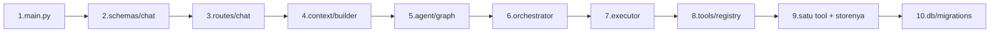
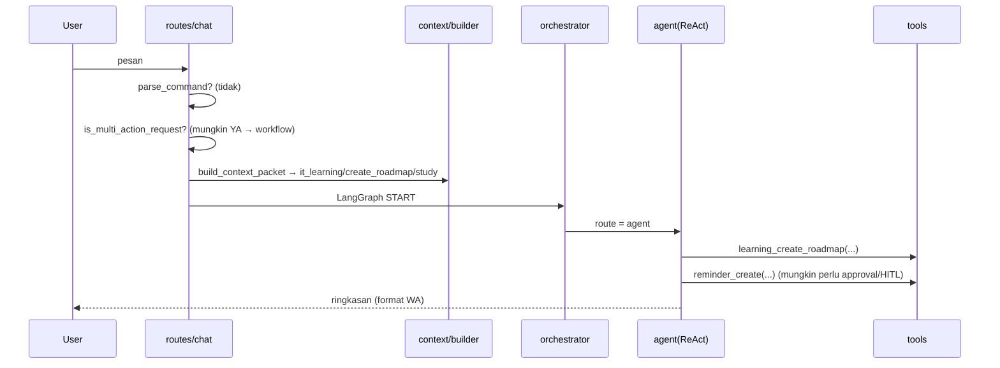
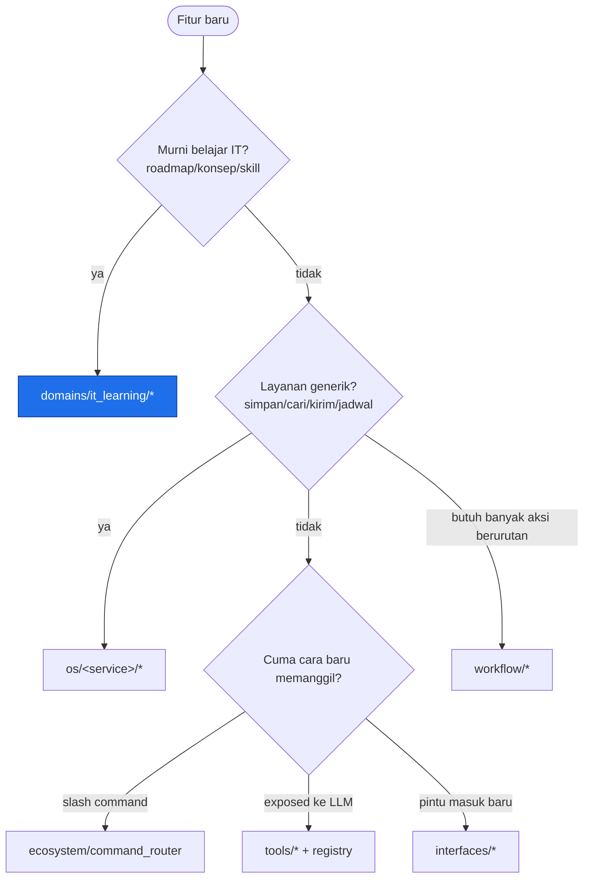
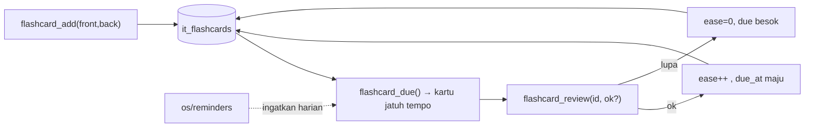

# Xninetzy — Panduan Memahami Kodebase & Playbook Fitur

Tujuan dokumen: bikin kamu **paham kodebase ini dari nol**, lalu bisa **berimprovisasi menambah fitur** dengan cara yang benar (sesuai konvensi yang sudah ada), lengkap dengan *why* di tiap langkah.

> Lihat juga: `XNINETZY_AGENT_SYSTEM_VISUAL.md` (diagram sistem) dan
> `FOLDERING_REFACTOR_IT_LEARNING_OS.md` (kenapa struktur foldernya begini).

Daftar isi:
- [Bagian A — Setup & Mental Model](#bagian-a--setup--mental-model)
- [Bagian B — Reading Path (urutan baca kode)](#bagian-b--reading-path-urutan-baca-kode)
- [Bagian C — Latihan Tracing](#bagian-c--latihan-tracing-request--response)
- [Bagian D — Di mana fitur saya tinggal?](#bagian-d--di-mana-fitur-saya-tinggal-decision-tree)
- [Bagian E — Best Practice Kodebase Ini](#bagian-e--best-practice-kodebase-ini-wajib)
- [Bagian F — Resep Menambah Fitur (step by step)](#bagian-f--resep-menambah-fitur-step-by-step)
- [Bagian G — Worked Example: Plan Fitur Lengkap](#bagian-g--worked-example-plan-fitur-lengkap)
- [Bagian H — Template Plan Fitur (copy-paste)](#bagian-h--template-plan-fitur-copy-paste)
- [Bagian I — Checklist sebelum selesai & Pitfalls](#bagian-i--checklist-sebelum-selesai--pitfalls)

---

## Bagian A — Setup & Mental Model

### A.1 Setup lokal
```bash
cd services/ai
uv venv && source .venv/bin/activate     # atau pakai .venv yang ada
uv pip install pytest pytest-asyncio      # untuk run test
export DEEPSEEK_API_KEY=test SQLITE_PATH=/tmp/xninetzy-dev.sqlite3
python -m pytest -q                       # harus hijau dulu sebelum ngoprek
```
> **Why:** pegang baseline test hijau dulu. Itu jaring pengaman. Kalau setelah ngoprek ada yang merah, kamu tahu itu ulahmu.

### A.2 Mental model 30 detik
Xninetzy = **WhatsApp-first IT Learning OS**. Satu pesan masuk → diputuskan jalurnya → dijalankan → dibalas dalam format WhatsApp.

```
Pesan ──► [Command? Workflow? Agent?] ──► tools/OS ──► balasan WA
```

Tiga lapis yang harus kamu hafal:
1. **Interface** (`interfaces/`) — pintu masuk (API/WA/media).
2. **Agent core** (`agent/`, `context/`, `workflow/`) — otak & routing.
3. **Kapabilitas** (`domains/`, `os/`, `tools/`) — yang benar-benar mengerjakan sesuatu.

### A.3 Aturan emas struktur folder
| Folder | Isinya | Aturan |
|--------|--------|--------|
| `domains/it_learning` | logika khusus belajar IT | **domain aktif**, boleh tahu soal IT |
| `os/*` | layanan pendukung (knowledge, research, notes, life, reminders, academic/hebat, …) | **generik**, jangan hardcode "IT" |
| `tools/*` | pembungkus `@tool` untuk LLM | tipis, panggil `os/`/`domains/` |
| `interfaces/*` | API, WhatsApp, media | jangan taruh business logic di sini |
| `agent/` + `context/` + `workflow/` | routing & eksekusi | jangan taruh fitur domain di sini |
| `domains/future/*` | biology/neuro/it_biology | **placeholder**, jangan diisi dulu |

> **Why:** HEBAT sengaja diturunkan jadi *connector* di `os/academic/hebat`, bukan pusat. Produk = IT Learning OS, bukan kumpulan fitur.

---

## Bagian B — Reading Path (urutan baca kode)

Baca **berurutan**. Tiap langkah ada *why*-nya. Target: 1–2 jam.



| # | File | Apa yang dicari | Why |
|---|------|-----------------|-----|
| 1 | `app/main.py` | startup, router mana yang dipasang, task background (reminder loop, HEBAT auto-login) | tahu apa yang hidup saat boot |
| 2 | `app/xninetzy/schemas/chat.py` | `ChatRequest`/`ChatResponse` | bentuk input/output sistem |
| 3 | `interfaces/api/routes/chat.py` | 3 jalur: command → workflow → graph | **inti** dispatch; kapan agent dipakai vs tidak |
| 4 | `context/builder.py` (+ classifier) | `build_context_packet` → domain/intent/mode | bagaimana pesan "dibaca" sebelum agent |
| 5 | `agent/graph.py` | node & edge LangGraph | peta state machine |
| 6 | `agent/orchestrator.py` | LLM flash memutuskan `agent/direct/clarify` | otak routing |
| 7 | `agent/executor.py` | rakit system prompt + ReAct + tools | bagaimana agent "berpikir & pakai tool" |
| 8 | `tools/registry.py` | `get_all_tools()` + `get_tool_groups()` | katalog kemampuan |
| 9 | 1 tool, mis. `tools/ecosystem/knowledge_tools.py` + `os/knowledge/ingestion.py` | pola **tool → service → db** | template buat fiturmu |
| 10 | `db/sqlite.py` + `db/migrations.py` | `CREATE TABLE IF NOT EXISTS` | bagaimana data disimpan |

Saat baca, catat untuk tiap modul: **input apa → proses apa → output apa → simpan ke mana**.

---

## Bagian C — Latihan Tracing (request → response)

Lacak satu pesan sampai tuntas. Tulis jawabannya sendiri:

**Pesan:** `"buat roadmap belajar Docker, ingatkan aku review tiap Minggu"`



Pertanyaan untuk menguji pemahaman:
1. Kalau pesan diawali `/roadmaps`, masuk jalur mana? (jawab: command, bypass graph)
2. Siapa yang memutuskan ini "multi-action"? (jawab: `workflow/plan.py:is_multi_action_request`)
3. Di mana `domain=it_learning` muncul ke model? (jawab: blok `[Context Routing]` di `AGENT_PROMPT`, dirakit di `executor.py`)
4. Kalau `learning_create_roadmap` error, user lihat apa? (jawab: tool return string error, agent lanjut — lihat pola try/except di tool)

---

## Bagian D — Di mana fitur saya tinggal? (decision tree)



Aturan praktis:
- **Logika** selalu di `os/` atau `domains/`. **`tools/` cuma pembungkus tipis.**
- Kalau LLM perlu memanggilnya → bikin `@tool` + daftar di `registry.py`.
- Kalau user perlu memanggil cepat tanpa LLM → tambah `/command`.
- Kalau perlu disimpan → tambah tabel di `db/migrations.py`.

---

## Bagian E — Best Practice Kodebase Ini (WAJIB)

Ini konvensi nyata yang sudah dipakai. Ikuti biar konsisten.

### E.1 Pola Tool (`@tool`)
```python
from langchain_core.tools import tool

@tool
def my_feature(arg1: str, chat_id: str = "system") -> str:
    """Kalimat pertama = dibaca LLM untuk memutuskan kapan memakai tool ini.

    Args:
        arg1: deskripsi jelas (LLM baca ini).
        chat_id: WhatsApp chat ID (dari context).
    """
    from app.xninetzy.os.my_service.logic import do_it   # lazy import
    try:
        result = do_it(arg1)
        return f"✅ Berhasil: {result}"                    # return STRING, format WA
    except Exception as e:
        return f"⚠️ Gagal: {e}"
```
**Why tiap aturan:**
- *Docstring bagus* → LLM tahu kapan pakai. Docstring jelek = tool tak terpakai/disalahpakai.
- *Return string* → output langsung jadi balasan WA. Jangan return dict/objek.
- *Lazy import di dalam fungsi* → hindari circular import & startup berat.
- *try/except → string error* → satu tool gagal tidak menjatuhkan chat.
- *`chat_id` default* → command_router & executor mengisi otomatis dari context.

### E.2 Layering: Tool → Service → DB
```
tools/ecosystem/x_tools.py   (@tool, tipis)
        │ panggil
os/x/logic.py                (business logic, testable tanpa LLM)
        │ panggil
db/sqlite.py connect()       (SQL mentah, Row factory)
```
**Why:** logika di `os/` bisa diuji unit tanpa LLM/WA. Tool tinggal jadi adaptor.

### E.3 Database
- Tambah tabel di `db/migrations.py` (`run_migrations()`) dengan `CREATE TABLE IF NOT EXISTS`.
- Pakai `connect()` dari `db/sqlite.py` (sudah set `row_factory`, WAL, FK).
- Simpan waktu sebagai ISO string pakai timezone `get_settings().APP_TIMEZONE`.
- **Why:** idempotent (boot ulang aman), tanpa ORM (konsisten dengan kode lain), tidak perlu migrasi rumit.

### E.4 Config & feature flag
- Tambah field di `core/config.py` (`Settings`) dengan **default aman**.
- Fitur besar/eksperimen → kasih flag `MYFEATURE_ENABLED: bool = False`.
- **Why:** bisa di-rollout/rollback lewat `.env` tanpa ubah kode; default off = tidak ganggu yang lain.

### E.5 Human-in-the-Loop (HITL)
Aksi berisiko **wajib approval**: upload HEBAT, roadmap aktif + banyak task, simpan hasil research besar, deep research.
- Pakai `os/hitl/` (`hitl_request_approval`).
- **Why:** ini aturan produk & keamanan. Jangan auto-eksekusi aksi destruktif/eksternal.

### E.6 Format & gaya balasan
- Format WhatsApp: `*bold*`, `_italic_`, ```` ```code``` ````, bullet `•`. **Jangan** `#`, `>`, `[link](url)`, tabel.
- Bahasa Indonesia default. Singkat, jujur soal batasan.
- Jangan bocorkan JID/cookie/token/stack trace ke user.

### E.7 Namespace & adapter
- Import selalu dari `app.xninetzy.*`.
- Folder lama (`app/learning`, `app/tools/hebat`, …) adalah **adapter backward-compat — jangan dihapus, jangan dijadikan tempat kode baru.**

### E.8 Test
- Test = fungsi `def test_...()` polos di `tests/`, async pakai `@pytest.mark.asyncio`.
- `tests/conftest.py` sudah set env & path.
- **Why:** cepat, tanpa server. Uji logika `os/`/`domains/` langsung (bukan lewat LLM).

---

## Bagian F — Resep Menambah Fitur (step by step)

### Resep 1 — Tool sederhana (tanpa DB)
1. Tulis logika murni di `os/<service>/` atau `domains/it_learning/`.
2. Bungkus `@tool` di `tools/...` (pola E.1).
3. Daftar di `tools/registry.py` → `get_all_tools()` (taruh di grup yang pas) + (opsional) `get_tool_groups()`.
4. (Opsional) tambah `/command` di `ecosystem/command_router.py`.
5. Tulis test logika di `tests/`.
6. `python -m pytest -q`.

### Resep 2 — Fitur dengan penyimpanan (DB + service + tool + command)
1. **DB:** tabel baru di `db/migrations.py`.
2. **Service:** `os/<service>/store.py` (fungsi `add_*`, `list_*`, `get_*`) pakai `connect()`.
3. **Tool:** `@tool` pembungkus service.
4. **Registry:** daftar tool.
5. **Command:** `/myfeature` di `command_router` (kalau perlu akses cepat).
6. **Config:** flag `MYFEATURE_ENABLED` kalau eksperimen.
7. **Prompt (opsional):** sebut tool di kategori tools `agent/prompts.py` biar LLM aware.
8. **Test:** unit test service + (opsional) test command.

### Resep 3 — Kapabilitas domain IT Learning
1. Logika di `domains/it_learning/` (mis. `flashcards.py`).
2. Prompt teks (kalau perlu) di `domains/it_learning/prompts.py`.
3. Tools entrypoint di `domains/it_learning/tools.py` (+ re-export).
4. Skill: update `skills/it_learning/` dan `skills/registry.py` kalau jadi skill terpisah.
5. Registry + test.

> **Why urutan ini:** selalu **dari dalam ke luar** (data → logika → tool → cara panggil → prompt → test). Setiap lapis bisa dites sebelum lapis di atasnya dibuat.

---

## Bagian G — Worked Example: Plan Fitur Lengkap

Fitur contoh: **"Flashcard belajar IT (spaced repetition)"** — user simpan konsep, sistem ingatkan review bertahap.

### G.1 Kenapa fitur ini cocok
- Memperkuat domain **it_learning** (inti produk), bukan menambah domain baru.
- Memakai support OS yang sudah ada: **reminders** (jadwal review), **notes/knowledge** (sumber konsep). → contoh "Xninetzy sebagai satu produk".

### G.2 Penempatan (pakai decision tree Bagian D)
- Murni belajar IT? **Ya** → logika di `domains/it_learning/flashcards.py`.
- Perlu disimpan? Ya → tabel `it_flashcards` di `db/migrations.py`.
- Perlu dijadwalkan? Ya → pakai `os/reminders` (jangan bikin scheduler baru).
- Dipanggil LLM & user? Ya → `@tool` + `/flashcards`.

### G.3 Desain data
```
TABLE it_flashcards(
  id, chat_id, front, back, skill_branch,    -- skill_branch dari skill_tree.py
  ease INTEGER DEFAULT 0,                     -- berapa kali sukses (untuk interval)
  due_at TEXT,                                -- kapan review berikutnya (ISO)
  created_at TEXT
)
```
Interval (deterministik dulu, bukan LLM): `due_at = now + [1, 3, 7, 16, 35] hari` sesuai `ease`.

### G.4 Alur


### G.5 Langkah implementasi (mengikuti Resep 2 + 3)
1. `db/migrations.py`: tambah `CREATE TABLE IF NOT EXISTS it_flashcards (...)`.
2. `domains/it_learning/flashcards.py`: `add_card`, `due_cards`, `review_card` (pure, pakai `connect()`).
3. `domains/it_learning/tools.py` atau `tools/ecosystem/`: `@tool flashcard_add/flashcard_due/flashcard_review`.
4. `tools/registry.py`: daftar 3 tool (grup `it_learning`) + tambah ke `get_tool_groups()["it_learning"]`.
5. `ecosystem/command_router.py`: `/flashcards` → `flashcard_due`.
6. `core/config.py`: `FLASHCARDS_ENABLED: bool = True`.
7. `agent/prompts.py`: tambah baris di kategori "Learning Roadmap"/IT Learning.
8. (opsional) `os/reminders`: buat reminder harian "review flashcard".
9. Tests: `tests/test_flashcards.py` (add → due → review → interval maju). Plus pastikan `get_all_tools()` tetap berisi & `test_tools_grouping` hijau.
10. Docs: tambah catatan singkat di sini / `XNINETZY_AGENT_SYSTEM_VISUAL.md`.

### G.6 Definisi selesai
- `python -m pytest -q` hijau (lama + baru).
- `/flashcards` membalas kartu jatuh tempo dalam format WA.
- Tidak ada perubahan ke behavior fitur lain; adapter lama tetap jalan.

---

## Bagian H — Template Plan Fitur (copy-paste)

```md
# Plan Fitur: <NAMA>

## 1. Masalah & Why
- Masalah user: ...
- Kenapa sekarang & kenapa cocok dengan IT Learning OS: ...

## 2. Scope
- In scope: ...
- Out of scope (tegas): ...

## 3. Penempatan (decision tree)
- Domain / OS / tool / command / interface / workflow: ...
- Support OS yang dipakai ulang (reminders/notes/knowledge/...): ...

## 4. Data
- Tabel baru / kolom: ...
- Format waktu & timezone: ISO + APP_TIMEZONE

## 5. Alur (diagram)
- (mermaid singkat input → proses → output)

## 6. Kontrak
- Tool: nama, args, return string, contoh balasan WA
- Command: /...
- Config flag: <FEATURE>_ENABLED

## 7. HITL / Safety
- Aksi berisiko? perlu approval? ...

## 8. Langkah implementasi (dari dalam ke luar)
1. db → 2. service → 3. tool → 4. registry → 5. command → 6. config → 7. prompt → 8. test → 9. docs

## 9. Test
- Unit service: ...
- Regресi: get_all_tools tetap utuh

## 10. Definisi selesai
- [ ] pytest hijau
- [ ] balasan format WA benar
- [ ] tidak mengubah behavior lain
- [ ] docs diperbarui
```

---

## Bagian I — Checklist sebelum selesai & Pitfalls

### Checklist
- [ ] Logika di `os/`/`domains/`, tool cuma pembungkus.
- [ ] Tool return **string** ber-format WA, ada try/except.
- [ ] Tool terdaftar di `registry.py`; `get_all_tools()` tidak kosong/berkurang tanpa sengaja.
- [ ] Import dari `app.xninetzy.*`; adapter lama tidak disentuh.
- [ ] Tabel pakai `CREATE TABLE IF NOT EXISTS`.
- [ ] Aksi berisiko lewat HITL.
- [ ] Ada test; `python -m pytest -q` hijau.
- [ ] Tidak menyentuh `domains/future/*`.

### Pitfalls (sering bikin merah)
| Gejala | Penyebab | Fix |
|--------|----------|-----|
| `ImportError app.xninetzy...` | salah path / circular import | import dari namespace baru; lazy import di dalam fungsi |
| Tool tak pernah dipanggil LLM | docstring lemah / tak terdaftar | perjelas docstring + daftar di registry |
| `AGENT_PROMPT.format` KeyError | tambah placeholder tapi lupa kirim kwarg di `executor.py` | samakan placeholder ↔ kwargs |
| Balasan jelek di WA | pakai markdown heading/tabel | pakai `*bold*`/`•` saja |
| Test async "not natively supported" | belum pasang `pytest-asyncio` | `uv pip install pytest-asyncio` |
| Behavior fitur lain berubah | mengubah `get_all_tools()` / prompt inti | tambahkan, jangan ganti; jalankan full test |

---

### Langkah belajar berikutnya (saran)
1. Selesaikan **Bagian C** (tracing) sampai bisa jawab tanpa lihat kode.
2. Implement **fitur kecil** dengan Resep 1 (mis. tool `it_glossary` yang menjelaskan istilah dari `skill_tree`).
3. Naik ke Resep 2 (fitur + DB), pakai Template Bagian H.
4. Baru sentuh wiring agent/context kalau benar-benar perlu.

> Prinsip akhir: **tambah, jangan ganti**; **dari dalam ke luar**; **satu produk, bukan kumpulan fitur**.
