# Xninetzy Agent System — Visualisasi

> **Xninetzy = WhatsApp-first IT Learning OS.**
> Dokumen ini fokus **visualisasi**: bagaimana sistem AI agent bekerja sekarang dan arahnya ke depan.
> Semua diagram pakai [Mermaid](https://mermaid.js.org/) (render otomatis di GitHub) + ASCII.

---

## 1. Peta Produk (Big Picture)

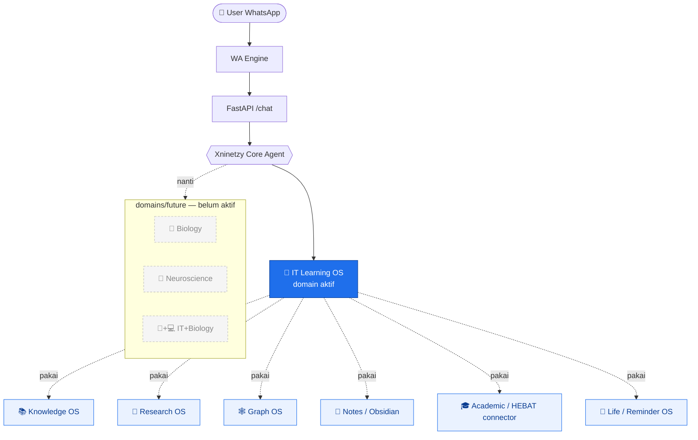

---

## 2. Request Lifecycle — 3 Jalur Masuk

Pesan masuk tidak selalu lewat agent. Ada **3 jalur** yang dicek berurutan di `interfaces/api/routes/chat.py`:

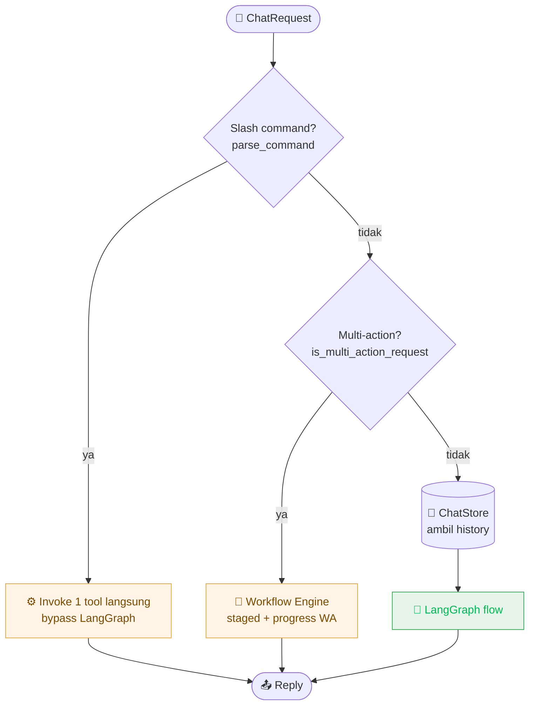

| Jalur | Trigger | Karakter |
|------|---------|----------|
| **1. Command** | pesan diawali `/...` | deterministik, cepat, 1 tool |
| **2. Workflow** | request majemuk (banyak aksi) | bertahap, lapor progress |
| **3. Agent graph** | selain di atas | reasoning penuh (ReAct) |

---

## 3. LangGraph State Machine (jalur utama)

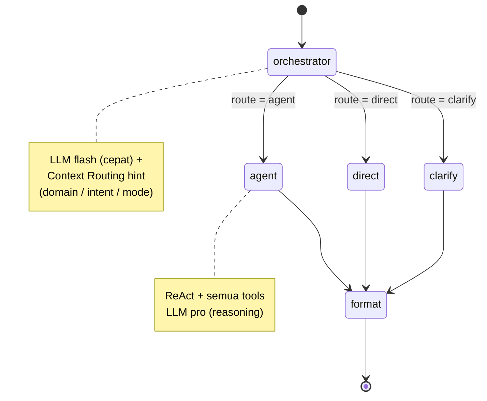

**Aturan routing orchestrator:**

```
            ┌─────────────────────────────────────────────┐
   pesan →  │ butuh AKSI / DATA / TOOL ?  ──────► AGENT     │
            │ cukup penjelasan teks ?      ──────► DIRECT    │
            │ benar-benar ambigu ?         ──────► CLARIFY   │
            └─────────────────────────────────────────────┘
              ragu antara AGENT vs DIRECT  →  selalu AGENT
```

---

## 4. Anatomi `agent` Node (ReAct + injeksi konteks)

Sebelum ReAct loop jalan, system prompt dirakit dari banyak sumber (semua *best-effort*, gagal = dilewati):

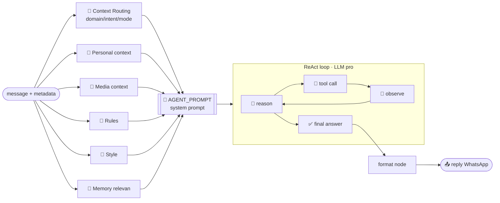

ASCII bentuk system prompt yang dikirim ke model:

```
┌─ AGENT_PROMPT ─────────────────────────────┐
│ Identitas: WhatsApp-first IT Learning OS    │
│ Konteks: sender / chat / waktu / quoted     │
│ [Context Routing] domain= intent= mode=     │  ◄── baru (phase 2)
│ [Personal] [Media] [Rules] [Style] [Memory] │
│ Kategori tools ...                          │
│ Aturan: Memory · Media · Format WA ·        │
│         Deep Research · HITL · Research ·   │
│         Learning OS · IT Learning           │
└─────────────────────────────────────────────┘
```

---

## 5. Context Layer (deterministik, tanpa LLM)

`app/xninetzy/context/` — preprocessing berbasis rule yang menghasilkan **ContextPacket**.

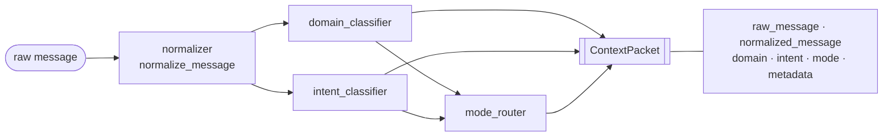

**Prioritas domain** (it_learning dulu, biar HEBAT tidak jadi pusat):

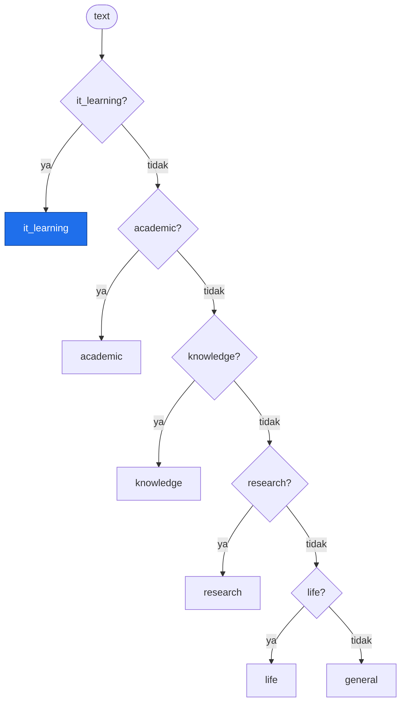

**Contoh hasil klasifikasi:**

| Pesan | domain | intent | mode |
|------|--------|--------|------|
| "buat roadmap belajar Docker" | `it_learning` | `create_roadmap` | `study` |
| "cek tugas HEBAT" | `academic` | `chat` | `quick` |
| "riset paper Graph RAG" | `it_learning` | `research` | `research` |
| "ingatkan aku besok jam 8" | `life` | `reminder` | `life` |
| "halo apa kabar" | `general` | `chat` | `quick` |

> Status: rule-based. **Ke depan** bisa di-upgrade ke LLM/embedding classifier tanpa mengubah kontrak `ContextPacket`.

---

## 6. Domain & Support OS Map

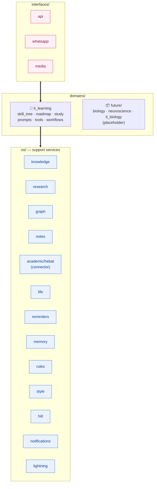

---

## 7. Tools Registry — Grouping by Domain/OS

`get_all_tools()` (≈127 tools) tetap utuh; `get_tool_groups()` cuma untuk navigasi.

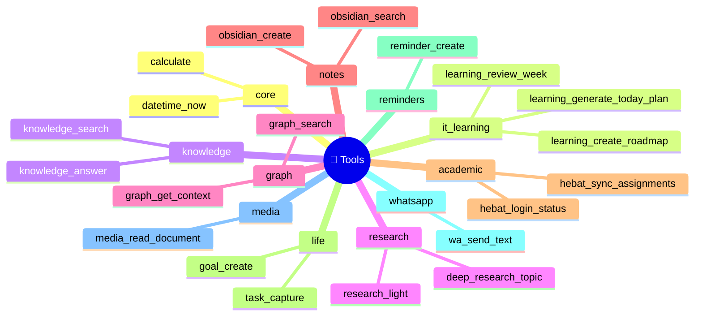

---

## 8. Multi-Action Workflow (jalur 2)

Untuk request majemuk, mis. *"riset RAG, lalu buat roadmap, terus ingatkan besok"*:

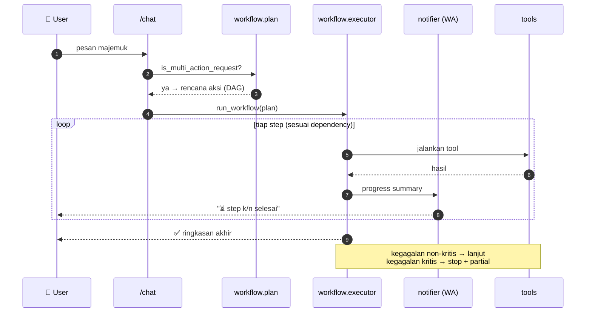

---

## 9. Human-in-the-Loop (HITL) — gerbang aksi berisiko

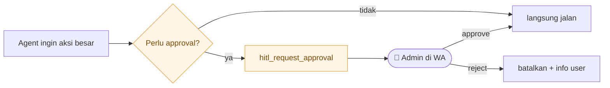

Wajib approval: **upload tugas HEBAT**, **roadmap aktif + banyak task**, **simpan hasil research besar** ke Obsidian/Knowledge/Graph, **deep research** (admin-only).

---

## 10. Arsitektur Berlapis (layered view)

```
╔══════════════════════════════════════════════════════════════╗
║  INTERFACES      WhatsApp · API · Media                        ║
╠══════════════════════════════════════════════════════════════╣
║  CONTEXT         normalize → domain/intent → mode → Packet     ║
╠══════════════════════════════════════════════════════════════╣
║  AGENT/CORE      orchestrator → agent(ReAct)/direct/clarify    ║
║                  → format                                      ║
╠══════════════════════════════════════════════════════════════╣
║  ORCHESTRATION   workflow engine (multi-action, DAG, HITL)     ║
╠══════════════════════════════════════════════════════════════╣
║  DOMAIN          🎯 it_learning      (future: bio/neuro)       ║
╠══════════════════════════════════════════════════════════════╣
║  SUPPORT OS      knowledge·research·graph·notes·academic·life  ║
║                  reminders·memory·rules·style·hitl·lightning   ║
╠══════════════════════════════════════════════════════════════╣
║  INFRA           core(config/llm/log) · db(sqlite) · tools     ║
╚══════════════════════════════════════════════════════════════╝
        ▲ interface     ▼ infra      (atas = dekat user)
```

---

## 11. Arah Ke Depan (target evolusi)

Garis putus = belum ada / parsial sekarang.

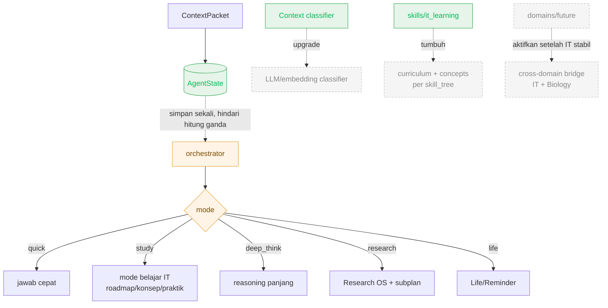

**Roadmap singkat:**

```
[ now ]   ─►  IT Learning OS + context rule-based + HITL + workflow
[ next ]  ─►  ContextPacket disimpan di AgentState (sekali hitung)
              mode router benar-benar memilih model/tool
[ later ] ─►  classifier LLM/embedding · curriculum per skill_tree
[ vision ]─►  aktifkan domains/future + jembatan cross-domain (IT+Biology)
```

---

## 12. Legenda

| Simbol | Arti |
|--------|------|
| 🎯 | Domain aktif (it_learning) |
| 📦 / putus-putus | Future / belum aktif |
| 🔧 | Tools |
| 👮 | Admin (HITL) |
| `─►` | alur / evolusi |
| `-.->` (dashed) | belum ada / opsional / arah ke depan |

> Sumber kebenaran tetap kode di `app/xninetzy/`. Jika diagram dan kode beda, **kode yang benar** — perbarui dokumen ini.
